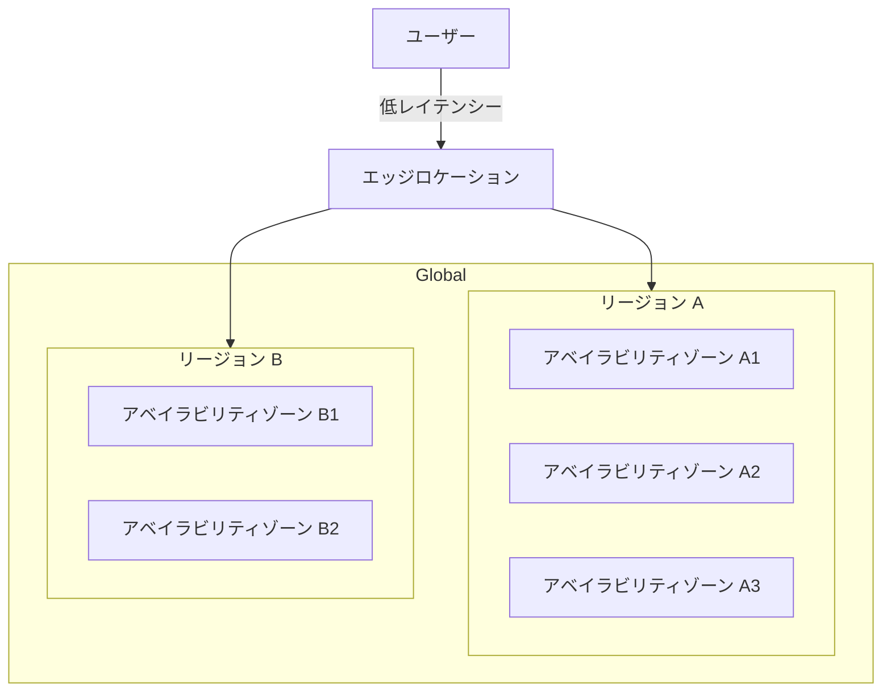
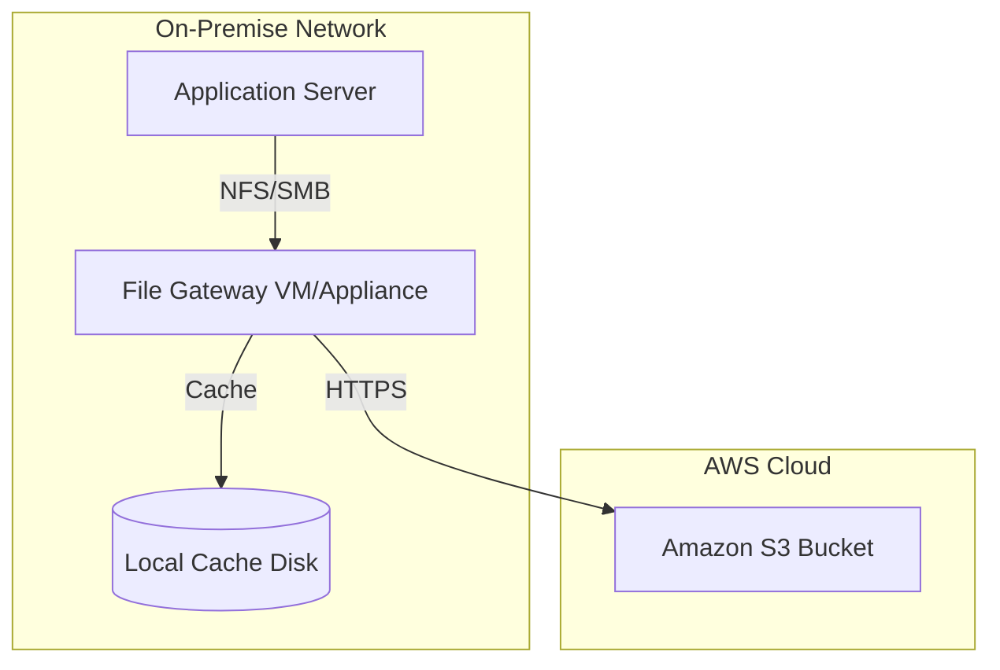
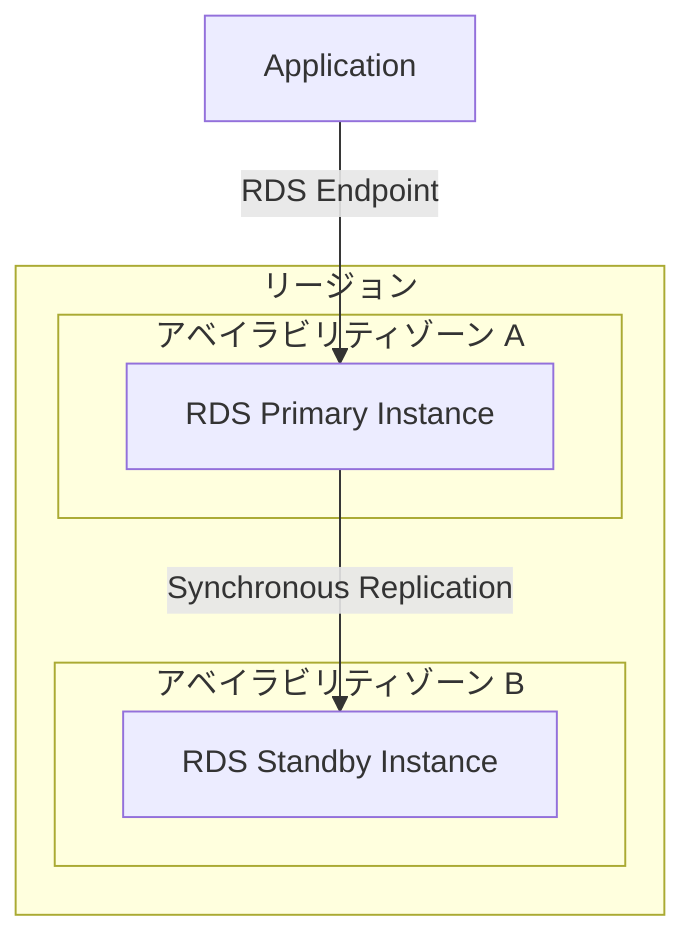
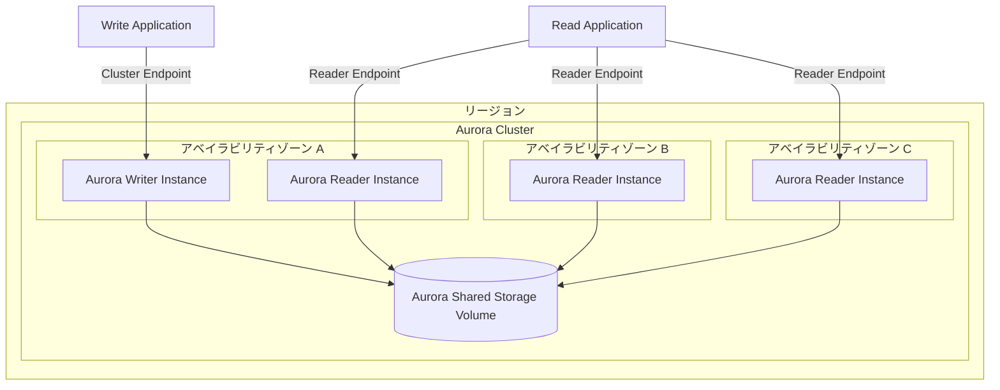
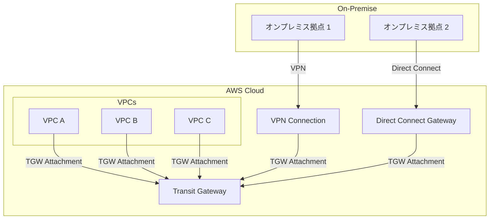
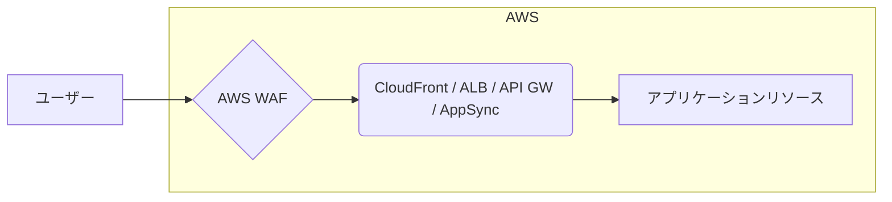

# AWS認定 ソリューションアーキテクト アソシエイト 合格対策参考書（SAA-C03対応） - Part 1

## はじめに

本書は、AWS認定ソリューションアーキテクト アソシエイト（SAA-C03）試験の合格を目指すIT初心者から中級者の方向けの参考書です。クラウドの基本的な概念から解説し、AWSの主要なサービスについて、試験で問われるポイントを中心に学習を進めます。

**本書の特徴:**

* **分野別の章立て:** 試験範囲を主要な分野に分け、体系的に学習できます。
* **基礎からのサービス解説:** 各AWSサービスの基本的な機能やユースケースを分かりやすく説明します。
* **試験頻出ポイントの強調:** 出題傾向、サービスの組み合わせ、重要キーワードを明確にし、効率的な学習をサポートします。
* **理解度チェックテスト:** 各章末のテストで学習内容の定着を確認できます。（選択式2問＋短記述式1問に調整）
* **学習を助けるTips:** 図解（テキスト表現）、補足情報、頻出ワードリストで学習効果を高めます。

**本書の使い方:**

1.  **各章の概要とサービス解説を読む:** まず、各分野の全体像と主要サービスの基本を理解しましょう。
2.  **問題と解説で学習を深める:** 提供された問題を解き、解説を読んで理解を深めます。特に、**出題傾向**や**よく出るサービスの組み合わせ**、**重要キーワード**に注目してください。
3.  **Tipsと補足で知識を補強する:** 学習のヒントや関連情報を参考に、知識を広げましょう。
4.  **理解度チェックテストで実力試し:** 章末のテストで理解度を確認し、苦手分野を把握します。
5.  **頻出ワードリストで復習:** 各章の重要キーワードを繰り返し確認し、記憶に定着させましょう。

クラウド技術は日々進化しています。本書を足がかりに、AWS公式ドキュメントなども参照しながら、継続的に学習を進めることをお勧めします。

*(目次は全体構成を示すため記載しますが、Part 1では第1章、第2章のみ扱います)*
### 目次 (予定)

* 概要： AWSクラウドとは
* 第1章: コンピューティングサービス (EC2, Auto Scaling, Elastic Beanstalk)
* 第2章: AWSストレージサービス (S3, EBS, EFS, Storage Gateway, DataSync)
* 第3章: AWSデータベースサービス (RDS, Aurora, DynamoDB, ElastiCache)
* 第4章: AWSネットワーキング (VPC, エンドポイント, ELB, CloudFront, Global Accelerator, Route 53 他)
* 第5章: セキュリティ、ID、コンプライアンス (ID・アクセス・マルチアカウント管理)
* 第6章: セキュリティの監視、検出、保護 (GuardDuty, Inspector, Macie, WAF, Shield, Config, Security Hub)
* 第7章: 運用、モニタリング、自動化 (CloudWatch, CloudTrail, Systems Manager, CloudFormation, Trusted Advisor, Service Catalog, Codeシリーズ概要)
* 第8章: 移行とハイブリッドクラウド (Migration Hub, DataSync, Server Migration Service)
* 第9章: コンテナサービス (ECS, EKS, Fargate, ECR)
* 第10章: 移行とハイブリッドクラウド (Migration Hub, DMS, SCT, DataSync, Storage Gateway, Direct Connect, VPN)
* 第11章: 分析と機械学習サービス (Athena, Redshift, EMR, Kinesis, Glue, Lake Formation, OpenSearch, SageMaker, AIサービス)
* 第12章: コスト最適化とWell-Architected Framework
* 巻末付録: 頻出AWS用語集

---

# 概要： AWSクラウドとは

AWS (Amazon Web Services) は、世界中のデータセンターから提供される、コンピューティングパワー、ストレージ、データベース、ネットワーキング、機械学習など、多岐にわたるクラウドコンピューティングサービスです。この章では、AWSを理解するための基本的な概念について学びます。

## □ クラウドコンピューティングの基本

クラウドコンピューティングとは、インターネットを通じて、サーバー、ストレージ、データベース、ソフトウェアなどのコンピューティングリソースをオンデマンドで利用するモデルです。

* **オンデマンド・セルフサービス**: ユーザーは必要な時に必要なだけ、管理者の介入なしにリソースを調達できます。
* **幅広いネットワークアクセス**: インターネット経由で、様々なデバイスからリソースにアクセスできます。
* **リソースの共有 (リソースプーリング)**: 物理的なリソースは仮想化され、複数のユーザーで共有されます。ユーザーは通常、リソースの正確な物理的な場所を知る必要はありません。
* **迅速な伸縮性 (弾力性)**: 需要に応じてリソースを迅速かつ容易にスケールアップ（増強）またはスケールダウン（縮小）できます。
* **従量課金制**: 利用したリソースの量に応じて料金が発生します。初期投資を抑え、コスト効率を高めることができます。

**クラウドサービスのモデル:**

* **IaaS (Infrastructure as a Service)**: サーバー、ストレージ、ネットワークなどのインフラを提供。OS以上の管理はユーザーが行う。 (例: Amazon EC2)
* **PaaS (Platform as a Service)**: アプリケーション開発・実行環境を提供。インフラ管理は不要。 (例: AWS Elastic Beanstalk, Amazon RDS)
* **SaaS (Software as a Service)**: ソフトウェアをサービスとして提供。ユーザーはソフトウェアを利用するだけ。 (例: Gmail, Salesforce, AWSの各種マネージドサービスの一部機能)

## □ AWSグローバルインフラストラクチャ (リージョン, AZ)

AWSは世界中に広がるインフラストラクチャを通じてサービスを提供しています。

* **リージョン (Region)**: AWSがデータセンターを設置している物理的な地理的エリア。複数のアベイラビリティゾーンで構成されます。レイテンシー、コンプライアンス要件、コストなどを考慮して選択します。 (例: 東京リージョン `ap-northeast-1`)
* **アベイラビリティゾーン (Availability Zone, AZ)**: 各リージョン内にある、1つ以上の独立したデータセンター群。それぞれが独立した電源、冷却、ネットワークを持ち、他のAZとは物理的に分離されています。AZ間で低レイテンシーのネットワーク接続が提供されます。アプリケーションの可用性を高めるために、複数のAZにリソースを分散させることが推奨されます (マルチAZ構成)。
* **エッジロケーション (Edge Location)**: コンテンツ配信ネットワーク (CDN) サービスであるAmazon CloudFrontや、DNSサービスのAmazon Route 53などが利用する、世界中に分散配置されたデータセンター拠点。ユーザーに近い場所からコンテンツを配信したり、DNSクエリに応答したりすることで、レイテンシーを低減します。

**(図のイメージ: リージョンとAZの関係)**


## □ AWS Well-Architected Framework の概要

AWS Well-Architected Framework は、AWS上で安全で高性能、高可用性、効率的なインフラストラクチャを構築するためのベストプラクティス集です。以下の6つの柱に基づいています。

1.  **オペレーショナルエクセレンス (運用上の優秀性)**: システムを実行および監視してビジネス価値を提供し、サポートプロセスと手順を継続的に改善する能力。
2.  **セキュリティ**: 情報、システム、資産を保護し、リスク評価と緩和戦略を通じてビジネス価値を提供する能力。
3.  **信頼性**: インフラストラクチャまたはサービスの中断から回復し、コンピューティングリソースに対する需要を動的に獲得し、設定ミスや一時的なネットワークの問題などの中断を緩和する能力。
4.  **パフォーマンス効率**: コンピューティングリソースを効率的に使用してシステム要件を満たし、需要の変化やテクノロジーの進化に応じてその効率を維持する能力。
5.  **コスト最適化**: 最低限の価格でビジネス価値を提供するために、不要なコストを回避または排除する能力。
6.  **サステナビリティ (持続可能性)**: クラウドワークロードの環境への影響を継続的に改善する能力。

これらの柱を意識してアーキテクチャを設計・レビューすることが推奨されます。

## □ 責任共有モデル (Shared Responsibility Model)

AWSにおけるセキュリティとコンプライアンスは、AWSと顧客の間で共有される責任です。

* **AWSの責任 (クラウド"の"セキュリティ)**:
    * AWSがサービスを提供するグローバルインフラストラクチャ（リージョン、AZ、エッジロケーション）の保護。
    * ハードウェア、ソフトウェア、ネットワーキング、データセンター施設など、AWSクラウドサービスの基盤となるインフラのセキュリティ。
    * マネージドサービス（RDS, DynamoDBなど）のOSパッチ適用や基盤管理。
* **顧客の責任 (クラウド"内"のセキュリティ)**:
    * 顧客データ。
    * プラットフォーム、アプリケーション、ID、アクセス管理 (IAM)。
    * オペレーティングシステム、ネットワーク、ファイアウォールの設定 (EC2などIaaSの場合)。
    * クライアント側のデータ暗号化とデータ整合性の認証。
    * サーバー側の暗号化 (ファイルシステムやデータ)。
    * ネットワークトラフィックの保護 (暗号化、完全性、アイデンティティ)。

サービスの種類（IaaS, PaaS, SaaS）によって、顧客が責任を持つ範囲は異なります。顧客は自身が管理する範囲に対して適切なセキュリティ対策を講じる必要があります。

**(図のイメージ: 責任共有モデルの概念図)**
```mermaid
graph TD
    subgraph AWSの責任 (クラウド"の"セキュリティ)
        direction LR
        GlobalInfra[グローバルインフラ]
        Compute[コンピューティング]
        Storage[ストレージ]
        Database[データベース]
        Networking[ネットワーキング]
    end
    subgraph 顧客の責任 (クラウド"内"のセキュリティ)
        direction LR
        CustomerData[顧客データ]
        PlatformApps[プラットフォーム, アプリケーション, ID管理]
        OSNetworkFirewall[OS, ネットワーク, ファイアウォール設定]
        ClientEncryption[クライアント側暗号化]
        ServerEncryption[サーバー側暗号化]
        NetworkTrafficProtection[ネットワークトラフィック保護]
    end
    AWSの責任 --> 顧客の責任
```
*注: 責任範囲はサービスモデルにより変動します。*

## □ AWSマネジメントコンソール、CLI、SDK

AWSリソースを操作・管理するための主要なインターフェースです。

* **AWSマネジメントコンソール (AWS Management Console)**: ウェブベースのグラフィカルインターフェース。直感的な操作が可能。
* **AWSコマンドラインインターフェイス (AWS CLI)**: コマンドラインからAWSサービスを操作するためのツール。スクリプトによる自動化に適しています。
* **AWSソフトウェア開発キット (AWS SDK)**: 各種プログラミング言語（Python, Java, JavaScript, .NET, Goなど）からAWSサービスを操作するためのライブラリとツール。アプリケーションへのAWS機能の組み込みに使用します。

これらのインターフェースを使い分けることで、効率的なAWS環境の管理と運用が可能になります。


# 第1章: コンピューティングサービス (EC2, Auto Scaling, Elastic Beanstalk)

## 1.1 EC2インスタンスの概要 (タイプ、購入オプション)
Amazon Elastic Compute Cloud (Amazon EC2) は、AWSクラウド上でスケーラブルなコンピューティングキャパシティを提供するサービスです。仮想サーバーである「インスタンス」を数分で起動し、必要に応じてその数を増減させることができます。

* **インスタンスタイプ**: ワークロードの特性（コンピューティング、メモリ、ストレージ、ネットワーク性能）に合わせて最適化された様々なインスタンスタイプが提供されています。
    * **汎用 (General Purpose)** (例: Mシリーズ, Tシリーズ): CPU、メモリ、ネットワークのバランスが取れており、Webサーバーや開発環境など幅広い用途に適しています。Tシリーズはバースト可能なCPU性能を持ちます。
    * **コンピューティング最適化 (Compute Optimized)** (例: Cシリーズ): 高いCPU性能を必要とするワークロード向け。バッチ処理、メディアトランスコーディング、高性能計算(HPC)など。
    * **メモリ最適化 (Memory Optimized)** (例: Rシリーズ, Xシリーズ, Zシリーズ): 大規模なデータセットをメモリ内で処理するワークロード向け。高性能データベース、インメモリキャッシュ、リアルタイムビッグデータ分析など。
    * **ストレージ最適化 (Storage Optimized)** (例: Iシリーズ, Dシリーズ, Hシリーズ): ローカルストレージ上の大規模データセットに対する高いシーケンシャルI/O性能が必要なワークロード向け。データウェアハウス、分散ファイルシステム、ビッグデータ分析など。Iシリーズは高速NVMe SSD、D/HシリーズはHDDを搭載。
    * **高速コンピューティング (Accelerated Computing)** (例: Pシリーズ, Gシリーズ, Fシリーズ): GPUやFPGAなどのハードウェアアクセラレーターを利用するワークロード向け。機械学習、HPC、グラフィックスレンダリングなど。
**(図のイメージ: EC2インスタンスタイプカテゴリ)**
```mermaid
graph TD
    subgraph EC2インスタンスタイプ
        A[汎用<br>(M, T)]
        B[コンピューティング最適化<br>(C)]
        C[メモリ最適化<br>(R, X, Z)]
        D[ストレージ最適化<br>(I, D, H)]
        E[高速コンピューティング<br>(P, G, F)]
    end
    A -- バランス --> App1[Webサーバー, 開発環境]
    B -- CPU重視 --> App2[バッチ処理, HPC]
    C -- メモリ重視 --> App3[インメモリDB, ビッグデータ分析]
    D -- I/O重視 --> App4[DWH, 分散ファイルシステム]
    E -- アクセラレータ --> App5[機械学習, グラフィック処理]

```
* **Amazon マシンイメージ (AMI)**: インスタンスの起動に必要な情報（OS、アプリケーションサーバー、アプリケーションなど）を含むテンプレート。AWS提供のAMI、AWS MarketplaceのAMI、自作のカスタムAMIを利用できます。
* **購入オプション**: コストと柔軟性のバランスに応じて選択。
    * **オンデマンドインスタンス (On-Demand Instances)**: 秒単位（Linux）または時間単位（Windows）の従量課金。初期費用なし。柔軟性が高いが、割引はない。開発/テスト環境や短期的なワークロードに適している。
    * **リザーブドインスタンス (Reserved Instances, RI)**: 1年または3年の利用期間をコミットすることで、オンデマンド料金から大幅な割引（最大72%）を受けられる。安定した長期利用が見込める場合に最適。（詳細は第14章参照）
    * **Savings Plans (SP)**: 1年または3年の利用量（USD/時）をコミットすることで、EC2, Fargate, Lambdaに適用される柔軟な割引を受けられる。（詳細は第14章参照）
    * **スポットインスタンス (Spot Instances)**: AWSの予備のコンピューティングキャパシティをオンデマンド料金から大幅な割引（最大90%）で利用。ただし、AWS側の都合で中断される可能性があるため、中断耐性のあるワークロード（バッチ処理、ビッグデータ分析、テストなど）に適している。
    * **Dedicated Hosts**: 物理的なEC2サーバーを専有。コンプライアンス要件や既存のソフトウェアライセンス（BYOL）に対応する場合に利用。最も高価。
    * **Dedicated Instances**: VPC内でハードウェア専有インスタンスを実行。Dedicated Hostsほどの制御はできないが、ハードウェア専有が必要な場合に利用。
    * **キャパシティ予約 (Capacity Reservations)**: 特定AZで特定のインスタンスタイプのキャパシティを予約。RIやSPとは異なり割引はないが、必要な時に確実にインスタンスを起動できるようにする。

**【EC2 ポイント解説】**

* **インスタンスタイプの選択**:
    * **問題の傾向**: アプリケーションのワークロード特性（CPU負荷、メモリ使用量、I/O要件など）に基づいて、最適なインスタンスファミリー（汎用、コンピューティング最適化など）を選択する問題が出ます。
    * **キーポイント**: 各インスタンスファミリーの特徴と主なユースケースを理解する。汎用(M/T)、コンピューティング(C)、メモリ(R/X/Z)、ストレージ(I/D/H)、高速コンピューティング(P/G/F)。
    * **関連問題**:
        * \[問題] あなたはEC2インスタンスを利用したサーバー構成を検討しています。このサーバーはストレージに対するデータ処理が多発するため、ストレージに特化したインスタンスタイプが必要となります。そこで、SSDボリュームストレージを選択した上で、低レイテンシーと高いランダム I/O パフォーマンスを達成することができるインスタンスタイプを選択して、同時にコスト最適を実現したいと考えています。この要件を満たすインスタンスタイプを選択してください。
        * \[選択肢]
            a) T2インスタンス
            b) I3enインスタンス
            c) D2 インスタンス
            d) H1 インスタンス
        * \[正答] b)
        * \[解説] SSDベースで高いランダムI/O性能を持つストレージ最適化インスタンスが求められています。I3enインスタンスはNVMe SSDを搭載し、低レイテンシー・高IOPSを提供し、GBあたりのコストも比較的低いストレージ最適化インスタンスです(b)。T2(a)は汎用バースト、D2(c)とH1(d)はHDDベースのストレージ最適化インスタンスです。
        * \[問題] あなたはEC2インスタンスを利用したサーバーを構成しています。このサーバーではメモリ内の大きいビッグデータデータセットをリアルタイムで処理するワークロードに対して高速なパフォーマンスを実現することが必要です。この要件を満たすことができる最適なインスタンスタイプを選択してください。
        * \[選択肢]
            a) a1インスタンス
            b) T3インスタンス
            c) R5インスタンス
            d) M5インスタンス
        * \[正答] c)
        * \[解説] メモリ内の大規模データセットを高速に処理するには、メモリ最適化インスタンスが適しています。R5インスタンスはメモリ最適化インスタンスファミリーに属し、高パフォーマンスデータベースやインメモリキャッシュ、リアルタイムビッグデータ分析などのワークロード向けです(c)。A1(a), T3(b), M5(d)は汎用インスタンスです。
    * **重要キーワード**: EC2インスタンスタイプ, 汎用, コンピューティング最適化, メモリ最適化, ストレージ最適化, 高速コンピューティング, ワークロード

* **購入オプションの選択**:
    * **問題の傾向**: 利用期間、利用量の安定性、中断耐性、コスト要件に基づいて、オンデマンド、RI、SP、スポットなどの購入オプションを選択する問題が出ます。コスト最適化の観点が重要です。
    * **キーポイント**: 短期/柔軟→オンデマンド。長期安定→RI/SP。中断許容/コスト最優先→スポット。専有ハードウェア→Dedicated Host/Instance。キャパシティ確保→キャパシティ予約。
    * **関連問題**:
        * \[問題] ある企業では、EC2インスタンス上でバッチ処理のワークロードを運用しています。このワークロードは複数のAmazon EC2インスタンスを活用しており、ステートレスな特性を持っています。そのため、処理を途中で停止したり再開したりすることが可能です。全体の処理時間は約1時間を要します。あなたはソリューションアーキテクトとして、コストの最適化を求められています。コスト最適化を実現するために、ソリューションアーキテクトはどのインスタンスタイプを選択すべきでしょうか。
        * \[選択肢]
            a) スポットインスタンスを利用する。
            b) リザーブドインスタンスを利用する。
            c) オンデマンドインスタンスを利用する。
            d) ベアメタルインスタンスを利用する。
        * \[正答] a)
        * \[解説] ワークロードがステートレスで中断・再開が可能であり、実行時間が比較的短い（1時間程度）場合、オンデマンド料金より大幅に安いスポットインスタンスを利用するのが最もコスト効率が良いです(a)。中断リスクはありますが、ワークロードの特性上許容できます。RI(b)は長期利用向け、オンデマンド(c)は割引なし、ベアメタル(d)は特殊用途で高価です。
        * \[問題] あなたはソリューションアーキテクトとして、AWSを利用したインフラストラクチャのコストを節約するために、AWSクラウドインフラストラクチャのセットアップ状況を分析およびレビューするように依頼されました。 また、使用している全てのAWSリソースに対して会社が支払う金額を事前に見積もるように要求されています。次のうちでコスト要因となっている要素を選択してください。（2つ選択してください。）
        * \[選択肢]
            a) 実行中のEC2インスタンス
            b) 停止されたオンデマンドのEC2インスタンス
            c) 停止されたEC2インスタンスにアタッチされたEBSボリューム
            d) 使用中のVPC
            e) 大量のインフラ設定がされているCloudFormation
        * \[正答] a, c
        * \[解説] 実行中のEC2インスタンス(a)には時間単位または秒単位で料金が発生します。停止されたEC2インスタンス(b)自体には課金されませんが、それにアタッチされているEBSボリューム(c)にはストレージ料金が発生し続けます。VPC(d)やCloudFormation(e)自体は無料です（VPC内のNAT Gatewayなどは有料）。
        * \[問題] ある会社は、長期間利用する予定のAmazon EC2インスタンスにホストされたWEBアプリケーションを構築しています。各サーバーは、開発、テストおよび本番環境に分割して実行されます。EC2インスタンスは通常時にCPU使用率が10％となり、ピーク時間中は平均50％ほどになります。本番EC2インスタンスは1日24時間実行されますが、開発およびテスト用のEC2インスタンスは毎日8時間ほど実行されています。同社は、開発時に使用していない開発用インスタンスは適時停止してコストを節約します。また常設されるインスタンス数を抑制して、Auto Scalingを構成してインスタンス数を調整することにします。また、それぞれの環境におけるインスタンスタイプを最適化して、コストを削減したいと考えています。同社の要件を満たすためのインスタンスタイプの購入方法を選択してください。
        * \[選択肢]
            a) 本番用のEC2インスタンスにスポットインスタンスを使用する。開発およびテスト用のEC2インスタンスにリザーブドインスタンスを使用する。
            b) 本番用のEC2インスタンスにリザーブドインスタンスを使用する。開発およびテスト用のEC2インスタンスにオンデマンドインスタンスを使用する。
            c) 本番用のEC2インスタンスにスポットブロックを使用する。開発およびテスト用のEC2インスタンスにリザーブドインスタンスを使用する。
            d) 本番用のEC2インスタンスにオンデマンドブロックを使用する。開発およびテスト用のEC2インスタンスにスポットブロックを使用する。
        * \[正答] b)
        * \[解説] 本番環境は24時間稼働で長期間利用するため、リザーブドインスタンス(RI)またはSavings Plans(SP)がコスト効率が良いです。開発・テスト環境は利用時間が限定的（8時間/日）で、停止も行うため、柔軟性の高いオンデマンドインスタンスが適しています(b)。スポットインスタンス(a)は本番の常時稼働には不向き。スポットブロック(c, d)は廃止されています。
    * **重要キーワード**: EC2購入オプション, オンデマンド, リザーブドインスタンス (RI), Savings Plans (SP), スポットインスタンス, Dedicated Host, キャパシティ予約, コスト最適化

## 1.2 Auto Scalingの基本 (グループ、ポリシー)
Amazon EC2 Auto Scalingは、アプリケーションの負荷に応じてEC2インスタンスの数を自動的に調整するサービスです。可用性の向上とコストの最適化に役立ちます。

* **Auto Scaling グループ (ASG)**: 自動的にスケーリングされるEC2インスタンスの集合。最小サイズ、最大サイズ、希望する容量（Desired Capacity）を設定。複数のAZにまたがって設定することで可用性を高める。
* **起動設定 (Launch Configuration) / 起動テンプレート (Launch Template)**: Auto Scalingが新しいEC2インスタンスを起動する際に使用する設定情報（AMI ID, インスタンスタイプ, キーペア, セキュリティグループなど）。**起動テンプレートの使用が推奨**されており、より多くの設定項目（タグ付け、ネットワーク設定詳細など）やバージ_ョン管理が可能。
* **スケーリングポリシー**: インスタンス数を増減させる条件と方法を定義。
    * **手動スケーリング (Manual Scaling)**: 管理者が手動で希望する容量を変更。
    * **スケジュールされたスケーリング (Scheduled Scaling)**: 特定の日時に基づいてインスタンス数を変更。予測可能な負荷変動（例: 業務開始時間、週末セール）に対応。
    * **動的スケーリング (Dynamic Scaling)**: CloudWatchメトリクス（CPU使用率、ネットワークトラフィック、SQSキューの長さなど）に基づいて自動的にインスタンス数を調整。
        * **ターゲット追跡スケーリング (Target Tracking Scaling)**: 最もシンプル。特定のメトリクス（例: 平均CPU使用率）のターゲット値を設定し、その値を維持するようにインスタンス数を調整。
        * **ステップスケーリング (Step Scaling)**: アラームの閾値超過の程度に応じて、段階的にインスタンス数を増減（例: CPU 70%超で1台追加、85%超でさらに2台追加）。
        * **簡易スケーリング (Simple Scaling)**: アラームの閾値を超えたら、指定した数のインスタンスを追加/削除。クールダウン期間中は追加のスケーリングを行わない。ステップスケーリングが推奨される場合が多い。
* **クールダウン期間 (Cooldown Period)**: スケーリングアクティビティ（インスタンス起動/終了）後、次のスケーリングアクティビティを開始するまでの待機時間。システムの安定化や過剰なスケーリングを防ぐ。デフォルトは300秒。
* **ヘルスチェック**: EC2ステータスチェックまたはELBヘルスチェックに基づいて、異常なインスタンスを検出し、自動的に置き換える。
* **ライフサイクルフック**: インスタンスの起動時または終了時にカスタムアクション（スクリプト実行など）を実行するための待機ポイント。

**(図のイメージ: Auto Scalingの基本的な仕組み)**
```mermaid
graph TD
    subgraph CloudWatch
        CW_Alarm[CloudWatch Alarm (例: CPU > 70%)]
    end
    subgraph AutoScaling
        ASG[Auto Scaling Group (Min=2, Max=6, Desired=2)] -- Uses --> LT[起動テンプレート];
        ScalingPolicy[スケーリングポリシー] -- Triggered by --> CW_Alarm;
        ASG -- Controlled by --> ScalingPolicy;
    end
    subgraph EC2_Instances [EC2インスタンス群]
        EC2_1(Instance 1)
        EC2_2(Instance 2)
    end
    subgraph ELB
        LoadBalancer[Application Load Balancer] --> EC2_Instances;
    end

    ASG -- Launches/Terminates --> EC2_Instances;
    CW_Alarm -- Monitors --> EC2_Instances; # メトリクス監視
    ASG -- Registers with --> LoadBalancer; # ターゲットグループ登録
    LoadBalancer -- Health Check --> EC2_Instances; # ELBヘルスチェック
    ASG -- Uses Health Check --> LoadBalancer; # ELBヘルスチェック利用
```

**【Auto Scaling ポイント解説】**

* **スケーリングポリシーの選択**:
    * **問題の傾向**: アプリケーションの負荷パターン（予測可能/不能、段階的/急激）に応じて、適切なスケーリングポリシー（スケジュール、ターゲット追跡、ステップ）を選択する問題が出ます。
    * **キーポイント**: 予測可能→スケジュール。特定のメトリクス値を維持→ターゲット追跡。段階的な調整→ステップ。簡易スケーリングは古い。
    * **関連問題**:
        * \[問題] ある企業はEC2インスタンス上に「イベントドリブンアプリケーション」を構築しました。アプリケーションが負荷の増加時にも円滑に処理を続けられるよう、これらのインスタンスにはAuto Scalingグループが設定されています。しかし、最近、毎日17時から17時半の間にアプリケーションのパフォーマンスが低下する現象が観察されました。この負荷の増加が短時間であるため、Auto Scalingによるインスタンスの追加が追いついていないようです。ソリューションアーキテクトとして、どのようにこの問題を改善するべきでしょうか。
        * \[選択肢]
            a) Auto Scalingが起動するインスタンス数の最大数を増加する。
            b) ELBによるロードバランシングを設定する。
            c) Route53によるトラフィックルーティングを設定する。
            d) Auto Scalingに対して、スケジュールされたスケーリングポリシーを追加する。
        * \[正答] d)
        * \[解説] 負荷が増加する時間帯（毎日17時～17時半）が予測可能なため、その時間帯に合わせて事前にインスタンス数を増やしておくスケジュールされたスケーリングポリシーが最適です(d)。これにより、負荷増加時にインスタンス起動が間に合わない問題を解決できます。(a)最大数を増やしても起動タイミングは変わらない。(b, c)は負荷分散やルーティングであり、インスタンス不足の根本解決にはなりません。
        * \[問題] ある会社は、AWSにホストされたWEBアプリケーションに対して、Auto Scalingグループの使用を検討しています。 あなたはソリューションアーキテクトとして、Auto scalingグループを介してインスタンスがスピンアップした際に、アプリケーションが安定するのに十分な時間が提供されるように設定することが求められています。この要件に対応するための方法を選択してください。
        * \[選択肢]
            a) Auto Scalingの終了ポリシーを最適なものに変更する。
            b) Auto Scalingの増加させる最大インスタンス数を増やして、余裕がある最大スケーリングを保持する。
            c) Auto Scalingのスケジュールドスケーリングを設定して、インスタンス停止時の処理能力を安定化させる。
            d) Auto Scalingのクールダウン期間の設定時間を増加させる。
        * \[正答] d)
        * \[解説] インスタンス起動後、アプリケーションが初期化され安定稼働するまでには時間がかかる場合があります。クールダウン期間は、スケーリングアクティビティ後に次のスケーリングを開始するまでの待機時間です。この時間を十分に長く設定することで、起動したインスタンスが安定し、メトリクスが落ち着くまで次のスケーリング（特にスケールイン）が実行されるのを防ぐことができます(d)。
        * \[問題] ある企業はWEBアプリケーションをAWS上にホストしています。このアプリケーションは不規則に急激に上昇する傾向が見受けられます。あなたはソリューションアーキテクトとして、負荷時間に対してスケーリングを設定することにしました。要件としては、負荷に応じて必要となるインスタンス数が大きく異なるため、１つの閾値でインスタンス数を一気に増加させるのではなく、複数の閾値を設定してインスタンス数を徐々に増加させることが必要です。この要件を満たすAuto Scalingの設定方法を選択してください。
        * \[選択肢]
            a) 手動スケーリング
            b) スケジュールされたスケーリング
            c) 簡易スケーリングポリシー
            d) ステップスケーリングポリシー
        * \[正答] d)
        * \[解説] 負荷に応じて段階的にインスタンス数を調整する必要がある場合、ステップスケーリングポリシーが適しています(d)。ステップスケーリングでは、CloudWatchアラームの閾値超過の程度に応じて、複数のステップでインスタンス数を増減させることができます。ターゲット追跡は特定のメトリクス値を維持、スケジュールは時間ベース、簡易は単一の調整です。
    * **重要キーワード**: Auto Scaling, スケーリングポリシー, スケジュールされたスケーリング, 動的スケーリング, ターゲット追跡スケーリング, ステップスケーリング, クールダウン期間

* **起動設定 vs 起動テンプレート**:
    * **問題の傾向**: Auto Scalingグループでインスタンス起動設定を行う際に、起動設定と起動テンプレートのどちらを使用すべきか、その違いに基づいて問われることがあります。
    * **キーポイント**: 起動テンプレートが推奨。バージ_ョン管理、より多くのEC2機能（スポット、Dedicated Hostなど）のサポート、タグ付けの柔軟性などの利点がある。
    * **重要キーワード**: 起動設定, 起動テンプレート, Auto Scaling Group

* **ヘルスチェックとインスタンス置換**:
    * **問題の傾向**: Auto Scalingグループが異常なインスタンスをどのように検出し、置き換えるか、EC2ヘルスチェックとELBヘルスチェックの利用方法について問われます。
    * **キーポイント**: EC2ステータスチェック（デフォルト）またはELBヘルスチェックを利用。異常検出時にインスタンスを終了し、新しいインスタンスを起動して置き換える。
    * **関連問題**:
        * \[問題] ある会社では、ELBとAuto Scalingグループを適用しているWEBアプリケーションを運用しています。このアプリケーションでは、ELBのヘルスチェックが異常を示しているにも関わらず、Auto ScalingによるEC2インスタンスのスケーリングによる起動が実行されていません。この問題を解決するために実施するべき方法を選択してください。
        * \[選択肢]
            a) Auto Scaling設定でELBのヘルスチェックを利用する。
            b) Auto Scalingのヘルスチェックを有効化する。
            c) Auto Scalingの動的スケーリングを有効化する。
            d) Auto ScalingのEC2インスタンスのヘルスチェックを有効化する。
        * \[正答] a)
        * \[解説] Auto ScalingグループはデフォルトでEC2ステータスチェックのみを使用します。ELBのヘルスチェック結果も考慮してインスタンスの異常を判断し置き換えるには、Auto Scalingグループの設定でELBヘルスチェックタイプを明示的に有効にする必要があります(a)。
    * **重要キーワード**: Auto Scalingヘルスチェック, EC2ヘルスチェック, ELBヘルスチェック, インスタンス置換

## 1.3 AWS Elastic Beanstalk: PaaSによるアプリケーションデプロイ
AWS Elastic Beanstalkは、WebアプリケーションやサービスをAWS上に簡単にデプロイし、スケーリングするためのPaaS (Platform as a Service) です。開発者はコードをアップロードするだけで、Beanstalkがキャパシティプロビジョニング、ロードバランシング、Auto Scaling、アプリケーションのヘルスモニタリングなどのインフラストラクチャ管理を自動的に処理します。

* **機能**:
    * **プラットフォームサポート**: Java, .NET, PHP, Node.js, Python, Ruby, Go, Dockerなど、多様なプラットフォームをサポート。
    * **自動プロビジョニング**: アプリケーションの実行に必要なAWSリソース（EC2, Auto Scaling, ELB, RDSなど）を自動的にプロビジョニング・設定。内部的にはCloudFormationを使用。
    * **デプロイメント**: コードのアップロード（ZIPファイル、Git、Dockerイメージなど）だけでデプロイ可能。複数のデプロイ戦略（All at once, Rolling, Rolling with additional batch, Immutable, Blue/Green）をサポート。
    * **管理とモニタリング**: アプリケーションのヘルス状況を監視。環境設定の変更、ログの表示、プラットフォームバージョンの更新などを容易に実行。
* **利点**: インフラ管理の複雑さを大幅に削減し、開発者がアプリケーション開発に集中できる。迅速なデプロイとスケーリング。
* **CloudFormationとの違い**: Beanstalkはアプリケーションデプロイに特化したより抽象度の高いPaaS。CloudFormationはより汎用的なインフラプロビジョニングツール(IaaS)。Beanstalkは内部でCloudFormationを利用しているが、ユーザーは直接テンプレートを意識する必要は少ない（カスタマイズは可能）。

**【Elastic Beanstalk ポイント解説】**

* **役割とPaaS**:
    * **問題の傾向**: Webアプリケーションのコードはあるが、インフラのセットアップや管理（EC2, ELB, ASGなど）の手間をかけずに、簡単にAWS上にデプロイ・実行したい場合にBeanstalkが選択肢となります。
    * **キーポイント**: アプリケーションデプロイ・管理のためのPaaS。インフラ自動プロビジョニング・管理。開発者はコードに集中。
    * **関連問題**:
        * \[問題] ある開発チームは、Javaで開発されたWebアプリケーションを迅速にAWSにデプロイしたいと考えています。チームはサーバーのプロビジョニングやロードバランサー、Auto Scalingの設定などのインフラ管理作業は最小限に抑えたいと考えています。どのAWSサービスが最も適していますか？
        * \[選択肢]
            a) Amazon EC2 (手動デプロイ)
            b) AWS CloudFormation
            c) AWS Elastic Beanstalk
            d) Amazon ECS (Fargate起動タイプ)
        * \[正答] c)
        * \[解説] コードをアップロードするだけで、必要なインフラ（EC2, ELB, ASGなど）を自動的にプロビジョニングし、アプリケーションを実行・管理できるPaaSはElastic Beanstalkです(c)。EC2手動(a)やCloudFormation(b)はインフラ管理が必要。ECS(d)はコンテナ実行環境であり、コードを直接デプロイするPaaSとは異なります。
    * **重要キーワード**: Elastic Beanstalk, PaaS, アプリケーションデプロイ, インフラ自動化, サーバー管理不要

## 1.4 EC2のストレージオプション (インスタンスストア)
EC2インスタンスには、永続的なブロックストレージであるEBS（第2章参照）の他に、インスタンスストアと呼ばれる一時的なブロックレベルストレージを利用できる場合があります。

* **インスタンスストア (Instance Store)**:
    * **物理的**: インスタンスがホストされている物理サーバーに**直接接続された**ストレージデバイス（通常NVMe SSD）。
    * **一時的 (Ephemeral)**: インスタンスのライフサイクルに紐づいており、**インスタンスが停止、休止、終了するとデータは失われます**。再起動ではデータは保持されます。
    * **パフォーマンス**: EBSに比べて一般的に**非常に高いI/Oパフォーマンス**（低レイテンシー、高IOPS/スループット）を提供。
    * **ユースケース**: 一時的なデータ（キャッシュ、バッファ、スクラッチデータ）、レプリケーションされるデータ（分散DB、検索インデックスなど）、高いI/O性能が必要なワークロード。
    * **提供インスタンス**: 全てのインスタンスタイプで利用できるわけではなく、特定のインスタンスファミリー（例: Iシリーズ、Dシリーズ、一部のC/M/Rシリーズなど）で提供されます。
* **EBSとの比較**:
    * **永続性**: EBSは永続的、インスタンスストアは一時的。
    * **パフォーマンス**: 一般的にインスタンスストアの方が高性能。
    * **共有**: EBSはデタッチ/アタッチ可能（同一AZ内）、インスタンスストアは不可。
    * **スナップショット**: EBSはスナップショット可能、インスタンスストアは不可。
    * **コスト**: インスタンスストアのコストはインスタンス料金に含まれる。

**【インスタンスストア ポイント解説】**

* **特性とユースケース**:
    * **問題の傾向**: 非常に高いI/Oパフォーマンスが必要だが、データの永続性が不要な一時的なストレージとしてインスタンスストアが選択肢となります。EBSとの違い（特に永続性）が問われます。
    * **キーポイント**: 高速だが一時的なローカルストレージ。インスタンス停止/終了でデータ消失。キャッシュ、スクラッチ領域、分散データストアなどに利用。
    * **関連問題**:
        * \[問題] 大規模なデータ分析ジョブを実行するEC2インスタンスで、処理中の一時的な中間データを高速に読み書きする必要があります。処理完了後はこの中間データは不要になります。最も高いI/Oパフォーマンスを提供し、コスト効率も考慮したストレージオプションはどれですか？
        * \[選択肢]
            a) EBS 汎用SSD (gp3) ボリューム
            b) EBS プロビジョンドIOPS SSD (io2) ボリューム
            c) インスタンスストア
            d) Amazon EFS (汎用モード)
        * \[正答] c)
        * \[解説] 非常に高いI/O性能が求められ、かつデータが一時的（永続性不要）である場合、インスタンスストアが最も適しています(c)。EBS(a, b)は永続的ですが、インスタンスストアほどのパフォーマンスは出ない場合があります（特にio2以外）。EFS(d)は共有ファイルストレージであり、ローカルな一時データには不向きです。インスタンスストアのコストはインスタンス料金に含まれます。
    * **重要キーワード**: インスタンスストア, エフェメラルストレージ, 一時ストレージ, 高パフォーマンスI/O, EBS比較, データ永続性

## 1.5 プレイスメントグループ (Placement Groups)
EC2インスタンスをAWSインフラストラクチャ内でどのように物理的に配置するかを制御するための論理的なグループです。ワークロードの要件に応じてインスタンス間のネットワーク性能や耐障害性を最適化します。

* **クラスタープレイスメントグループ (Cluster Placement Group)**:
    * **配置**: インスタンスを単一AZ内の**近接した**物理ハードウェアに配置。
    * **特性**: インスタンス間の**低レイテンシー、高スループット**ネットワークを実現。
    * **ユースケース**: 高性能計算(HPC)、高いネットワーク性能を必要とする密結合アプリケーション。
    * **注意点**: 単一AZ障害の影響を受ける。起動できるインスタンスタイプに制限がある場合がある。
* **スプレッドプレイスメントグループ (Spread Placement Group)**:
    * **配置**: インスタンスをそれぞれ**異なる**物理ハードウェア（ラック）に分散配置。単一AZ内または複数AZにまたがって配置可能。
    * **特性**: 個々のインスタンス障害の影響を最小限に抑え、**高い耐障害性**を実現。
    * **ユースケース**: 少数のクリティカルなインスタンス（例: マスターノード、データベース）の可用性向上。
    * **注意点**: AZあたり最大7インスタンスという制限がある。インスタンス間のネットワーク性能は保証されない。
* **パーティションプレイスメントグループ (Partition Placement Group)**:
    * **配置**: インスタンスを複数の論理的な**パーティション**に分散。各パーティションは独立したラック群で構成。同一パーティション内のインスタンスは近接配置可能。
    * **特性**: クラスター（低レイテンシー）とスプレッド（耐障害性）の**バランス**。パーティション障害の影響を局所化。
    * **ユースケース**: 大規模な分散・複製ワークロード（HDFS, HBase, Cassandraなど）。パーティション構成を把握したい場合。

**【プレイスメントグループ ポイント解説】**

* **タイプの選択**:
    * **問題の傾向**: アプリケーションの要件（低レイテンシー、高スループット、耐障害性）に基づいて、適切なプレイスメントグループタイプを選択する問題が出ます。
    * **キーポイント**: 低レイテンシー/高スループット→クラスター。耐障害性（少数インスタンス）→スプレッド。耐障害性（大規模分散）→パーティション。
    * **関連問題**:
        * \[問題] 大規模な高性能計算(HPC)ワークロードを実行するため、複数のEC2インスタンス間で非常に低いネットワークレイテンシーと高い帯域幅が必要です。インスタンスは単一のアベイラビリティゾーン内で実行されます。どのプレイスメントグループタイプを選択すべきですか？
        * \[選択肢]
            a) クラスタープレイスメントグループ
            b) スプレッドプレイスメントグループ
            c) パーティションプレイスメントグループ
            d) プレイスメントグループは不要
        * \[正答] a)
        * \[解説] インスタンス間の低レイテンシーと高スループットを最大化するには、インスタンスを物理的に近接配置するクラスタープレイスメントグループが最適です(a)。スプレッド(b)やパーティション(c)は耐障害性を重視する配置です。
        * \[問題] あなたは会社のEC2インスタンスを利用したサーバー構成を検討しています。このサーバーはストレージに対するデータ処理が多発するため、ストレージに特化したインスタンスタイプが必要となります。そこで、SSDボリュームストレージを選択した上で、低レイテンシーと高いランダム I/O パフォーマンスを達成することができるインスタンスタイプを選択して、同時にコスト最適を実現したいと考えています。この要件を満たすインスタンスタイプを選択してください。
        * \[選択肢]
            a) T2インスタンス
            b) I3enインスタンス
            c) D2 インスタンス
            d) H1 インスタンス
        * \[正答] b)
        * \[解説] この問題はインスタンスタイプの選択ですが、もし「インスタンス間の低レイテンシー通信も重要」という要件があれば、I3enインスタンスをクラスタープレイスメントグループに配置することを検討します。I3enはストレージ最適化インスタンスで高いI/O性能を持ちます(b)。
    * **重要キーワード**: プレイスメントグループ, クラスタープレイスメントグループ, スプレッドプレイスメントグループ, パーティションプレイスメントグループ, 低レイテンシー, 高スループット, 耐障害性

## 1.6 学習Tips
* **インスタンスタイプの命名規則**: なんとなくでも理解しておくと選択肢を絞りやすくなります (例: `m`=汎用, `c`=コンピューティング, `r`=メモリ, `i`=ストレージIOPS, `d`=ストレージ密度, `t`=バースト)。世代番号が大きいほど新しい（高性能/高コスパ）。
* **購入オプションの使い分け**: コスト削減の基本です。ワークロードの特性（安定性、期間、中断耐性）に合わせてRI/SP/Spotを使い分けるシナリオを理解しましょう。
* **Auto Scalingの目的**: 可用性向上（障害時復旧）とスケーラビリティ（負荷追従による性能維持＆コスト最適化）の両方の側面を理解しましょう。
* **起動テンプレート vs 起動設定**: 新規構成では起動テンプレートを使う、という点を覚えておきましょう。
* **PaaSとの比較**: Elastic BeanstalkのようなPaaSはEC2, ELB, ASGなどを抽象化してくれますが、その分カスタマイズ性が制限されます。IaC (CloudFormation) やコンテナ (ECS/EKS) との違いを意識しましょう。
* **ストレージ選択**: EBSとインスタンスストアの特性（永続性、性能）の違いを明確にしましょう。EFS（ファイル共有）との使い分けも重要です（第2章参照）。
* **物理配置の意識**: プレイスメントグループは、インスタンス間のネットワーク性能や耐障害性に関わるため、特定のワークロード要件がある場合に検討します。

## 1.7 理解度チェックテスト
**(選択式)**

1.  Webサーバーとして利用するEC2インスタンスで、普段の負荷は低いが、時折アクセスが急増することがあります。コストを抑えつつ、アクセス急増時にCPUパフォーマンスを一時的に向上させたい場合、どのインスタンスファミリーが最も適していますか？
    a) Cシリーズ (コンピューティング最適化)
    b) Rシリーズ (メモリ最適化)
    c) Tシリーズ (バースト可能パフォーマンス)
    d) Iシリーズ (ストレージ最適化)

    **正答: c)**
    解説: Tシリーズインスタンスは、ベースラインのCPUパフォーマンスを提供しつつ、必要に応じてCPUクレジットを使用して一時的にパフォーマンスをバーストさせることができます。低負荷時にクレジットを蓄積し、高負荷時に消費するため、コスト効率よくバーストトラフィックに対応できます(c)。

2.  アプリケーションの負荷に応じてEC2インスタンス数を自動的に増減させたい。負荷の指標として、Auto Scalingグループ全体の平均CPU使用率を50%に維持するようにしたい。どのスケーリングポリシータイプを使用するのが最も簡単で適切か？
    a) 簡易スケーリングポリシー
    b) ステップスケーリングポリシー
    c) スケジュールされたスケーリングポリシー
    d) ターゲット追跡スケーリングポリシー

    **正答: d)**
    解説: 特定のメトリクス（平均CPU使用率）のターゲット値を設定し、その値を維持するようにインスタンス数を自動調整するのはターゲット追跡スケーリングポリシーの機能です(d)。設定が最もシンプルです。ステップ(b)や簡易(a)は閾値ベース、スケジュール(c)は時間ベースのスケーリングです。

3.  開発チームが作成したWebアプリケーション（例: PHP, Python）を、インフラのプロビジョニングや管理の手間を最小限にしてAWS上にデプロイしたい。コードをアップロードするだけで実行環境が整うサービスはどれか？
    a) AWS CloudFormation
    b) Amazon EC2 Auto Scaling
    c) AWS Elastic Beanstalk
    d) Amazon EKS

    **正答: c)**
    解説: AWS Elastic Beanstalkは、コードをアップロードするだけで、アプリケーションの実行に必要なインフラ（EC2, ELB, ASGなど）を自動的にプロビジョニング・管理するPaaSです(c)。CloudFormation(a)はインフラ定義、Auto Scaling(b)はスケーリング機能、EKS(d)はKubernetesサービスです。


# 第2章: AWSストレージサービス (S3, EBS, EFS, Storage Gateway, DataSync)

## 2.1 分野概要
データは現代のアプリケーションやビジネスにおいて中核的な要素であり、AWSは多様なニーズに応えるスケーラブルで耐久性の高いストレージサービスを提供しています。オブジェクトストレージのAmazon S3、ブロックストレージのAmazon EBS、ファイルストレージのAmazon EFS、オンプレミス環境とAWSストレージを連携するAWS Storage Gateway、そしてデータ転送を高速化するAWS DataSyncなど、用途に応じて最適なサービスを選択することが重要です。

この章では、これらの主要なストレージサービスの特徴、ユースケース、パフォーマンス特性、耐久性と可用性、セキュリティ機能、コスト最適化の方法などを学びます。適切なストレージサービスを選択し、設定することは、アプリケーションのパフォーマンス、コスト効率、そしてデータの安全性を確保する上で不可欠です。

**責任共有モデルにおけるストレージ:**
AWSはストレージサービスの基盤となるインフラ（ハードウェア、ネットワークなど）の管理と物理的なセキュリティに責任を持ちます。一方、ユーザーは保存するデータの管理、データの暗号化設定、アクセス権限（IAMポリシー、S3バケットポリシー、セキュリティグループなど）、バックアップ戦略、ライフサイクル管理などに責任を持ちます。

## 2.2 主要AWSサービス解説とポイント解説

### Amazon S3 (Simple Storage Service)
インターネット経由でどこからでもアクセス可能な、高い耐久性とスケーラビリティを持つオブジェクトストレージサービスです。

* **オブジェクトストレージ**: ファイルを「オブジェクト」として扱い、一意のキー（名前）、データ本体、メタデータで構成されます。ディレクトリ構造はなく、フラットな名前空間です（ただし、プレフィックス`/`を使って擬似的なフォルダ構造を表現可能）。
* **バケット**: オブジェクトを格納するコンテナ。バケット名はグローバルで一意である必要があります。リージョンごとに作成されます。
* **耐久性と可用性**: 標準ストレージクラスでは99.999999999% (イレブンナイン) の耐久性を実現。データは自動的に複数のAZに複製されます（One Zone-IAを除く）。
* **ストレージクラス**: アクセス頻度やコスト要件に応じて選択可能。
    * **S3 標準 (Standard)**: デフォルト。頻繁なアクセス向け。低レイテンシー、高スループット。
    * **S3 標準-IA (Infrequent Access)**: 低頻度アクセスだが、必要時に即時アクセスが必要なデータ向け。標準よりストレージ料金は安いが、データ取得料金がかかる。
    * **S3 1ゾーン-IA (One Zone-IA)**: 標準-IAと同様だが、単一AZにのみ保存。AZ障害時にはデータが失われるリスクがあるため、再作成可能なデータ向け。コストはさらに低い。
    * **S3 Glacier Instant Retrieval**: アーカイブデータだが、ミリ秒単位での即時アクセスが必要な場合向け。ストレージ料金は非常に安いが、データ取得料金は高め。
    * **S3 Glacier Flexible Retrieval**: アーカイブデータ向け。通常数分〜数時間で取り出し可能（迅速、標準、大容量オプションあり）。
    * **S3 Glacier Deep Archive**: 長期アーカイブ向け。最も低コスト。通常12時間以内に取り出し可能。
    * **S3 Intelligent-Tiering**: アクセスパターンに応じて自動的に最適なストレージクラスに移動。アクセスパターンが不明または変動する場合に有効。管理オーバーヘッド削減。
* **バージョニング**: オブジェクトの全てのバージョンを保持。誤削除や上書きからの復旧が可能。
* **ライフサイクル管理**: オブジェクトを定義したルールに基づいて自動的に他のストレージクラスに移行したり、削除したりする機能。コスト最適化に有効。
* **レプリケーション**:
    * **クロスリージョンレプリケーション (CRR)**: 異なるリージョンのバケットにオブジェクトを非同期でコピー。DR対策や低レイテンシーアクセスに利用。
    * **同一リージョンレプリケーション (SRR)**: 同じリージョン内の別バケットにコピー。ログ集約や本番/開発アカウント間のデータ同期などに利用。
* **セキュリティ**:
    * **アクセスコントロール**: IAMポリシー、バケットポリシー、アクセスコントロールリスト(ACL)。ブロックパブリックアクセス機能で意図しない公開を防止。
    * **暗号化**: 保管時の暗号化 (SSE-S3, SSE-KMS, SSE-C)、転送中の暗号化 (SSL/TLS)。
* **S3 Transfer Acceleration**: エッジロケーションを利用して、クライアントとS3バケット間の長距離でのファイル転送を高速化。
* **署名付きURL/Cookie**: プライベートなオブジェクトに対して、一時的なアクセス許可を与えるURLまたはCookieを生成。

**【S3 ポイント解説】**

* **ストレージクラスの選択**:
    * **問題の傾向**: データへのアクセス頻度、取得時間、コスト要件に基づいて最適なストレージクラスを選択する問題が出ます。Intelligent-Tieringのユースケースも問われます。
    * **キーポイント**: 頻繁アクセス→標準。低頻度・即時取得→標準-IA。低頻度・単一AZ可→1ゾーン-IA。アーカイブ・即時取得→Glacier Instant Retrieval。アーカイブ・数分〜時間取得→Glacier Flexible Retrieval。長期アーカイブ→Glacier Deep Archive。アクセスパターン不明→Intelligent-Tiering。
    * **関連問題**:
        * \[問題] 毎日生成されるが、最初の30日間は頻繁にアクセスされ、その後90日間は低頻度ながら即時アクセスが必要、それ以降は長期保管のために最も安価なストレージに移動したい。どのS3機能の組み合わせが最適か？
        * \[選択肢]
            a) S3標準のみを使用し、手動でGlacier Deep Archiveに移動する。
            b) S3 Intelligent-Tieringを使用する。
            c) S3ライフサイクルポリシーを設定し、30日後にS3標準-IAへ、さらに90日後にS3 Glacier Deep Archiveへ移行する。
            d) S3標準を使用し、30日後にS3 Glacier Flexible Retrievalへ移行するライフサイクルポリシーを設定する。
        * \[正答] c)
        * \[解説] 要件に合わせた明確な移行期間とストレージクラスが定義されているため、ライフサイクルポリシーによる自動移行が最適です(c)。(b)Intelligent-Tieringはアクセスパターンが不明な場合に有効ですが、明確なルールがある場合はライフサイクルの方がコスト効率が良い可能性があります。(a)手動は非効率。(d)90日間の即時アクセス要件を満たしません。
    * **重要キーワード**: S3ストレージクラス, ライフサイクルポリシー, Intelligent-Tiering, アクセス頻度, コスト最適化

* **セキュリティとアクセス制御**:
    * **問題の傾向**: バケットやオブジェクトへのアクセスを安全に制御する方法（意図しない公開の防止、特定ユーザー/ロールへの許可、プライベートコンテンツの共有）が問われます。
    * **キーポイント**: ブロックパブリックアクセスは原則有効。アクセス制御はIAMポリシーとバケットポリシーが基本。ACLは限定的な利用推奨。プライベートコンテンツの一時共有には署名付きURL/Cookie。暗号化オプション（SSE-S3, SSE-KMS, SSE-C）の違いも理解。
    * **重要キーワード**: S3セキュリティ, バケットポリシー, IAMポリシー, ACL, ブロックパブリックアクセス, 署名付きURL/Cookie, SSE-S3, SSE-KMS, SSE-C

* **静的ウェブサイトホスティング**:
    * **問題の傾向**: S3単体で静的ウェブサイト（HTML, CSS, JS, 画像など）をホスティングする方法が問われます。CloudFrontと組み合わせてHTTPS化や高速化を図る構成も頻出です。
    * **キーポイント**: S3バケットで静的ウェブサイトホスティングを有効化し、インデックスドキュメント等を設定。パブリックアクセスを許可する必要がある（バケットポリシー等）。カスタムドメインはRoute 53、HTTPS化やパフォーマンス向上のためにはCloudFrontと連携。
    * **重要キーワード**: S3静的ウェブサイトホスティング, CloudFront, Route 53, HTTPS

### Amazon EBS (Elastic Block Store)
EC2インスタンスで使用するために設計された、永続的なブロックレベルストレージボリュームです。OS、データベース、アプリケーションなどをインストールできます。

* **ブロックストレージ**: OSから通常のハードディスクのようにマウントして利用可能。ファイルシステムを作成して使用します。
* **永続性**: EC2インスタンスとは独立したライフサイクルを持ち、インスタンスを停止・終了してもデータは保持されます（終了時に削除する設定も可能）。
* **AZ依存**: EBSボリュームは特定のAZ内に作成され、そのAZ内のEC2インスタンスにのみアタッチできます。異なるAZのインスタンスにアタッチするには、スナップショットから別AZにボリュームを復元する必要があります。
* **ボリュームタイプ**: ワークロードの特性に応じて選択。
    * **汎用SSD (gp3, gp2)**: デフォルト。コストとパフォーマンスのバランスが良い。Webサーバー、開発環境など幅広い用途に。gp3はベースライン性能とIOPS/スループットを個別に設定可能で、よりコスト効率が良い場合が多い。
    * **プロビジョンドIOPS SSD (io2 Block Express, io1)**: 高いパフォーマンスと一貫した低レイテンシーが求められるI/O集約型ワークロード向け。大規模データベース、ビジネスクリティカルなアプリケーションなど。io2 Block Expressは最高のパフォーマンスと耐久性を提供。
    * **スループット最適化HDD (st1)**: 低コストで高いスループットが求められるアクセス頻度の高いワークロード向け。ビッグデータ、データウェアハウス、ログ処理など。IOPSは低い。
    * **Cold HDD (sc1)**: 最も低コストなHDD。アクセス頻度が低いデータ向け。ファイルサーバーなど。
* **スナップショット**: 特定時点のボリュームのバックアップ。S3に保存され、高い耐久性を持ちます。新しいボリュームの作成、ボリュームサイズの変更、AZ間の移動に使用できます。増分バックアップです。
* **暗号化**: KMSを使用して保管時のデータを暗号化可能。スナップショットも暗号化されます。
* **EBS Lifecycle Manager**: スナップショットの作成、保持、削除を自動化するポリシーを設定可能。

**【EBS ポイント解説】**

* **ボリュームタイプの選択**:
    * **問題の傾向**: ワークロードの要件（IOPS, スループット, コスト）に基づいて最適なボリュームタイプを選択する問題が出ます。gp3とgp2の違いもポイントです。
    * **キーポイント**: バランスならgp3/gp2。高IOPSならio1/io2。高スループット(HDD)ならst1。低コスト(HDD)ならsc1。gp3は性能を柔軟に設定可能。
    * **重要キーワード**: EBSボリュームタイプ, gp3, gp2, io1, io2 Block Express, st1, sc1, IOPS, スループット, コスト

* **スナップショットとリストア**:
    * **問題の傾向**: EBSボリュームのバックアップ、DR、別AZへのデータ移行方法としてスナップショットの利用が問われます。
    * **キーポイント**: スナップショットはS3に保存されるポイントインタイムコピー。増分バックアップ。同一/別AZ、別リージョンにボリュームとして復元可能。AMI作成にも利用。
    * **重要キーワード**: EBSスナップショット, バックアップ, リストア, 増分バックアップ, AZ間コピー, リージョン間コピー

* **アタッチ制約 (AZ)**:
    * **問題の傾向**: EBSボリュームが特定のAZに紐づくという制約と、それに伴うインスタンス障害時の対応方法が問われます。
    * **キーポイント**: EBSボリュームは作成されたAZ内のインスタンスにしかアタッチできません。インスタンスが別AZで起動した場合、元のボリュームは直接アタッチできません。スナップショットから別AZにボリュームを復元するか、インスタンスを元のAZで起動する必要があります。
    * **関連問題**:
        * \[問題] アベイラビリティゾーンA (AZ-A) で稼働しているEC2インスタンスに、同じくAZ-Aで作成したEBSボリュームがアタッチされています。このEC2インスタンスが停止し、Auto ScalingによってアベイラビリティゾーンB (AZ-B) で新しいインスタンスが起動した場合、元のEBSボリュームを新しいインスタンスにアタッチするにはどうすればよいですか？
        * \[選択肢]
            a) 新しいインスタンスから直接元のEBSボリュームをアタッチする。
            b) 元のEBSボリュームのスナップショットを作成し、そのスナップショットからAZ-Bに新しいボリュームを復元してアタッチする。
            c) EBSボリュームをデタッチし、リージョン間でコピーしてからAZ-Bのインスタンスにアタッチする。
            d) Auto Scalingグループの設定を変更し、常にAZ-Aでインスタンスが起動するようにする。
        * \[正答] b)
        * \[解説] EBSボリュームは特定のAZに属するため、異なるAZのインスタンスには直接アタッチできません(a)。スナップショットを作成し、目的のAZにボリュームとして復元するのが標準的な方法です(b)。(c)リージョン間コピーは別リージョンへの移行用です。(d)はAuto Scalingによる可用性のメリットを損なう可能性があります。
    * **重要キーワード**: EBS, アベイラビリティゾーン(AZ), アタッチ制約, スナップショット, ボリューム復元

### Amazon EFS (Elastic File System)
複数のEC2インスタンスから同時にアクセス可能な、シンプルでスケーラブルなフルマネージドNFSファイルストレージサービスです。

* **ファイルストレージ (NFS)**: LinuxベースのEC2インスタンスやオンプレミスサーバーからNFSv4プロトコルでマウントして使用。
* **スケーラビリティと伸縮性**: 容量は自動的にスケール。ペタバイト級まで拡張可能。使用した分だけ課金。
* **共有アクセス**: 複数のEC2インスタンス（異なるAZ、場合によっては異なるリージョンやオンプレミスからも）から同時にアクセス可能。
* **パフォーマンスモード**:
    * **汎用 (General Purpose)**: デフォルト。ほとんどのファイルシステムワークロードに適した低レイテンシー。
    * **最大I/O (Max I/O)**: レイテンシーより全体のI/Oとスループットを重視。大規模なスケールアウトアプリケーション向け。
* **スループットモード**:
    * **バースト (Bursting)**: デフォルト。ファイルシステムのサイズに応じてベースラインスループットが決まり、一時的にバースト可能。
    * **プロビジョンド (Provisioned)**: アプリケーションが必要とする特定のスループットを事前に設定。
    * **Elastic Throughput**: アプリケーションのワークロードに基づいて自動的にスループットをスケール。予測不能または変動するワークロード向け。
* **ストレージクラス**:
    * **EFS 標準 (Standard)**: 頻繁にアクセスされるファイル向け。複数のAZにデータを保存。
    * **EFS 低頻度アクセス (IA)**: アクセス頻度の低いファイルを低コストで保存。ライフサイクル管理で自動移行可能。
* **ライフサイクル管理**: アクセスされていないファイルを自動的にEFS IAストレージクラスに移動。
* **セキュリティ**: セキュリティグループ、ネットワークACL、IAMポリシー（NFSクライアント認証）、保管時/転送中の暗号化。
* **バックアップ**: AWS Backupサービスと統合。
* **補足: Amazon FSx**: EFS(NFS)以外にも、特定のワークロード向けファイルストレージとしてAmazon FSxファミリーがあります。Windowsファイル共有(SMB)が必要なら **FSx for Windows File Server**、ハイパフォーマンスコンピューティング(HPC)向けなら **FSx for Lustre**、NetApp ONTAPの機能が必要なら **FSx for NetApp ONTAP** などがあります。SAA試験ではEFSが中心ですが、これらの存在を知っておくと知識の幅が広がります。

**【EFS ポイント解説】**

* **ユースケース**:
    * **問題の傾向**: 複数のEC2インスタンスから共有アクセスが必要なシナリオ（Webサーバーのコンテンツ共有、CMS、開発環境、ホームディレクトリなど）でEFSが選択肢となります。
    * **キーポイント**: NFS共有、自動スケーリング、複数インスタンスからの同時アクセスが特徴。Linuxベースのワークロードに適しています。
    * **重要キーワード**: EFS, ファイルストレージ, NFS, 共有アクセス, スケーラブル, EC2

* **パフォーマンス/スループットモード**:
    * **問題の傾向**: アプリケーションのパフォーマンス要件（レイテンシー重視かスループット重視か、スループットが予測可能か変動するか）に応じて適切なモードを選択する問題が出ます。
    * **キーポイント**: 通常は汎用パフォーマンス/バーストスループット。大規模並列処理なら最大I/O。安定した高スループットが必要ならプロビジョンド。予測不能ならElastic Throughput。
    * **重要キーワード**: EFSパフォーマンスモード, EFSスループットモード, 汎用, 最大I/O, バースト, プロビジョンド, Elastic Throughput

### AWS Storage Gateway
オンプレミスのアプリケーションからAWSクラウドストレージ（S3, EBS, Glacier）へ、標準的なストレージプロトコル（NFS, iSCSI, SMB）を使用してシームレスかつセキュアにアクセスできるようにするハイブリッドクラウドストレージサービスです。

* **ゲートウェイタイプ**:
    * **ファイルゲートウェイ (File Gateway)**:
        * **プロトコル**: NFS, SMB
        * **機能**: オンプレミスからS3バケット内のオブジェクトをファイルとしてアクセス可能にする。アクセス頻度の高いデータはローカルキャッシュに保持。
        * **ユースケース**: オンプレミスファイルサーバーのクラウド移行・拡張、バックアップ、データ分析のためのクラウド連携。
    * **ボリュームゲートウェイ (Volume Gateway)**:
        * **プロトコル**: iSCSI
        * **モード**:
            * **キャッシュ型ボリューム (Cached Volumes)**: プライマリデータをS3に保存し、頻繁にアクセスするデータをローカルキャッシュに保持。オンプレミスのストレージ容量削減。
            * **保管型ボリューム (Stored Volumes)**: プライマリデータをローカルに保存し、そのデータのスナップショットを非同期でS3にバックアップ。低レイテンシーアクセスが必要なデータ、DR対策。
        * **ユースケース**: オンプレミスアプリケーションのバックアップ(EBSスナップショット形式)、DR、データ移行。
    * **テープゲートウェイ (Tape Gateway)**:
        * **プロトコル**: iSCSI VTL (Virtual Tape Library)
        * **機能**: 既存のテープバックアップワークフローを変更せずに、仮想テープをS3やGlacier/Deep Archiveにアーカイブ。
        * **ユースケース**: テープバックアップのクラウド移行、長期アーカイブ。

**(図のイメージ: Storage Gateway (ファイルゲートウェイ) の概念図)**


**【Storage Gateway ポイント解説】**

* **ゲートウェイタイプの選択**:
    * **問題の傾向**: オンプレミスの要件（ファイルアクセスかブロックアクセスかテープか、キャッシュ主体かローカル主体か）に応じて適切なゲートウェイタイプ/モードを選択する問題が出ます。
    * **キーポイント**: ファイル共有→ファイルゲートウェイ。iSCSIブロックストレージ（キャッシュ）→ボリュームゲートウェイ（キャッシュ型）。iSCSIブロックストレージ（ローカル＋バックアップ）→ボリュームゲートウェイ（保管型）。テープ置換→テープゲートウェイ。
    * **重要キーワード**: Storage Gateway, ファイルゲートウェイ, ボリュームゲートウェイ (キャッシュ型/保管型), テープゲートウェイ, ハイブリッドクラウドストレージ, NFS, SMB, iSCSI, VTL

* **ハイブリッドアクセスとユースケース**:
    * **問題の傾向**: オンプレミス環境からAWSストレージをシームレスに利用したい、またはオンプレミスデータのバックアップ/DRをAWSで行いたい、といったハイブリッド構成のシナリオでStorage Gatewayの利用が問われます。
    * **キーポイント**: オンプレミスアプリケーションの改修なしにクラウドストレージを活用できる点がメリット。バックアップ、アーカイブ、災害復旧、データ移行など多様なユースケースがあります。
    * **関連問題**:
        * \[問題] オンプレミスで稼働しているファイルサーバーの容量が逼迫しており、使用頻度の低いファイルを低コストなクラウドストレージに移行したいと考えている。ただし、オンプレミスのアプリケーションからは既存のファイル共有(SMB)パスを変更せずにアクセスできるようにしたい。どのAWSサービスを利用するのが最も適切か？
        * \[選択肢]
            a) AWS DataSyncを使用してS3にファイルを同期する。
            b) AWS Storage Gatewayのファイルゲートウェイ(SMB)をオンプレミスに展開し、S3バケットに接続する。
            c) Amazon EFSファイルシステムを作成し、オンプレミスからマウントする。
            d) Amazon S3バケットを作成し、アプリケーションから直接アクセスするように改修する。
        * \[正答] b)
        * \[解説] オンプレミスからSMBプロトコルでS3上のオブジェクトにファイルとしてアクセスし、ローカルキャッシュも利用できるのはファイルゲートウェイの特徴です(b)。(a)DataSyncはデータ転送サービスであり、継続的なファイル共有アクセスには向きません。(c)EFSのオンプレマウントは可能ですが、ファイルサーバー移行のシナリオではStorage Gatewayがより一般的です。(d)アプリケーション改修が必要になります。
    * **重要キーワード**: Storage Gateway, ハイブリッドクラウド, ファイルゲートウェイ, SMB, NFS, オンプレミス連携, バックアップ, DR

### AWS DataSync
オンプレミスストレージシステムとAWSストレージサービス（S3, EFS, FSx）間、またはAWSストレージサービス間で、大量のデータを迅速、簡単、かつ安全に移動できるオンラインデータ転送サービスです。

* **特徴**:
    * **高速転送**: 並列処理や最適化されたネットワークプロトコルにより、一般的なツールより高速に転送。
    * **自動化と管理**: スケジューリング、帯域制御、データ検証、暗号化などを自動化・管理。
    * **エージェントベース**: オンプレミス側（またはAWS内EC2）にエージェントをデプロイして使用。
* **ユースケース**:
    * 大規模なデータ移行（オンプレ→AWS）。
    * データレプリケーション（DR、分析用データ集約）。
    * アーカイブ。
    * 定期的なデータ同期。
* **Storage Gatewayとの違い**: DataSyncは主に**データ転送・同期**に特化。Storage GatewayはオンプレミスからAWSストレージへの**継続的なアクセス**を提供。
* **S3 Transfer Accelerationとの違い**: Transfer Accelerationはクライアント-S3間の転送を高速化。DataSyncはより大規模で継続的なデータ移動や、オンプレミスファイルシステムとの連携に強み。

**【DataSync ポイント解説】**

* **ユースケースと他サービス比較**:
    * **問題の傾向**: 大量のデータをオンプレミスからAWSへ（またはAWS内サービス間へ）効率的に転送・同期したい場合にDataSyncが選択肢となります。Storage GatewayやTransfer Accelerationとの使い分けが問われます。
    * **キーポイント**: 大量データ転送の自動化・高速化ならDataSync。ハイブリッド環境での継続アクセスならStorage Gateway。クライアントからのS3アップロード高速化ならTransfer Acceleration。
    * **関連問題**:
        * \[問題] オンプレミスのNFSサーバーに保存されている数十TBのデータを、分析のためにAmazon S3に一度だけ迅速にコピーしたい。転送中のデータ検証や帯域制御も行いたい。どのサービスが最も適しているか？
        * \[選択肢\]
            a) AWS Storage Gateway ファイルゲートウェイ
            b) AWS DataSync
            c) Amazon S3 Transfer Acceleration
            d) AWS Snowball Edge Storage Optimized
        * \[正答] b)
        * \[解説] 大量のデータをオンプレNFSからS3へ一度だけ高速に転送し、検証や帯域制御も行いたいという要件にはDataSyncが最適です(b)。(a)Storage Gatewayは継続アクセス向け。(c)Transfer Accelerationはクライアント-S3間。(d)Snowballはオフライン転送やネットワーク帯域が極端に狭い場合に検討します。
    * **重要キーワード**: AWS DataSync, データ転送, データ同期, オンプレミス移行, S3, EFS, FSx, Storage Gateway比較

## 2.3 学習Tips
* **ストレージタイプの選択基準**: オブジェクト(S3)、ブロック(EBS)、ファイル(EFS/FSx)の基本的な違いと、それぞれの代表的なユースケースを理解しましょう。
* **S3ストレージクラス**: アクセス頻度、取得時間、コストのトレードオフを理解し、ライフサイクルポリシーやIntelligent-Tieringによる最適化方法を把握します。
* **EBSボリュームタイプ**: ワークロードのIOPS/スループット要件とコストに応じて適切なタイプを選択できるようにします。特にgp3の柔軟性は重要です。AZ制約も忘れずに。
* **EFSとEBSの使い分け**: 単一インスタンス向けならEBS、複数インスタンスでの共有が必要ならEFS/FSx、という基本を抑えましょう。
* **ハイブリッドストレージ**: Storage Gatewayの各タイプ（File/Volume/Tape）がどのようなオンプレミス要件（ファイル共有/ブロック/テープ）とAWSストレージを結びつけるのかを理解します。
* **データ転送**: DataSyncが大量データ転送・同期に、Storage Gatewayが継続アクセスに、Transfer Accelerationがクライアント-S3間高速化に適している点を区別します。
* **耐久性と可用性**: 各サービスの耐久性（S3のイレブンナインなど）と可用性向上策（S3の複数AZ複製、EBSスナップショット、EFSの複数AZ設計、Storage GatewayのHA構成など）を意識しましょう。

## 2.4 理解度チェックテスト
**(選択式)**

1.  複数のEC2インスタンスから同時にアクセスする必要がある共有ファイルシステムを構築したい。データ容量は予測不能に増減する可能性がある。どのストレージサービスが最も適しているか？
    a) Amazon S3
    b) Amazon EBS (複数のボリュームを各インスタンスにアタッチ)
    c) Amazon EFS
    d) AWS Storage Gateway ボリュームゲートウェイ

    **正答: c)**
    解説: 複数のEC2インスタンスからの同時アクセスが可能で、容量が自動的にスケールするNFSベースのファイルストレージはAmazon EFSです(c)。(a)S3はオブジェクトストレージ。(b)EBSは単一インスタンスへのアタッチが基本。(d)Storage Gatewayはハイブリッド構成向けです。

2.  アクセス頻度は低いが、必要になった際にはミリ秒単位で取得する必要がある長期保存データを、最もコスト効率よくS3に保存するにはどのストレージクラスを選択すべきか？
    a) S3 標準-IA
    b) S3 Glacier Instant Retrieval
    c) S3 Glacier Flexible Retrieval
    d) S3 Glacier Deep Archive

    **正答: b)**
    解説: 低頻度アクセス（アーカイブ）でありながらミリ秒単位での取得が必要な場合の最適なストレージクラスはS3 Glacier Instant Retrievalです(b)。(a)標準-IAは低頻度だがアーカイブ向けではない。(c,d)は取得に時間がかかります。

3.  オンプレミスのiSCSIストレージ環境のバックアップ先としてAWSを利用したい。既存のバックアップソフトウェアを変更せず、仮想テープとしてAWSの低コストなストレージにデータを保存したい。どのStorage Gatewayタイプを使用すべきか？
    a) ファイルゲートウェイ
    b) ボリュームゲートウェイ（キャッシュ型）
    c) ボリュームゲートウェイ（保管型）
    d) テープゲートウェイ

    **正答: d)**
    解説: 既存のテープバックアップワークフローを活用し、仮想テープとしてS3/Glacierにデータを保存するのはテープゲートウェイの機能です。	
	

# 第3章: AWSデータベースサービス (RDS, Aurora, DynamoDB, ElastiCache)

## 3.1 分野概要
アプリケーションの多くはデータの永続化を必要とします。AWSは、リレーショナルデータベース、NoSQLデータベース、インメモリキャッシュなど、多様な要件に対応するマネージドデータベースサービスを提供しています。これらのサービスを利用することで、インフラストラクチャの管理（プロビジョニング、パッチ適用、バックアップ、スケーリングなど）の多くをAWSに任せ、開発者はアプリケーション開発に集中できます。

この章では、主にオンライントランザクション処理(OLTP)やキャッシュ用途で利用される主要なデータベース関連サービス、Amazon RDS、Amazon Aurora、Amazon DynamoDB、Amazon ElastiCacheについて学びます。それぞれのサービスの特徴、ユースケース、可用性、スケーラビリティ、セキュリティ、そしてコストに関する考慮事項を理解することが重要です。

なお、データ分析(OLAP)用途のデータウェアハウスサービスである **Amazon Redshift** については、性質が異なるため、\[（該当する章番号、例：第X章 分析サービス）\]で詳しく解説します。

また、データベース移行を支援するAWS Database Migration Service (DMS) や AWS Schema Conversion Tool (SCT) についても本章で触れます。

**責任共有モデルにおけるデータベース:**
AWSはデータベースソフトウェアのインストールやパッチ適用、基盤となるインフラの管理を担当しますが、データの暗号化、ネットワークアクセス制御（セキュリティグループなど）、IAMポリシーによるアクセス権管理、データベース内のスキーマ設計やクエリ最適化などはユーザーの責任範囲となります。

## 3.2 主要AWSサービス解説とポイント解説

### Amazon RDS (Relational Database Service)
クラウド上でリレーショナルデータベースの設定、運用、スケーリングを容易にするマネージドサービスです。

* **対応エンジン**: MySQL, PostgreSQL, MariaDB, Oracle Database, SQL Server, Db2に対応。
* **運用管理の自動化**: プロビジョニング、OSパッチ適用、バックアップ、フェイルオーバーなどを自動化。
* **高可用性 (Multi-AZ)**:
    * 同期レプリケーションを使用して、異なるAZにスタンバイインスタンスを作成・維持します。
    * プライマリDBインスタンスに障害が発生した場合、自動的にスタンバイインスタンスにフェイルオーバーします。
    * エンドポイントは変わらないため、アプリケーション側の変更は不要です。
    * メンテナンス時（パッチ適用など）のダウンタイムも最小限に抑えられます。
    * **注意点**: スタンバイインスタンスは読み取りには利用できません（読み取り性能向上が目的ではない）。
* **リードレプリカ (Read Replica)**:
    * 読み取り負荷を分散し、アプリケーションのスケーラビリティを向上させるための非同期レプリケーション。
    * 最大15個まで作成可能（Auroraを除く）。クロスリージョンレプリカも作成できます。
    * プライマリDBへの書き込み性能には影響しません。
    * 昇格させてスタンドアロンのDBインスタンスにすることも可能です。
* **バックアップ**:
    * **自動バックアップ**: デフォルトで有効。指定した保持期間（最大35日）内でポイントインタイムリカバリが可能。
    * **手動スナップショット**: ユーザーが任意のタイミングで取得。保持期間の制限なし。
* **ストレージ**: 汎用SSD (gp2/gp3), プロビジョンドIOPS SSD (io1/io2 Block Express) などから選択可能。ストレージタイプやサイズの変更も可能です（一部制限あり）。
* **セキュリティ**: セキュリティグループによるネットワークアクセス制御、IAM認証（MySQL/PostgreSQL）、KMSまたは透過的データ暗号化(TDE)による保管時の暗号化、SSL/TLSによる転送中の暗号化。
* **データベース移行**: AWS Database Migration Service (DMS) と AWS Schema Conversion Tool (SCT) を利用して、オンプレミスや他のクラウドからRDSへの移行を支援します。DMSはデータのレプリケーション、SCTはスキーマの変換を行います。

**(図のイメージ: RDS Multi-AZ構成図)**


**【RDS ポイント解説】**

* **Multi-AZ vs リードレプリカ**:
    * **問題の傾向**: 可用性向上（DR/フェイルオーバー）と読み取り性能向上のどちらが目的かによって、適切な機能を選択する問題が出ます。
    * **キーポイント**: 可用性向上・自動フェイルオーバーが目的ならMulti-AZ。読み取り負荷分散・スケーラビリティ向上が目的ならリードレプリカ。両方を組み合わせて利用することも可能です。
    * **関連問題**:
        * \[問題\] ECサイトのデータベース(RDS for MySQL)への読み取りアクセスが集中し、パフォーマンスが低下しています。書き込み性能には影響を与えず、読み取り性能を向上させるための最も適切な方法はどれですか？
        * \[選択肢\]
            a) DBインスタンスタイプをスケールアップする。
            b) Multi-AZ配置を有効にする。
            c) リードレプリカを作成し、読み取りクエリをそちらに振り分ける。
            d) プロビジョンドIOPS SSDストレージに変更する。
        * \[正答\] c)
        * \[解説\] 読み取り負荷の分散にはリードレプリカが最適です(c)。(a)スケールアップも有効ですが、コストが高くなる可能性があります。(b)Multi-AZは可用性向上目的。(d)ストレージI/Oがボトルネックの場合に有効ですが、読み取り負荷分散が主目的ならリードレプリカが先決です。
    * **重要キーワード**: RDS, Multi-AZ, リードレプリカ, 可用性, フェイルオーバー, 読み取り性能, スケーラビリティ

* **バックアップとリカバリ**:
    * **問題の傾向**: 自動バックアップと手動スナップショットの違い、ポイントインタイムリカバリの要件について問われます。
    * **キーポイント**: 自動バックアップは日次で行われ、トランザクションログと合わせてポイントインタイムリカバリ（最大5分前まで）が可能。保持期間は最大35日。手動スナップショットは任意のタイミングで取得でき、削除するまで保持されます。
    * **重要キーワード**: RDSバックアップ, 自動バックアップ, 手動スナップショット, ポイントインタイムリカバリ(PITR)

### Amazon Aurora
MySQLおよびPostgreSQLと互換性のある、クラウド向けに構築されたリレーショナルデータベースエンジンです。RDSの機能に加え、パフォーマンスと可用性が強化されています。

* **パフォーマンス**: 標準的なMySQLの最大5倍、標準的なPostgreSQLの最大3倍のパフォーマンス。
* **ストレージ**:
    * 自動スケーリング: 最大128TiBまで自動で拡張。ストレージ容量を事前にプロビジョニングする必要がありません。
    * 高可用性と耐久性: 3つのAZにわたりデータコピーを6つ保持。最大2つのコピーが失われても書き込み可能、最大3つのコピーが失われても読み取り可能です。
* **可用性**:
    * **Auroraレプリカ**: 最大15個まで作成可能。フェイルオーバーターゲットとしても機能し、通常1分未満でフェイルオーバーが完了します。読み取りにも利用できます。
    * **Global Database**: 複数のAWSリージョンにまたがる低レイテンシーのグローバル読み取りと、リージョン障害からのディザスタリカバリを提供します。
    * **Serverless**: ワークロードに応じてコンピューティング性能を自動でスケール（開始、停止、スケールアップ/ダウン）します。断続的なワークロードや予測不能なワークロードに適しています。
* **バックアップ**: RDSと同様の自動バックアップ、手動スナップショットに加え、継続的バックアップとポイントインタイムリカバリがデフォルトで有効（保持期間1日）。Backtrack機能により、DBを特定の時点に巻き戻すことが可能（最大72時間）。
* **コスト**: RDSより高機能な分、コストも高くなる傾向がありますが、パフォーマンスや管理性の向上によりTCOが削減できる場合もあります。Serverlessは利用状況に応じた課金です。

**(図のイメージ: Auroraクラスター構成図 - Writerインスタンスと複数のReaderインスタンス、共有ストレージボリューム)**


**【Aurora ポイント解説】**

* **Auroraの特徴と利点**:
    * **問題の傾向**: RDS (MySQL/PostgreSQL) と比較した場合のAuroraのパフォーマンス、可用性、スケーラビリティ、ストレージに関する利点が問われます。
    * **キーポイント**: 高パフォーマンス、自動拡張ストレージ、高速フェイルオーバー（レプリカ経由）、Global Database、Serverlessオプションなどが特徴です。RDSからの移行も比較的容易です。
    * **関連問題**:
        * \[問題\] 現在RDS for MySQLを使用しているが、より高いパフォーマンスと可用性、およびストレージ管理の簡素化を求めている。MySQLとの互換性を維持しつつ、これらの要件を満たす最も適切なサービスはどれか？
        * \[選択肢\]
            a) Amazon DynamoDB
            b) Amazon Redshift
            c) Amazon Aurora (MySQL互換)
            d) より大きなインスタンスタイプのRDS for MySQLに移行する。
        * \[正答\] c)
        * \[解説\] Aurora (MySQL互換)は、MySQLとの互換性を保ちながら、パフォーマンス、可用性（高速フェイルオーバー、6重化ストレージ）、ストレージ管理（自動拡張）の面でRDSを上回る機能を提供します(c)。(a,b)は異なるタイプのDB。(d)はストレージ管理の簡素化には繋がりません。
    * **重要キーワード**: Amazon Aurora, RDS比較, 高パフォーマンス, 高可用性, 自動拡張ストレージ, Auroraレプリカ, Global Database, Serverless

* **Aurora Serverless**:
    * **問題の傾向**: 普段はアクセスが少ないが、突発的に負荷が上昇するような予測不能なワークロードに適したデータベースソリューションとして問われます。
    * **キーポイント**: ワークロードに応じて自動でコンピューティング容量をスケール（停止も含む）するため、コスト効率が良い場合があります。v1とv2があり、v2の方がより高速で粒度の細かいスケーリングが可能です。
    * **重要キーワード**: Aurora Serverless, 自動スケーリング, コスト効率, 断続的ワークロード, 予測不能ワークロード

### Amazon DynamoDB
完全マネージド型のキーバリューおよびドキュメントデータベースです。ミリ秒単位のレイテンシーで、あらゆる規模に対応できるパフォーマンスを提供します。

* **特徴**:
    * **サーバーレス**: サーバーのプロビジョニングや管理が不要。
    * **高いスケーラビリティとパフォーマンス**: 自動的にスケーリングし、一貫して低いレイテンシーを実現。
    * **柔軟なデータモデル**: スキーマレス。キーバリュー型、ドキュメント型に対応。
    * **高可用性と耐久性**: データは自動的に3つのAZに複製されます。
* **キャパシティモード**:
    * **プロビジョンドキャパシティ**: 事前に読み取り/書き込みキャパシティユニット(RCU/WCU) を設定。予測可能なワークロード向け。Auto Scalingと組み合わせ可能。
    * **オンデマンドキャパシティ**: リクエスト量に応じて自動でキャパシティを調整。予測不能なワークロードや開発環境向け。利用した分だけ課金。
* **整合性モデル**:
    * **結果整合性 (Eventually Consistent Reads)**: デフォルト。読み取り時に最新の書き込みが反映されていない可能性があるが、通常1秒以内に整合性が取れる。RCU消費は半分。
    * **強力な整合性 (Strongly Consistent Reads)**: 読み取り時に常に最新の書き込み結果を保証。RCU消費は倍。
* **機能**:
    * **DynamoDB Streams**: テーブルへの変更イベント（追加、更新、削除）をほぼリアルタイムでキャプチャ。Lambdaと連携してトリガー処理などに利用。
    * **グローバルテーブル**: 複数のリージョン間でテーブルデータを自動的にレプリケートし、低レイテンシーでのグローバルアクセスと高可用性を実現。
    * **DAX (DynamoDB Accelerator)**: フルマネージド型のインメモリキャッシュ。DynamoDBへの読み取りアクセスを高速化（マイクロ秒単位）。
* **バックアップ**: ポイントインタイムリカバリ(PITR)、オンデマンドバックアップ。

**【DynamoDB ポイント解説】**

* **ユースケースとキャパシティモード**:
    * **問題の傾向**: 大量のリクエストを低レイテンシーで処理する必要があるアプリケーション（モバイルアプリ、ゲーム、IoTなど）や、スキーマレスが適している場合にDynamoDBが選択肢となります。ワークロードの特性（予測可能/不能）に応じたキャパシティモードの選択も問われます。
    * **キーポイント**: スケーラビリティ、パフォーマンス、サーバーレスが特徴。予測可能な負荷ならプロビジョンド（コスト最適化しやすい）、予測不能ならオンデマンド。
    * **関連問題**:
        * \[問題\] 急速に成長しているモバイルゲームのユーザープロフィールとゲーム状態を保存する必要がある。データアクセスは非常に多く、予測不能なスパイクが発生する可能性があり、ミリ秒単位の応答時間が求められる。どのデータベースサービスが最も適しているか？
        * \[選択肢\]
            a) Amazon RDS (MySQL) with Multi-AZ
            b) Amazon Aurora Serverless
            c) Amazon DynamoDB with On-Demand capacity
            d) Amazon ElastiCache for Redis
        * \[正答\] c)
        * \[解説\] 大量の予測不能なアクセスを低レイテンシーで処理する要件には、DynamoDBのオンデマンドキャパシティモードが最適です(c)。(a,b)リレーショナルDBはスケーリングに限界がある可能性。(d)ElastiCacheはキャッシュであり、永続的なデータストアではありません。
    * **重要キーワード**: DynamoDB, NoSQL, キーバリュー, ドキュメント, スケーラビリティ, 低レイテンシー, サーバーレス, プロビジョンドキャパシティ, オンデマンドキャパシティ

* **整合性モデル**:
    * **問題の傾向**: 読み取り時に常に最新データが必要か、多少の遅延が許容されるかで、どちらの整合性モデルを選択すべきか問われます。コスト（RCU消費）とのトレードオフも考慮されます。
    * **キーポイント**: 最新性重視なら強力な整合性（コスト高）。コストと性能重視なら結果整合性（デフォルト）。
    * **重要キーワード**: DynamoDB整合性, 結果整合性, 強力な整合性, RCU

### Amazon ElastiCache
インメモリデータストアまたはキャッシュをクラウドで簡単に設定、管理、スケーリングできるマネージドサービスです。データベースの負荷軽減や、セッション管理、リアルタイム分析などに利用されます。

* **対応エンジン**:
    * **Redis**: 高速なキーバリューストア。永続性オプション、レプリケーション、クラスタリング（シャーディング）、Pub/Sub機能などをサポート。データ構造（リスト、セット、ハッシュなど）も豊富。
    * **Memcached**: シンプルなキーバリューストア。マルチスレッド対応でRedisよりシンプルな分、CPU負荷が高い場合に有利なことも。クラスタリングはクライアント側で実装。永続性なし。
* **ユースケース**:
    * **データベースキャッシュ**: DBへのクエリ結果をキャッシュし、応答速度向上とDB負荷軽減。
    * **セッション管理**: Webアプリケーションのセッション情報を高速に保存・取得。
    * **リアルタイム処理**: リーダーボード、メッセージング（Redis Pub/Sub）、レート制限など。
* **高可用性**:
    * **Redis**: Multi-AZ（自動フェイルオーバー付きレプリケーション）をサポート。クラスターモードによるシャーディングも可能。
    * **Memcached**: 複数のノードにデータを分散。ノード障害時はデータが失われる可能性があるため、キャッシュ用途が主。
* **セキュリティ**: Redis AUTH、転送中/保管時の暗号化、セキュリティグループ。

**(図のイメージ: ElastiCacheによるデータベースキャッシュ構成)**
```mermaid
graph TD
    App[Application] -- Request --> Cache{ElastiCache (Redis/Memcached)};
    Cache -- Cache Hit --> App;
    Cache -- Cache Miss --> DB[(Database)];
    DB -- Data --> Cache;
    Cache -- Store Data --> Cache;
    Cache -- Data --> App;
```

**【ElastiCache ポイント解説】**

* **Redis vs Memcached**:
    * **問題の傾向**: 要件（永続性、データ構造、高可用性機能、シンプルさ）に応じて適切なエンジンを選択する問題が出ます。
    * **キーポイント**: 高機能・高可用性・永続性が必要ならRedis。シンプルさ・マルチスレッド性能重視ならMemcached。
    * **重要キーワード**: ElastiCache, Redis, Memcached, インメモリキャッシュ, データベースキャッシュ, セッション管理, パフォーマンス

* **セッション管理**:
    * **問題の傾向**: ステートレスなWebアプリケーションサーバー群で、ユーザーセッション情報を共有・維持する方法としてElastiCache (特にRedis) が問われます。
    * **キーポイント**: ElastiCacheにセッション情報を格納することで、どのアプリケーションサーバーがリクエストを受けても同じセッション情報を利用でき、スケーラビリティと可用性が向上します。
    * **関連問題**:
        * \[問題\] Auto Scalingグループ内の複数のEC2インスタンスで構成されるWebアプリケーションがあります。ユーザーがログイン状態を維持できるように、セッション情報をインスタンス間で共有する必要があります。最もスケーラブルで可用性の高い方法はどれですか？
        * \[選択肢\]
            a) 各EC2インスタンスのローカルストレージにセッション情報を保存する。
            b) ELBのスティッキーセッション（セッション維持機能）を使用する。
            c) Amazon ElastiCache for Redisクラスターにセッション情報を保存する。
            d) Amazon S3バケットにセッション情報を保存する。
        * \[正答\] c)
        * \[解説\] 複数のインスタンス間でセッション情報を共有するには、外部の共有データストアが必要です。ElastiCache for Redisは高速なインメモリキャッシュであり、セッション管理に適しています(c)。(a)は共有不可。(b)スティッキーセッションは負荷分散の偏りやインスタンス障害時のセッション喪失リスクがあります。(d)S3は低速であり、セッション管理には不向きです。
    * **重要キーワード**: ElastiCache, Redis, セッション管理, ステートレスアプリケーション, スケーラビリティ, 可用性

## 3.3 学習Tips
* **DBタイプの使い分け**: リレーショナル(RDS/Aurora) vs NoSQL(DynamoDB) vs キャッシュ(ElastiCache) の基本的な違いと、それぞれの代表的なユースケースを理解しましょう。データ構造、整合性要件、スケーラビリティ要件が選択の鍵です。データウェアハウス(Redshift)は分析用途で使われることを念頭に置きます。
* **可用性と読み取り性能**: Multi-AZ（可用性）とリードレプリカ/Auroraレプリカ（読み取り性能）の違いを明確に区別しましょう。Auroraのストレージの仕組み（6重化）もポイントです。
* **DynamoDBの基本**: パーティションキー/ソートキー、RCU/WCU、プロビジョンド/オンデマンド、結果整合性/強力な整合性の概念を理解しましょう。DAXやStreams、Global Tablesも重要です。
* **ElastiCacheのエンジン選択**: RedisとMemcachedの機能差（永続性、データ構造、クラスタリングなど）を把握し、ユースケースに応じて選択できるようにします。
* **マネージドサービスの利点**: RDS, Aurora, DynamoDB, ElastiCacheがマネージドサービスであることの利点（運用負荷軽減、スケーリング、パッチ適用など）を意識しましょう。
* **移行**: オンプレミス等からのデータベース移行にはDMS/SCTが利用されることを覚えておきましょう。

## 3.4 理解度チェックテスト
**(選択式)**

1. 企業の基幹システムで利用するリレーショナルデータベースをAWSに移行します。高い可用性が求められ、DBインスタンス障害時には自動的にフェイルオーバーする必要があります。読み取り性能の向上は必須ではありません。どのRDS機能を利用すべきですか？
   a) リードレプリカ
   b) Multi-AZ配置
   c) 手動スナップショット
   d) Performance Insights

   **正答: b)**
   解説: DBインスタンスの障害に対する高可用性と自動フェイルオーバーを提供する機能はMulti-AZ配置です(b)。リードレプリカ(a)は読み取り性能向上目的、手動スナップショット(c)はバックアップ、Performance Insights(d)はパフォーマンス分析ツールです。

2. ミリ秒単位の一貫した応答時間が求められる、大規模なオンライン広告配信プラットフォームのユーザープロファイルデータを格納するのに最も適したデータベースサービスはどれですか？データ構造は事前に定義できず、アクセスパターンは変動します。
   a) Amazon RDS for PostgreSQL with Multi-AZ
   b) Amazon Aurora (MySQL互換)
   c) Amazon DynamoDB with On-Demand capacity
   d) Amazon Redshift

   **正答: c)**
   解説: 低レイテンシー、高スケーラビリティ、スキーマレス、変動するアクセスパターンという要件には、DynamoDBのオンデマンドキャパシティモードが最適です(c)。リレーショナルDB(a,b)はスキーマが必要で、この規模のスケーラビリティには課題がある可能性。Redshift(d)はデータウェアハウス向けです。

3. Webアプリケーションの応答速度を改善するために、頻繁にアクセスされるデータベースクエリの結果をキャッシュしたいと考えています。キャッシュデータは永続化する必要はなく、できるだけシンプルな構成が望ましいです。どのElastiCacheエンジンを選択すべきですか？
   a) ElastiCache for Redis (クラスターモード無効)
   b) ElastiCache for Redis (クラスターモード有効)
   c) ElastiCache for Memcached
   d) ElastiCache for Redis with Multi-AZ

   **正答: c)**
   解説: シンプルなキーバリューキャッシュで永続性が不要な場合、Memcachedが適しています(c)。Redis(a,b,d)はより高機能ですが、今回の要件ではMemcachedで十分であり、構成もシンプルになります。
   

# 第4章: AWSネットワーキング (VPC, エンドポイント, ELB, CloudFront, Global Accelerator, Route 53 他)

## 4.1 分野概要
AWSにおけるネットワーキングは、クラウド上でリソースを安全かつ効率的に接続するための基盤です。Amazon Virtual Private Cloud (VPC) を中心に、サブネット、ルートテーブル、ゲートウェイ、エンドポイントなどを組み合わせて、オンプレミス環境と同様の柔軟なネットワーク構成を構築できます。また、Elastic Load Balancing (ELB) による負荷分散、Amazon CloudFrontによるコンテンツ配信、AWS Global Acceleratorによるグローバルなパフォーマンス最適化、Amazon Route 53によるDNS管理など、アプリケーションの可用性、パフォーマンス、セキュリティを高めるためのサービスも重要です。

この章では、VPCの基本構成要素から、インターネット接続、プライベート接続（VPCエンドポイント）、オンプレミス接続、複数VPC間の接続、負荷分散、コンテンツ配信、グローバルネットワーク最適化、DNSサービスまで、AWSの主要なネットワーキング関連サービスとその仕組みを幅広く学びます。セキュリティグループやネットワークACLによるアクセス制御、Direct ConnectやVPNによるハイブリッド構成、Transit Gatewayによるネットワーク集約、Route 53による名前解決とルーティング制御など、セキュアでスケーラブル、かつ高可用なネットワークを設計・運用するための知識を習得します。

**責任共有モデルにおけるネットワーク:**
ネットワークインフラ（物理ネットワーク、AWSグローバルネットワーク）はAWSの責任範囲ですが、VPC内のネットワーク構成、ファイアウォールルール（セキュリティグループ、NACL）、データ転送の暗号化、各種サービスの適切な設定などはユーザーの責任範囲となります。

**(図のイメージ: 基本的なVPC構成図 - リージョン内にVPCがあり、複数のAZにまたがるサブネット、IGW、ルートテーブルが含まれる)**
```mermaid
graph TD
    subgraph AWS Cloud
        subgraph Region [リージョン]
            subgraph VPC [VPC (例: 10.0.0.0/16)]
                subgraph AZ1 [アベイラビリティゾーン A]
                    PubSub1[Public Subnet 1 (例: 10.0.1.0/24)]
                    PriSub1[Private Subnet 1 (例: 10.0.2.0/24)] -.-> VPCE_IF(VPCE Interface)
                end
                subgraph AZ2 [アベイラビリティゾーン B]
                    PubSub2[Public Subnet 2 (例: 10.0.3.0/24)]
                    PriSub2[Private Subnet 2 (例: 10.0.4.0/24)]
                end
                RT_Pub[Public Route Table]
                RT_Pri[Private Route Table]
                VPCE_GW[VPCE Gateway (S3/DynamoDB)]
                PubSub1 --> RT_Pub
                PubSub2 --> RT_Pub
                PriSub1 --> RT_Pri
                PriSub2 --> RT_Pri
                RT_Pri -- PrefixList --> VPCE_GW
            end
            IGW[Internet Gateway]
            NATGW[NAT Gateway (AZ A)]
            VPG[Virtual Private Gateway]
            VPC -- Attached --> IGW
            VPC -- Attached --> VPG
            RT_Pub -- Target: IGW --> IGW
            RT_Pri -- Target: NATGW --> NATGW
            NATGW --> IGW
            S3[Amazon S3]
            DynamoDB[Amazon DynamoDB]
            OtherService[Other AWS Service]
            VPCE_GW --> S3
            VPCE_GW --> DynamoDB
            VPCE_IF --> OtherService
        end
    end
    Internet[インターネット] <--> IGW
    OnPremise[オンプレミスネットワーク] <--> VPG
```
*注: 上図はVPCエンドポイントの概念を追加したイメージです。*

## 4.2 VPCと基本コンポーネント

### Amazon VPC (Virtual Private Cloud)
AWSクラウド内に論理的に分離されたプライベートネットワーク空間を作成するサービスです。

* **CIDRブロック**: VPCで使用するプライベートIPアドレス範囲 (例: 10.0.0.0/16)。後からの変更は困難なため、計画的な設計が重要です。
* **サブネット**: VPCのIPアドレス範囲を分割したもの。特定のAZ内に作成されます。
    * **パブリックサブネット**: ルートテーブルがインターネットゲートウェイ(IGW)を指しており、インターネットと直接通信可能。WebサーバーやNAT Gatewayなどを配置します。
    * **プライベートサブネット**: IGWへのルートを持たず、インターネットから直接アクセスできない。DBサーバーや内部アプリケーションサーバーなどを配置します。
* **ルートテーブル**: サブネットやゲートウェイからのネットワークトラフィックの経路を決定するルールセット。サブネットごとにルートテーブルを関連付けます。
* **インターネットゲートウェイ (IGW)**: VPCとインターネット間の通信を可能にするゲートウェイ。VPCにアタッチして使用します。高可用性はAWSによって担保されます。
* **NATゲートウェイ (NAT GW)**: プライベートサブネット内のインスタンスがインターネットへアクセス（例: パッチ適用、ソフトウェアダウンロード）するためのマネージド型NATサービス。パブリックサブネットに配置し、EIP（Elastic IP）が必要です。AZ冗長性のため、複数のAZに配置することが推奨されます。
    * **コスト**: NAT Gatewayは時間料金とデータ処理量に応じた料金が発生します。データ転送量が多い場合はコストに注意が必要です。コスト削減のため、後述のVPCエンドポイントの利用を検討します。
* **NATインスタンス**: EC2インスタンス上でNAT機能を実現するもの。NAT GW登場以前に使われていましたが、現在は運用管理の手間（パッチ適用、スケーリング、冗長化）や可用性の観点からNAT GWが推奨されます。
* **Elastic IP (EIP)**: 静的なパブリックIPv4アドレス。インスタンスの停止・起動に関わらず同じIPアドレスを保持できます。IGWやNAT GWにも関連付けられます。（注: 起動中のインスタンスに紐づいていないEIPには課金が発生します。）
* **DHCPオプションセット**: VPC内のインスタンスが使用するDNSサーバー、ドメイン名、NTPサーバーなどをカスタマイズできます。デフォルトではAmazonProvidedDNSが利用されます。
* **IPv6 on VPC**: VPCおよびサブネットにIPv6 CIDRブロックを割り当て、IPv6通信を有効にできます。Egress-Only Internet Gatewayを使用すると、インスタンスからIPv6インターネットへのアウトバウンド通信のみを許可できます。

### VPCエンドポイント
VPC内のリソースから、インターネットを経由せずにAWSサービスへプライベートに接続するための機能です。セキュリティ向上、コスト削減（NAT Gateway経由のデータ転送料金削減）、パフォーマンス向上が期待できます。

* **ゲートウェイエンドポイント (Gateway Endpoint)**:
    * **対象サービス**: Amazon S3, DynamoDB
    * **仕組み**: ルートテーブルに特定のプレフィックスリスト（AWSサービスのIP範囲）へのルートを追加し、トラフィックをVPC内のエンドポイントに向ける。
    * **特徴**: VPC内にENIを作成しない。利用料金は無料。
* **インターフェイスエンドポイント (Interface Endpoint / AWS PrivateLink)**:
    * **対象サービス**: S3, DynamoDB以外の多くのAWSサービス (API Gateway, Kinesis, Lambda, Secrets Manager, Systems Managerなど)、AWS MarketplaceのSaaS、独自に構築したVPCエンドポイントサービス。
    * **仕組み**: サブネット内にプライベートIPアドレスを持つENI (Elastic Network Interface) を作成し、DNS名を通じてサービスに接続する。
    * **特徴**: セキュリティグループを適用可能。オンプレミスからDXやVPN経由でのアクセスも可能。時間料金とデータ処理料金が発生。

**【VPCエンドポイント ポイント解説】**

* **Gateway vs Interface**:
    * **問題の傾向**: S3/DynamoDBへのプライベート接続か、それ以外のサービスへのプライベート接続かで、どちらのエンドポイントを選択すべきか問われます。コストやオンプレミスからの接続可否も判断材料になります。
    * **キーポイント**: S3/DynamoDBのみならGateway Endpoint（無料）。それ以外、またはオンプレミスからの接続が必要ならInterface Endpoint (PrivateLink)（有料）。Interface EndpointはSGによる制御が可能です。
    * **関連問題**:
        * \[問題\] プライベートサブネット内のEC2インスタンスから、インターネットを経由せずにAmazon SQSキューにメッセージを送信したい。どのタイプのVPCエンドポイントを使用すべきか？
        * \[選択肢\]
            a) SQS用のゲートウェイエンドポイント
            b) SQS用のインターフェイスエンドポイント
            c) NAT Gateway
            d) インターネットゲートウェイ
        * \[正答\] b)
        * \[解説\] SQSはS3/DynamoDB以外のサービスであり、プライベート接続にはインターフェイスエンドポイント (AWS PrivateLink) を使用します(b)。(a)ゲートウェイエンドポイントはS3/DynamoDB用。(c,d)はインターネット経由になります。
    * **重要キーワード**: VPCエンドポイント, ゲートウェイエンドポイント, インターフェイスエンドポイント, AWS PrivateLink, S3, DynamoDB, プライベート接続, NAT Gatewayコスト削減

### セキュリティ
VPC内のリソースへのアクセスを制御する機能です。

* **セキュリティグループ (SG)**: EC2インスタンスなどのENI（Elastic Network Interface）レベルで動作する**ステートフル**なファイアウォール。インバウンド/アウトバウンドのトラフィックを制御します。許可ルールのみ設定可能（デフォルトは全拒否）。
* **ネットワークACL (NACL)**: サブネットレベルで動作する**ステートレス**なファイアウォール。インバウンド/アウトバウンドのトラフィックを制御します。許可ルールと拒否ルールを設定可能（デフォルトは全許可）。ルール番号が小さい順に評価されます。

**(図のイメージ: SGとNACLの適用範囲 - NACLがサブネットの境界、SGがインスタンスの境界で動作する)**

**【セキュリティグループ vs ネットワークACL ポイント解説】**
* (内容は前バージョンと同じため省略)
* **重要キーワード**: セキュリティグループ(SG), ネットワークACL(NACL), ステートフル, ステートレス, インスタンスレベル, サブネットレベル, 許可ルール, 拒否ルール

### VPC Flow Logs
VPC、サブネット、またはENIを行き来するIPトラフィックに関する情報をキャプチャできる機能です。

* **目的**: ネットワークトラフィックの監視、トラブルシューティング（例: SGやNACLで拒否されている通信の特定）、セキュリティ分析（例: 不正なIPからのアクセス試行の検出）。
* **出力先**: Amazon CloudWatch Logs, Amazon S3。
* **キャプチャ内容**: 送信元/宛先IPアドレス、ポート、プロトコル、パケット数、バイト数、アクション（ACCEPT/REJECT）など。
* **注意点**: Flow Logs自体はトラフィックをブロックする機能ではありません。リアルタイムではなく、数分程度の遅延があります。

**【VPC Flow Logs ポイント解説】**
* **問題の傾向**: ネットワーク接続の問題調査や、特定のトラフィックパターンの監視方法として問われます。
* **キーポイント**: SG/NACLで意図せずブロックされている通信の特定や、予期せぬトラフィックの発生源調査に有効です。CloudWatch LogsやS3に出力し、Athenaなどで分析できます。
* **重要キーワード**: VPC Flow Logs, トラフィック監視, トラブルシューティング, セキュリティ分析, CloudWatch Logs, S3

## 4.3 ネットワーク接続オプション

他のネットワークとの接続を実現する機能です。

* **VPCピアリング**: 2つのVPC間でプライベートIPアドレスを使用して通信できるようにする接続。異なるAWSアカウント間、異なるリージョン間でも接続可能です。推移的な接続はサポートされません（A-B、B-Cが接続されていてもA-Cは通信不可）。
    * **コスト**: 同一リージョン内のピアリングは無料ですが、リージョン間のピアリングにはデータ転送量に応じた料金が発生します。
* **AWS Direct Connect (DX)**: オンプレミス環境とAWS間に専用線接続を確立するサービス。安定した帯域幅と低レイテンシーを実現します。
    * **接続タイプ**: Dedicated Connection (1/10/100 Gbps), Hosted Connection (50 Mbps - 10 Gbps, パートナー経由)。
    * **Direct Connect Gateway**: 複数のリージョンにあるVPC (VGWまたはTGW経由) との接続を集約できます。
    * **コスト**: ポート時間料金とデータ転送（アウトバウンド）料金が発生します。専用線の費用も別途必要です。VPN接続と比較して初期費用・月額費用は高くなる傾向があります。
* **AWS Site-to-Site VPN**: オンプレミス環境とVPC間にIPsec VPNトンネルを確立する接続。インターネット経由で暗号化された通信を行います。
    * **仮想プライベートゲートウェイ (VPG)**: VPC側のVPN接続エンドポイント。
    * **カスタマーゲートウェイ (CGW)**: オンプレミス側のVPNデバイス情報。
    * **冗長化**: 通常、2つのVPNトンネルが自動で作成され、冗長性が確保されます。
    * **Accelerated VPN**: Global Acceleratorを利用してVPN接続のパフォーマンスと安定性を向上させるオプション。
    * **コスト**: VPN接続時間料金とデータ転送（アウトバウンド）料金が発生します。Direct Connectより一般的に低コストで始められます。
* **AWS Transit Gateway (TGW)**: 多数のVPCやオンプレミス接続（VPN, DX）をハブ＆スポークモデルで集約・接続するネットワークトランジットハブ。ネットワーク構成を簡素化し、管理性を向上させます。
    * **役割**: VPCピアリングのフルメッシュ接続や、多数のVPN接続管理の複雑さを解消します。TGWをハブとして、各VPCやオンプレミス拠点をスポークとして接続します。
    * **利点**: ネットワーク管理の一元化、スケーラビリティの向上、推移的なルーティング（スポーク間の通信もTGW経由で可能）、セグメンテーション（ルートテーブルによる分離）。
    * **コスト**: アタッチメントごとの時間料金とデータ処理量に応じた料金が発生します。接続数が多い場合、VPCピアリングや個別のVPN接続よりもコスト効率が良くなる可能性がありますが、小規模な環境では割高になることもあります。

**(図のイメージ: Transit Gatewayによるハブ＆スポーク構成図 - TGWを中心に複数のVPCとVPN/DXが接続される)**


**【接続オプション ポイント解説】**
* **VPC Peering vs Transit Gateway**: (内容は前バージョンと同じため省略)
    * **重要キーワード**: VPC Peering, Transit Gateway, VPC間接続, ハブ＆スポーク, フルメッシュ, コスト効率, 管理性, 推移的ルーティング
* **Direct Connect vs Site-to-Site VPN**: (内容は前バージョンと同じため省略)
    * **重要キーワード**: Direct Connect (DX), Site-to-Site VPN, オンプレミス接続, 専用線, 帯域幅, 安定性, コスト, Direct Connect Gateway, Accelerated VPN

## 4.4 負荷分散とエッジサービス

### Elastic Load Balancing (ELB)
受信トラフィックを複数のターゲット（EC2インスタンス、コンテナ、Lambda関数など）に自動的に分散するサービスです。高可用性とスケーラビリティを実現します。

* **Application Load Balancer (ALB)**:
    * **レイヤー**: レイヤー7 (HTTP/HTTPS)。
    * **特徴**: リクエスト内容（パス、ホスト名など）に基づいた高度なルーティングが可能。コンテナ(ECS, EKS)やマイクロサービスとの親和性が高い。WAF連携可能。
    * **ユースケース**: Webアプリケーション、マイクロサービス。
* **Network Load Balancer (NLB)**:
    * **レイヤー**: レイヤー4 (TCP/UDP/TLS)。
    * **特徴**: 高性能（数百万リクエスト/秒）、低レイテンシー。静的IPアドレスまたはElastic IPをAZごとに割り当て可能。ソースIPアドレスを維持したままターゲットに転送。
    * **ユースケース**: 高性能TCP/UDPアプリケーション、静的IPが必要な場合、ソースIPの維持が必要な場合。
* **Gateway Load Balancer (GWLB)**:
    * **レイヤー**: レイヤー3 (IP)。
    * **特徴**: サードパーティ製の仮想アプライアンス（ファイアウォール、IPS/IDSなど）を透過的に挿入し、スケーリングと可用性を向上させる。GWLB Endpoint (GWLBE) を介してトラフィックを送受信。
    * **ユースケース**: セキュリティアプライアンスのデプロイとスケーリング。
* **Classic Load Balancer (CLB)**: 旧世代のロードバランサー。現在はALB/NLBの使用が推奨されます。

**【ELB ポイント解説】**
* **ALB vs NLB**:
    * **問題の傾向**: アプリケーションの要件（HTTP/HTTPSかTCP/UDPか、高度なルーティングが必要か、静的IPが必要か、性能要件）に基づいて適切なLBタイプを選択する問題が出ます。
    * **キーポイント**: HTTP/HTTPSでパスベースルーティング等が必要ならALB。TCP/UDPで高性能・低遅延・静적IPが必要ならNLB。
    * **関連問題**:
        * \[問題\] マイクロサービスアーキテクチャを採用したWebアプリケーションがあり、リクエストURLのパスに基づいて異なるバックエンドサービスにトラフィックを振り分けたい。どのロードバランサーを使用すべきか？
        * \[選択肢\]
            a) Network Load Balancer
            b) Application Load Balancer
            c) Gateway Load Balancer
            d) Classic Load Balancer
        * \[正答\] b)
        * \[解説\] URLパスに基づいたルーティングはレイヤー7の機能であり、Application Load Balancer (ALB) が適しています(b)。
    * **重要キーワード**: ELB, ALB, NLB, GWLB, レイヤー7, レイヤー4, レイヤー3, 負荷分散, ルーティング, 静的IP, 高性能

### Amazon CloudFront
グローバルなエッジロケーション網を利用して、コンテンツ（Webサイト、動画、APIなど）をユーザーの近くから高速かつ安全に配信するCDN (Content Delivery Network) サービスです。

* **オリジン**: コンテンツの元サーバー（S3バケット, EC2インスタンス, ELB, オンプレミスサーバーなど）。
* **ディストリビューション**: CloudFrontの設定単位。
* **エッジロケーション**: 世界中に分散配置されたキャッシュサーバー拠点。
* **キャッシュ**: オリジンへのアクセスを減らし、表示速度を向上させる。TTL（Time To Live）でキャッシュ期間を制御。
* **セキュリティ機能**:
    * **オリジンアクセス制御 (OAC) / オリジンアクセスアイデンティティ (OAI)**: S3バケットへの直接アクセスを禁止し、CloudFront経由のみ許可する。OACが推奨。
    * **署名付きURL/Cookie**: 特定のユーザーのみにプライベートコンテンツへのアクセスを一時的に許可する。
    * **WAF連携**: CloudFrontディストリビューションにWAFを適用し、Web攻撃から保護。
    * **フィールドレベル暗号化**: 特定のPOSTリクエストフィールドをエッジで暗号化。
* **コスト**: データ転送量、リクエスト数に応じた料金。オリジンへのデータ転送（アウトバウンド）を削減できるため、トータルコストが下がる場合もあります。

**【CloudFront ポイント解説】**
* **キャッシュとオリジンアクセス**:
    * **問題の傾向**: 静的/動的コンテンツの配信高速化、S3オリジンへのアクセス制御方法（OAC/OAI）が問われます。
    * **キーポイント**: 静的コンテンツはCloudFrontでキャッシュして高速配信。S3オリジンはOAC/OAIで保護し、直接アクセスを防ぐ。動的コンテンツもキャッシュせずにオリジンへのプロキシとして利用可能。
    * **関連問題**:
        * \[問題\] S3バケットに保存されている画像ファイルを、Webサイトから高速かつ安全に配信したい。S3バケットへの直接URLアクセスは禁止し、CloudFront経由でのみアクセスできるようにするにはどうすればよいか？
        * \[選択肢\]
            a) S3バケットをパブリック公開し、CloudFrontからアクセスする。
            b) CloudFrontディストリビューションを作成し、オリジンアクセス制御(OAC)を設定してS3バケットへのアクセスを許可する。S3バケットポリシーでOACからのアクセスのみを許可する。
            c) S3バケットの署名付きURLをWebサイトで生成する。
            d) Application Load BalancerをS3バケットの前に置く。
        * \[正答\] b)
        * \[解説\] CloudFrontのOAC（またはOAI）を使用してS3オリジンへのアクセスを制御するのがベストプラクティスです(b)。(a)は安全でない。(c)は一時的なアクセス許可。(d)ALBはS3のフロントには置けません。
    * **重要キーワード**: CloudFront, CDN, エッジロケーション, キャッシュ, オリジン, OAC, OAI, 署名付きURL/Cookie, WAF連携

### AWS Global Accelerator
AWSのグローバルネットワークインフラストラクチャを利用して、アプリケーションへのパスを最適化し、パフォーマンスと可用性を向上させるサービスです。

* **静的エニーキャストIP**: 2つの固定グローバルIPアドレスを提供。クライアントはこのIPにアクセスします。
* **インテリジェントルーティング**: ユーザーに最も近い正常なAWSエッジロケーションにトラフィックをルーティングし、AWSグローバルネットワーク経由で最適なエンドポイント（ALB, NLB, EC2, EIP）に転送します。
* **TCP/UDPサポート**: HTTP/HTTPSだけでなく、TCP/UDPベースのアプリケーション（ゲーム、IoTなど）のパフォーマンスも向上させます。
* **ヘルスチェックとフェイルオーバー**: エンドポイントのヘルスチェックを行い、異常があれば自動的にトラフィックを正常なエンドポイントに振り向けます。
* **CloudFrontとの違い**: CloudFrontは主にキャッシュによる静的/動的コンテンツ配信の高速化。Global Acceleratorはネットワーク経路最適化によるTCP/UDPを含むアプリケーション全体のパフォーマンスと可用性向上。組み合わせて利用することも可能です。
* **コスト**: 時間料金と、支配的な方向のデータ転送量に応じた料金（DT-Premium）。

**【Global Accelerator ポイント解説】**
* **ユースケースとメリット**:
    * **問題の傾向**: グローバルユーザー向けのアプリケーション（特にTCP/UDPベースやAPI）のパフォーマンス改善、静的IPの提供、リージョン障害時の高速フェイルオーバーが求められるシナリオで問われます。
    * **キーポイント**: 静的エニーキャストIP、AWSグローバルネットワークによる経路最適化、高速なフェイルオーバーが特徴。CloudFrontがキャッシュ中心なのに対し、GAはネットワークレイヤーでの最適化。
    * **関連問題**:
        * \[問題\] グローバルに展開するオンラインゲームサーバー（UDP通信）があり、世界中のプレイヤーからの接続遅延を最小限に抑え、単一のエンドポイントIPアドレスを提供したい。どのサービスが最も適しているか？
        * \[選択肢\]
            a) Amazon CloudFront
            b) Application Load Balancer
            c) AWS Global Accelerator
            d) Amazon Route 53 レイテンシールーティング
        * \[正答\] c)
        * \[解説\] UDP通信のパフォーマンス改善、グローバルネットワーク最適化、静的エニーキャストIP提供はGlobal Acceleratorの主な特徴です(c)。(a)CloudFrontは主にHTTP/キャッシュ。(b)ALBはリージョナル。(d)Route 53はDNSレベルであり、ネットワーク経路は最適化しません。
    * **重要キーワード**: Global Accelerator, エニーキャストIP, ネットワーク経路最適化, パフォーマンス向上, 可用性向上, TCP/UDP, グローバルアプリケーション

## 4.5 DNSとルーティング制御

### Amazon Route 53
スケーラブルで可用性の高いDNS (Domain Name System) ウェブサービスです。

* **ドメイン登録**: ドメイン名の購入・管理。
* **DNS解決**: example.comのようなドメイン名をIPアドレスに変換（正引き）またはその逆（逆引き）。パブリックホストゾーンとプライベートホストゾーン（VPC内専用）があります。
* **ヘルスチェック**: リソース（Webサーバー、EC2インスタンス、ELBエンドポイントなど）の状態を監視し、異常があればトラフィックを正常なリソースに振り分ける。CloudWatchアラームに基づくヘルスチェックも可能。
* **ルーティングポリシー**: トラフィックをどのようにルーティングするかを決定するポリシー。
    * **シンプル**: 単一のリソースにルーティング（複数の値も可、順不同）。
    * **フェイルオーバー**: アクティブ/スタンバイ構成。プライマリが異常時にセカンダリへ自動切り替え。ヘルスチェックが必須。
    * **加重**: 指定した重み付けに基づいて複数のリソースにトラフィックを分散（例: A/Bテスト、段階的リリース）。
    * **レイテンシー**: ユーザーに最も近い（レイテンシーが低い）AWSリージョンのリソースへルーティング。
    * **位置情報**: ユーザーの地理的な場所（大陸、国、米国の州）に基づいてトラフィックをルーティング（例: 地域制限コンテンツ、言語別サイト）。
    * **複数値回答**: 最大8つの正常なレコードをランダムに返す。ヘルスチェックと組み合わせることで、簡易的な負荷分散と可用性向上を実現。ELBを使わない場合に有効。
    * **地理的近接性**: (Traffic Flow利用時) リソースの場所と、オプションで設定するバイアス値に基づいてルーティング。より柔軟な地理ベースルーティング。
* **Route 53 Resolver**: VPCとオンプレミスネットワーク間のDNSクエリを解決するための機能（インバウンド/アウトバウンドエンドポイント）。

**【Route 53 ポイント解説】**
* **ルーティングポリシーの選択**:
    * **問題の傾向**: 特定の要件（高可用性、負荷分散、パフォーマンス最適化、地域ターゲティング）を満たすための適切なルーティングポリシーを選択する問題が出ます。ヘルスチェックの要否もポイントです。
    * **キーポイント**: 高可用性→フェイルオーバー。負荷分散→加重、複数値回答。低遅延→レイテンシー。地域→位置情報、地理的近接性。
    * **関連問題**:
        * \[問題\] Webサイトを東京リージョンと大阪リージョンでアクティブ/アクティブ構成で運用しており、ユーザーをネットワーク遅延が最も少ないリージョンに誘導したい。Route 53のどのルーティングポリシーを使用すべきか？
        * \[選択肢\]
            a) シンプルルーティング
            b) フェイルオーバールーティング
            c) 位置情報ルーティング
            d) レイテンシールーティング
        * \[正答\] d)
        * \[解説\] ユーザーからのネットワーク遅延（レイテンシー）に基づいて最適なリージョンにルーティングするのは、レイテンシールーティングポリシーです(d)。
    * **重要キーワード**: Route 53, DNS, ルーティングポリシー, ヘルスチェック, フェイルオーバー, 加重, レイテンシー, 位置情報, 複数値回答

## 4.6 学習Tips
* **VPCの基本構成を図で理解**: VPC, Subnet (Public/Private), Route Table, IGW, NAT GW, VPC Endpointの関係性を理解しましょう。トラフィックがどのように流れるか（インターネットへ、AWSサービスへ、オンプレミスへ）を説明できるようにします。
* **セキュリティは階層で**: NACL（サブネット境界、ステートレス、拒否可）とSG（インスタンス境界、ステートフル、許可のみ）の役割と違いを明確に。両方で適切に設定します。VPC Flow Logsでの確認方法も知っておくと良いでしょう。
* **接続オプションの使い分け**: VPC Peering (少数VPC間), TGW (多数VPC/オンプレ集約), DX (専用線), VPN (インターネット経由暗号化) のユースケース、特性（コスト、性能、管理性）を比較します。
* **エンドポイントの種類と目的**: Gateway Endpoint (S3/DynamoDB, 無料) と Interface Endpoint (多くのサービス, PrivateLink, 有料) の違いと、利用するメリット（セキュリティ、コスト）を理解します。
* **負荷分散と高速化**: ELBの種類 (ALB/NLB/GWLB) の選択基準、CloudFront (キャッシュ、オリジン保護)、Global Accelerator (経路最適化、静的IP) の役割分担とメリットを把握します。
* **Route 53ルーティングポリシー**: 各ポリシーが解決する課題（可用性、性能、地域性など）と、ヘルスチェックとの関連を理解します。
* **コスト意識**: NAT Gateway, Interface Endpoint, リージョン間Peering, TGW, DX, CloudFront, Global Acceleratorなど、コストが発生するポイントと、その要因（時間、データ処理量、リクエスト数など）を意識しましょう。

## 4.7 理解度チェックテスト
**(選択式)**

1. プライベートサブネット内のEC2インスタンスから、インターネットを経由せずにAmazon S3バケットにアクセスするための最もコスト効率の良い方法はどれですか？
   a) パブリックサブネットにNAT Gatewayを設置する。
   b) S3用のインターフェイスエンドポイントを作成する。
   c) S3用のゲートウェイエンドポイントを作成し、ルートテーブルを更新する。
   d) EC2インスタンスにIAMロールを割り当て、AWS PrivateLinkを使用する。

   **正答: c)**
   解説: S3へのプライベートアクセスにはVPCエンドポイントを使用します。S3はゲートウェイエンドポイントに対応しており、これは無料で利用できるため最もコスト効率が良いです(c)。(b)インターフェイスエンドポイントも利用可能ですが有料です。(a)NAT Gatewayはインターネット経由となりコストもかかります。(d)PrivateLinkはインターフェイスエンドポイントの技術であり、IAMロールだけではプライベート接続は実現しません。

2. グローバルに展開しているWebアプリケーションがあり、世界中のユーザーに対して低レイテンシーでコンテンツを配信し、かつDDoS攻撃やSQLインジェクションからアプリケーションを保護したい。どのサービスの組み合わせが最も適切か？
   a) ELB と AWS Shield Standard
   b) Amazon Route 53 と セキュリティグループ
   c) Amazon CloudFront と AWS WAF および AWS Shield Advanced
   d) AWS Global Accelerator と ネットワークACL

   **正答: c)**
   解説: グローバルな低レイテンシー配信にはCDNであるCloudFrontが適しています。Web攻撃からの保護にはWAF、高度なDDoS対策とコスト保護にはShield Advancedを組み合わせるのが最も包括的です(c)。(a)ELBはリージョナル、Shield Standardは基本的なDDoS保護のみ。(b)Route 53とSGだけでは不十分。(d)Global Acceleratorは経路最適化が主目的であり、WAF機能はありません。

3. 東京リージョンをプライマリ、大阪リージョンをスタンバイとしてDR構成を組んでいます。東京リージョンが利用不可になった場合に、自動的に大阪リージョンへトラフィックを切り替えたい。Amazon Route 53のどのルーティングポリシーと機能の組み合わせを使用すべきか？
   a) シンプルルーティング と ヘルスチェック
   b) 加重ルーティング と エイリアスレコード
   c) フェイルオーバールーティング と ヘルスチェック
   d) レイテンシールーティング と プライベートホストゾーン

   **正答: c)**
   解説: アクティブ/スタンバイ構成で、プライマリ障害時に自動でスタンバイへ切り替えるのはフェイルオーバールーティングポリシーの役割です。この機能には、プライマリの状態を監視するためのヘルスチェックが不可欠です(c)。


# 第5章: セキュリティ、ID、コンプライアンス (ID・アクセス・マルチアカウント管理)

## 5.1 分野概要
AWS環境におけるセキュリティの基盤は、誰が (ID)、何に (リソース)、どのように (権限) アクセスできるかを厳密に管理することから始まります。また、複数のAWSアカウントを効率的かつ安全に管理するためのガバナンス体制も重要です。この章では、これらのID管理、アクセス制御、およびマルチアカウント管理戦略の中核となるサービスについて学びます。

具体的には、AWSリソースへのアクセスを安全に管理する **AWS IAM (Identity and Access Management)**、複数のAWSアカウントを一元管理しガバナンスを適用する **AWS Organizations**、アカウント間でリソースを安全に共有する **AWS Resource Access Manager (RAM)**、暗号化キーを管理・制御する **AWS KMS (Key Management Service)**、そしてデータベース認証情報やAPIキーなどの機密情報を安全に管理する **AWS Secrets Manager** について解説します。

これらのサービスを理解し適切に組み合わせることで、最小権限の原則に基づいたセキュアなアクセス制御、組織全体のガバナンス強化、そして機密情報の効果的な保護を実現できます。

**責任共有モデルにおけるIDとアクセス管理:**
AWSはIAMなどのサービスを提供しますが、適切なユーザー、グループ、ロール、ポリシーを作成・管理し、最小権限の原則を適用するのは顧客の責任です。同様に、OrganizationsやRAMの設定、KMSキーやSecrets Managerのシークレットの管理と保護も顧客の責任範囲となります。

## 5.2 主要AWSサービス解説とポイント解説

### AWS IAM (Identity and Access Management)
AWSリソースへのアクセスを安全に管理するためのサービスです。認証（誰であるか）と認可（何ができるか）を提供します。

* **IAMユーザー**: AWSとやり取りする個人またはアプリケーションを表すエンティティ。長期的な認証情報（パスワード、アクセスキー）を持ちます。ルートユーザー（アカウント作成時のユーザー）は極力使用せず、日常操作にはIAMユーザーを使用することが推奨されます。
* **IAMグループ**: IAMユーザーの集合。ユーザーに直接ポリシーをアタッチする代わりに、グループにポリシーをアタッチし、ユーザーをグループに追加することで権限管理を簡素化できます。
* **IAMロール**: 特定の権限を持つIAMエンティティ。IAMユーザー、EC2などのAWSサービス、別アカウントのユーザーなどが一時的な認証情報を取得してそのロールの権限を引き受ける（AssumeRole）ことができます。アクセスキーを直接埋め込む代わりにロールを使用するのがベストプラクティスです。
* **IAMポリシー**: JSON形式で記述された権限定義ドキュメント。「何を（Action）」「どのリソース（Resource）に対して」「許可（Allow）または拒否（Deny）するか」「どのような条件下（Condition）で」を定義します。
    * **アイデンティティベースポリシー**: IAMユーザー、グループ、ロールにアタッチ。
    * **リソースベースポリシー**: S3バケット、KMSキーなどのリソース自体にアタッチ。
* **最小権限の原則**: ユーザーやサービスには、タスク実行に必要な最小限の権限のみを付与するというセキュリティのベストプラクティスです。
* **MFA (Multi-Factor Authentication)**: パスワードに加えて、仮想/物理MFAデバイスによるワンタイムパスワードなどを要求する多要素認証。ルートユーザーや管理者ユーザーには設定が強く推奨されます。
* **アクセスキー**: IAMユーザーがAWS API、CLI、SDKを使用するための長期的な認証情報（アクセスキーIDとシークレットアクセスキー）。漏洩リスクがあるため、可能な限りIAMロールを使用します。
* **IDフェデレーション**: SAML 2.0やOpenID Connect (OIDC) を使用して、既存のIDプロバイダー（例: 社内のActive Directory, Google Workspace, Oktaなど）の認証情報でAWSマネジメントコンソールやAPIにアクセスできるようにする仕組みです。

**【IAM ポイント解説】**

* **クロスアカウントアクセス**:
    * **問題の傾向**: 異なるAWSアカウント間でリソースへのアクセスを許可する方法として、IAMロールの利用が問われます。
    * **キーポイント**: アカウントAのリソースにアカウントBからアクセスする場合、アカウントAにIAMロールを作成し、そのロールの信頼ポリシーでアカウントB（または特定のプリンシパル）からのAssumeRoleを許可します。アカウントBのユーザー/ロールは、このロールを引き受けて一時的な認証情報を取得し、アカウントAのリソースにアクセスします。
    **(図のイメージ: IAMロールによるクロスアカウントアクセス)**
    ```mermaid
    sequenceDiagram
        actor UserB as User (Account B)
        participant STS as AWS STS
        participant RoleA as IAM Role (Account A)
        participant S3A as S3 Bucket (Account A)

        UserB ->> STS: AssumeRole (RoleAを要求)
        STS -->> UserB: 一時的な認証情報 (Credentials)
        UserB ->> S3A: API Call (例: GetObject) with Credentials
        S3A -->> UserB: Response
    ```
    * **関連問題**:
        * \[問題] ある企業Aは、自社のAWSアカウント（アカウントA）で管理しているS3バケットに保存されたデータを、パートナー企業BのAWSアカウント（アカウントB）で実行されているEC2インスタンスからアクセスさせる必要があります。企業BのEC2インスタンスに永続的なアクセスキーを設定することなく、安全にアクセスを許可するための最も適切な方法は何ですか？
        * \[選択肢]
            a) アカウントAでIAMユーザーを作成し、そのアクセスキーを企業Bに提供する。
            b) アカウントAでIAMロールを作成し、信頼ポリシーでアカウントBを信頼させ、企業BのEC2インスタンスにそのロールを引き受けさせる。
            c) S3バケットポリシーでアカウントBのルートユーザーからのアクセスを許可する。
            d) アカウントBでIAMロールを作成し、アカウントAのS3バケットへのアクセス権限を付与する。
        * \[正答] b)
        * \[解説] クロスアカウントアクセスにはIAMロールを使用するのがベストプラクティスです(b)。アカウントAでロールを作成し、アカウントBを信頼させます。企業BのEC2はAssumeRole API（またはインスタンスプロファイル経由）でこのロールの一時認証情報を取得します。(a)アクセスキー共有は危険。(c)ルートユーザーでのアクセスは非推奨。(d)ロールはアクセスされる側のアカウント（A）で作成します。
    * **重要キーワード**: クロスアカウントアクセス, IAMロール, 信頼ポリシー, AssumeRole, 最小権限

* **IAMポリシーの評価**:
    * **問題の傾向**: 複数のポリシーが適用される場合に、最終的にどの操作が許可/拒否されるかを判断する問題が出ます。評価ロジックの理解が重要です。
    * **キーポイント**: IAMポリシーの評価は以下の順序で行われます。
        1.  明示的なDeny（拒否） が最優先。
        2.  明示的なAllow（許可） があれば許可。
        3.  どちらもなければ暗黙的なDeny（拒否）。
    **(図のイメージ: IAMポリシー評価ロジック)**
    ```mermaid
    graph TD
        A[アクセスリクエスト] --> B{明示的なDenyがあるか？};
        B -- はい --> C[アクセス拒否 (Deny)];
        B -- いいえ --> D{明示的なAllowがあるか？};
        D -- はい --> E[アクセス許可 (Allow)];
        D -- いいえ --> F[デフォルトでアクセス拒否 (Implicit Deny)];
    ```
    * **関連問題**:
        * \[問題] あるIAMユーザーには、所属するグループ経由で「EC2インスタンスの起動(ec2:RunInstances)を許可(Allow)」するポリシーと、ユーザー自身に直接アタッチされた「特定のインスタンスタイプ(t2.micro)以外でのEC2インスタンス起動を拒否(Deny)」するポリシーが付与されています。このユーザーがm5.largeインスタンスを起動しようとした場合、結果はどうなりますか？
        * \[選択肢]
            a) 起動できる。
            b) 起動できない。
            c) グループポリシーが優先されるため起動できる。
            d) ユーザーポリシーが優先されるため起動できる。
        * \[正答] b)
        * \[解説] 明示的なDenyはAllowよりも優先されます。ユーザーポリシーでm5.large（t2.micro以外）の起動がDenyされているため、グループポリシーでAllowされていても、最終的に起動は拒否されます。
    * **重要キーワード**: IAMポリシー評価ロジック, 明示的Deny, 明示的Allow, 暗黙的Deny

### AWS Organizations
複数のAWSアカウントをポリシーベースで一元的に管理・統括（ガバナンス）するためのサービスです。

* **機能**:
    * **組織 (Organization)**: 管理アカウント（旧マスターアカウント）とメンバーアカウントで構成される階層構造。
    * **組織単位 (Organizational Unit, OU)**: アカウントをグループ化し、ポリシーを適用するための単位。階層構造を作成可能。
    * **サービスコントロールポリシー (SCP)**: 組織内のアカウント（ルートユーザー含む）が実行できるAWSサービスやアクションの最大権限を制限するガードレール。IAMポリシーとは別に評価される（SCPで許可されていてもIAMで拒否されれば不可、SCPで拒否されればIAMで許可されていても不可）。**権限を付与するものではない**点に注意。
    * **一括請求 (Consolidated Billing)**: 組織内の全アカウントの請求を管理アカウントに集約。ボリュームディスカウントの適用範囲拡大やコスト管理の簡素化。
    * **AWSサービス連携**: Security Hub, GuardDuty, Config, RAMなど、多くのAWSサービスと連携し、組織全体での設定や管理を容易にする。
* **利点**: マルチアカウント環境のガバナンス強化、セキュリティ統制、コスト管理の効率化。
* **コスト**: 無料で利用可能。

**(図のイメージ: AWS Organizationsの構造)**
```mermaid
graph TD
    Root[組織ルート] --> OU1[OU: Production];
    Root --> OU2[OU: Development];
    OU1 --> Acct1[メンバーアカウント A (本番)];
    OU1 --> Acct2[メンバーアカウント B (本番)];
    OU2 --> OU3[OU: DevTeam1];
    OU2 --> OU4[OU: DevTeam2];
    OU3 --> Acct3[メンバーアカウント C (開発)];
    OU4 --> Acct4[メンバーアカウント D (開発)];
    Root -- SCP --> OU1;
    Root -- SCP --> OU2;
    ManagementAcct[管理アカウント]:::hidden; # 可視化しないが構造上存在
```

**【Organizations ポイント解説】**

* **マルチアカウント管理とSCP**:
    * **問題の傾向**: 複数のAWSアカウントに対して、特定のサービス利用禁止やリージョン制限などの統制を一元的に適用したい場合にOrganizationsとSCPの利用が問われます。IAMポリシーとの違いもポイントです。
    * **キーポイント**: Organizationsでアカウントを階層管理(OU)。SCPで組織全体の最大権限（ガードレール）を設定。SCPは許可を与えず、制限のみ。実際の権限はIAMポリシーで付与。
    * **関連問題**:
        * \[問題] あなたの会社では、コスト管理とセキュリティ上の理由から、開発部門のAWSアカウントでは特定のリージョン（例: us-east-1）以外でのEC2インスタンス起動を禁止したいと考えています。開発部門のアカウントはAWS Organizationsの特定のOUに属しています。この要件を実現するための最も適切な方法はどれですか？
        * \[選択肢]
            a) 各開発アカウントのIAMポリシーで、us-east-1以外のリージョンでのec2:RunInstancesをDenyする。
            b) 開発部門のOUにアタッチされたSCPで、us-east-1以外のリージョンでのec2:RunInstancesをDenyする。
            c) AWS Configルールを作成し、us-east-1以外で起動されたEC2インスタンスを検出して通知する。
            d) 開発部門のIAMユーザーにのみ適用されるアクセス許可境界を設定する。
        * \[正答] b)
        * \[解説] 組織単位（OU）に属する全てのアカウントに対して一律の制限（ガードレール）を適用するには、SCPを使用するのが最も効果的かつ効率的です(b)。IAMポリシー(a, d)はアカウントごとやユーザー/ロールごとの設定が必要。Configルール(c)は検出のみで禁止はできません。
        * \[問題] あなたの会社ではAWS Organizationsを利用したOU単位でのSCPによるアクセス管理を実施しています。SCPを有効化して、既存のSCP設定はそのまま利用します。あなたは更に新しいSCPを作成して、EC2インスタンスの全権限を許可する設定をOUに追加しました。この場合のOU内のメンバーアカウントの権限状況を説明してください。
        * \[選択肢]
            a) EC2のみ全ての操作ができる。
            b) デフォルトでは何も権限が設定されていないため、EC2以外のリソースへの操作は実施できない。
            c) デフォルト設定が自動で非有効化されるため、EC2以外のリソースへの操作は実施できる。
            d) フルアクセス権限を有しているため、全てのリソースへの操作が実行できる。
        * \[正答] d)
        * \[解説] AWS OrganizationsでSCPを有効化すると、デフォルトで`FullAWSAccess`ポリシーがルートまたはOUにアタッチされます。このポリシーは全てのアクションを許可します。既存の設定（`FullAWSAccess`）をそのまま利用し、追加でEC2の全権限を許可するSCP（ホワイトリスト形式）をアタッチしても、`FullAWSAccess`が優先される（より広範な許可がある）ため、結果的に全ての操作が可能な状態が維持されます(d)。特定のサービスのみに制限したい場合は、`FullAWSAccess`をデタッチし、必要な許可のみを与えるSCPをアタッチする必要があります。
        * \[問題] あるOUに以下の2つのSCPがアタッチされています。OU内のメンバーアカウントのIAMユーザーは、IAMポリシーでS3とEC2の両方に対するフルアクセス権限を持っています。このユーザーはどの操作を実行できますか？
            * SCP1 (Denyポリシー): `Effect: Deny, Action: s3:*, Resource: *`
            * SCP2 (Allowポリシー): `Effect: Allow, Action: ec2:*, Resource: *`
        * \[選択肢]
            a) S3とEC2の両方の操作を実行できる。
            b) EC2の操作のみ実行できる。
            c) S3の操作のみ実行できる。
            d) S3とEC2のどちらの操作も実行できない。
        * \[正答] b)
        * \[解説] SCPでは、明示的なDenyがAllowよりも優先されます。SCP1でS3の全操作がDenyされているため、IAMポリシーやSCP2で許可されていてもS3操作は実行できません。一方、EC2操作はSCP1でDenyされておらず、SCP2でAllowされ、かつIAMポリシーでもAllowされているため実行可能です(b)。SCPはIAMポリシーとは独立して評価され、両方で許可（かつSCPでDenyされていない）アクションのみが最終的に許可されます。
    * **重要キーワード**: AWS Organizations, マルチアカウント管理, 組織単位 (OU), サービスコントロールポリシー (SCP), ガードレール, 一括請求, ポリシー評価

### AWS Resource Access Manager (RAM)
AWSリソースを複数のAWSアカウント間、またはAWS Organizations内の組織/OU間で安全に共有するためのサービスです。

* **機能**:
    * **リソース共有**: Transit Gateway, Subnet, License Manager設定, Route 53 Resolverルールなど、サポートされているリソースを他のアカウントと共有。
    * **集中管理**: 共有するリソースと共有先（アカウントID, OU ID, 組織全体）を指定し、RAMが一元的に管理。
    * **アクセス許可**: 共有されたリソースに対するアクセス許可は、各アカウントのIAMポリシーによって制御される。
* **利点**: リソースの重複作成を避け、コスト削減と運用効率を向上。一貫した管理とセキュリティ。
* **コスト**: 無料で利用可能（共有されるリソース自体の料金は発生）。

**(図のイメージ: RAMによるリソース共有)**
```mermaid
graph TD
    subgraph SharingAccount [共有元アカウント (例: ネットワークアカウント)]
        TGW[Transit Gateway]
        SubnetA[サブネット A]
    end
    subgraph RecipientAccount1 [共有先アカウント 1]
        VPC1[VPC 1] -- Uses --> SharedTGW(TGW via RAM)
        EC2_1[EC2 in Shared Subnet A]
    end
    subgraph RecipientAccount2 [共有先アカウント 2]
        VPC2[VPC 2] -- Uses --> SharedTGW
        EC2_2[EC2 in Shared Subnet A]
    end
    RAM[AWS RAM] -- Shares --> RecipientAccount1;
    RAM -- Shares --> RecipientAccount2;
    SharingAccount -- Creates Share in --> RAM;
    TGW -- Shared by --> RAM;
    SubnetA -- Shared by --> RAM;

    style SharedTGW fill:#f9f,stroke:#333,stroke-width:2px
```

**【RAM ポイント解説】**

* **リソース共有**:
    * **問題の傾向**: 複数のアカウントで共通のネットワークリソース（Transit Gateway, Subnetなど）やライセンスを利用したい場合に、リソースの重複を避けて共有する方法としてRAMが問われます。
    * **キーポイント**: アカウント間で特定のリソースを共有。Transit Gateway共有によるネットワーク集約、サブネット共有によるVPC内リソース展開などが主なユースケース。
    * **関連問題**:
        * \[問題] あなたの会社では、複数のAWSアカウントでそれぞれVPCを運用していますが、ネットワーク構成を簡素化するため、AWS Transit Gatewayを導入しました。各アカウントのVPCからこのTransit Gatewayに接続し、相互通信を行いたいと考えています。Transit Gatewayを各アカウントで個別に作成せずに共有するには、どのサービスを利用すべきですか？
        * \[選択肢]
            a) VPC Peering
            b) AWS Direct Connect Gateway
            c) AWS Resource Access Manager (RAM)
            d) AWS PrivateLink
        * \[正答] c)
        * \[解説] AWS Resource Access Manager (RAM) を使用すると、Transit Gatewayなどのサポートされているリソースを、AWS Organizations内の他のアカウントや特定のAWSアカウントと共有できます(c)。これにより、各アカウントでTransit Gatewayを作成する必要がなくなります。
        * \[問題] AWS Resource Access Manager (RAM) を使用して共有できるリソースの例として、適切でないものはどれですか？
        * \[選択肢]
            a) VPC サブネット
            b) Transit Gateway
            c) EC2 インスタンス
            d) Route 53 Resolver ルール
        * \[正答] c)
        * \[解説] RAMでは、ネットワーク関連リソース（サブネット、TGW、Resolverルールなど）やライセンス設定などを共有できますが、EC2インスタンス自体を直接共有する機能はありません(c)。EC2インスタンスを利用させたい場合は、AMIを共有したり、アカウント間でロールを引き受けるなどの方法があります。
    * **重要キーワード**: Resource Access Manager (RAM), リソース共有, マルチアカウント, Transit Gateway共有, Subnet共有, サポート対象リソース

### AWS KMS (Key Management Service)
データの暗号化に使用する暗号化キーを作成・管理・制御するマネージドサービスです。

* 多くのAWSサービス（S3, EBS, RDSなど）と統合され、サーバーサイド暗号化(SSE-KMS) を容易に実現。監査証跡を提供。
* **KMSキー (CMK)**:
    * **AWSマネージドキー**: AWSが管理。ユーザー制御不可。
    * **カスタマーマネージドキー**: ユーザーが作成・管理・制御。キーポリシー、ローテーション設定可能。
* **キーポリシー**: KMSキーへのアクセス権限を定義するリソースベースポリシー（必須）。
* **グラント**: 一時的な権限付与メカニズム。
* **自動キーローテーション**: カスタマーマネージドキーで有効化可能（1年ごと）。
* **エンベロープ暗号化**: KMSキーでデータキーを暗号化し、データキーでデータを暗号化。

**(図のイメージ: KMSエンベロープ暗号化 - 再掲)**
```mermaid
graph LR
    subgraph KMS
        CMK[カスタマーマネージドキー (CMK)]
    end
    subgraph Application
        DataKey_Plain[データキー (平文)]
        DataKey_Enc[データキー (暗号化済)]
        Data_Plain[データ (平文)]
        Data_Enc[データ (暗号化済)]
    end

    KMS -- 1. GenerateDataKey --> Application(DataKey_Plain, DataKey_Enc)
    Application -- 2. Encrypt Data --> Data_Enc
    Application -- 3. Discard Plain Key --> Removed(DataKey_Plain)
    Application -- 4. Store --> StoredData{Data_Enc + DataKey_Enc}

    style Removed fill:#ccc,stroke:#ccc,stroke-dasharray: 5 5
```

**【KMS ポイント解説】**

* **SSE-KMSとキー管理**:
    * **問題の傾向**: S3等でのSSE-KMS利用時のキー管理（アクセス制御、監査、ローテーション）のメリットや設定方法。SSE-S3との比較。
    * **キーポイント**: カスタマーマネージドキーで詳細な制御・監査・ローテーションが可能。SSE-S3より管理は増えるがコンプライアンス対応力向上。
    * **関連問題**:
        * \[問題] あなたは企業のセキュリティ担当者として、S3バケットに保存される機密データの暗号化キー管理戦略を策定しています。キーへのアクセス権限をIAMユーザー/ロールごとに細かく制御し、キーの使用状況を監査ログで追跡可能にし、かつ定期的なキーローテーションを自動で行いたいと考えています。これらの要件を最も満たすS3のサーバーサイド暗号化オプションはどれですか？
        * \[選択肢]
            a) SSE-S3
            b) SSE-KMS (AWSマネージドキーを使用)
            c) SSE-KMS (カスタマーマネージドキーを使用)
            d) SSE-C
        * \[正答] c)
        * \[解説] 詳細なアクセス制御（キーポリシー）、監査（CloudTrail）、自動ローテーションの全てを満たすのは、カスタマーマネージドキーを使用したSSE-KMSです(c)。(a)SSE-S3はキー管理がAWS任せで制御・監査が限定的。(b)AWSマネージドキーもユーザーによる制御は不可。(d)SSE-Cはユーザーがキーを管理するためローテーション等の手間がかかります。
    * **重要キーワード**: SSE-KMS, キー管理, 自動キーローテーション, キーポリシー, CloudTrail監査, カスタマーマネージドキー

* **キーポリシーとIAMポリシー**:
    * **問題の傾向**: KMSキーへのアクセス許可がキーポリシーとIAMポリシーでどう評価されるか。
    * **キーポイント**: 基本的に両方で許可が必要。キーポリシーでの許可が基本。
    * **関連問題**:
        * \[問題] IAMユーザー「Alice」が、あるカスタマーマネージドKMSキーを使用してデータを復号しようとしています。Aliceにはkms:Decryptアクションを許可するIAMポリシーがアタッチされています。しかし、対象のKMSキーのキーポリシーには、Alice（またはAliceが属するロール）に対する許可ステートメントが含まれていません。Aliceはこのキーでデータを復号できますか？
        * \[選択肢]
            a) はい、IAMポリシーで許可されているため復号できる。
            b) いいえ、キーポリシーで許可されていないため復号できない。
            c) キーポリシーが設定されていない場合に限り、IAMポリシーのみで復号できる。
            d) ルートユーザーであれば復号できる。
        * \[正答] b)
        * \[解説] KMSキーへのアクセスには、原則としてキーポリシーでの許可が必要です(b)。IAMポリシーだけでは不十分です。キーポリシーが設定されていない場合、デフォルトではアカウント内のルートユーザーのみがアクセス可能です。
    * **重要キーワード**: KMSキーポリシー, IAMポリシー, アクセス許可評価

### AWS Secrets Manager
データベース認証情報、APIキー、その他のシークレット を安全に保存、取得、ローテーションするサービスです。

* **機能**:
    * **シークレットの安全な保存**: KMSで暗号化して保存。
    * **アクセス制御**: IAMポリシー、リソースベースポリシーで制御。
    * **自動ローテーション**: RDS, Redshift, DocumentDBなどの認証情報を定期的に自動ローテーション。Lambdaによるカスタムローテーションも可能。
    * **APIによる取得**: アプリケーションはAPI経由でシークレットを取得（ハードコーディング回避）。
* **Parameter Storeとの違い**: Secrets Managerは自動ローテーション機能やライフサイクル管理機能がより充実。コストはSecrets Managerの方が高い。

**【Secrets Manager ポイント解説】**

* **シークレット管理と自動ローテーション**:
    * **問題の傾向**: DBパスワード等の機密情報を安全に管理し、定期的に自動変更（ローテーション）したい場合に問われる。
    * **キーポイント**: 安全な保存・取得に加え、自動ローテーション機能が特徴。Parameter Store SecureStringとの使い分け。
    * **関連問題**:
        * \[問題] あなたは、アプリケーションが使用するRDSデータベースのパスワードを定期的に（例：90日ごと）自動で変更し、アプリケーションコードを修正することなく新しいパスワードを利用できるようにしたいと考えています。この要件を満たすために利用すべき最も適切なAWSサービスはどれですか？
        * \[選択肢]
            a) AWS Systems Manager Parameter Store (SecureString)
            b) AWS Key Management Service (KMS)
            c) AWS Secrets Manager
            d) IAMデータベース認証
        * \[正答] c)
        * \[解説] データベースパスワードの自動ローテーション機能を提供するのはSecrets Managerです(c)。(a)パラメーターストアSecureStringも安全な保存は可能ですが、RDS自動ローテーションはSecrets Managerの機能です。(b)KMSは暗号化キー管理。(d)IAM DB認証はパスワード自体を不要にする方式です。
    * **重要キーワード**: AWS Secrets Manager, シークレット管理, 自動ローテーション, データベース認証情報, APIキー, Parameter Store比較

## 5.3 学習Tips
* **IAMの基本**: ユーザー、グループ、ロール、ポリシーの関係性と、ポリシー評価ロジック（Deny優先）を確実に理解する。最小権限の原則を常に意識する。
* **マルチアカウント管理**: Organizationsがアカウント集約、一括請求、SCPによるガードレールを提供するサービスであることを理解する。SCPは権限付与ではなく制限である点に注意。
* **リソース共有**: RAMが特定のリソース（TGW, Subnet等）をアカウント間で共有するサービスであることを理解する。
* **KMSのキー管理**: AWSマネージドキーとカスタマーマネージドキーの違い、キーポリシーの重要性、自動ローテーションの有無を把握する。エンベロープ暗号化の概念も理解しておく。
* **シークレット管理**: Secrets ManagerとParameter Store SecureStringの使い分け（特に自動ローテーション要否）を理解する。アプリケーションコードに認証情報をハードコーディングしないベストプラクティスを意識する。
* **連携**: OrganizationsとSCP、RAM、Security Hubなどの連携、KMSと各種サービス（S3, EBS, RDS）の連携、Secrets ManagerとRDSの連携などを理解する。

## 5.4 理解度チェックテスト
**(選択式)**

1.  複数の開発チームがそれぞれ独自のAWSアカウントを使用しています。全アカウントに対して、特定の高コストなEC2インスタンスタイプの起動を禁止したいと考えています。最も効率的な方法はどれですか？
    a) 各アカウントの管理者がIAMポリシーで該当インスタンスタイプの起動をDenyする。
    b) AWS Organizationsで全アカウントを管理し、ルートまたは適切なOUに該当インスタンスタイプの起動をDenyするSCPをアタッチする。
    c) AWS Configルールを作成し、禁止されたインスタンスタイプが起動されたら通知する。
    d) AWS Service Catalogで許可されたインスタンスタイプのみを含む製品を作成し、それを利用させる。

    **正答: b)**
    解説: 組織内の全アカウントに一律の制限（ガードレール）を適用するには、AWS OrganizationsのSCPを使用するのが最も効率的です(b)。IAMポリシー(a)はアカウントごとの設定が必要。Config(c)は検出のみ。Service Catalog(d)は承認済み構成の提供であり、禁止の強制力はSCPほど高くありません。

2.  あるアプリケーションは、RDSデータベースの認証情報を必要とします。セキュリティ要件として、この認証情報は定期的に自動でローテーションする必要があります。どのサービスを利用するのが最も適切ですか？
    a) AWS Systems Manager Parameter Store (SecureString)
    b) AWS KMS
    c) AWS Secrets Manager
    d) IAMデータベース認証

    **正答: c)**
    解説: データベース認証情報の安全な保存に加え、「自動ローテーション」機能を提供するのはAWS Secrets Managerです(c)。Parameter Store(a)も安全な保存は可能ですが、自動ローテーションはSecrets Managerの主要機能です。KMS(b)は暗号化キー管理、IAM DB認証(d)はパスワードを使わない認証方式です。

3.  中央のネットワーク管理アカウントで作成したAWS Transit Gatewayを、組織内の他の複数のメンバーアカウントのVPCから利用させたい。リソースを安全かつ効率的に共有するにはどのサービスを利用すべきか？
    a) VPC Peering
    b) AWS Direct Connect Gateway
    c) AWS Resource Access Manager (RAM)
    d) AWS PrivateLink

    **正答: c)**
    解説: AWS Resource Access Manager (RAM) は、Transit Gatewayなどのサポートされているリソースを、AWS Organizations内の他のアカウントや特定のAWSアカウントと共有するためのサービスです(c)。これにより、各アカウントでリソースを重複して作成する必要がなくなります。
	
	
# 第6章: セキュリティの監視、検出、保護 (GuardDuty, Inspector, Macie, WAF, Shield, Config, Security Hub)

## 6.1 分野概要
AWS環境のセキュリティを確保するには、適切なアクセス制御（第5章）に加え、環境内で発生する脅威や脆弱性、設定ミス、不正なアクティビティを継続的に監視し、迅速に検出・対応することが極めて重要です。また、Webアプリケーションを標的とした攻撃やDDoS攻撃からの保護も不可欠です。AWSは、これらのセキュリティ課題に対応するための包括的なマネージドサービスを提供しています。

この章では、AWS環境におけるセキュリティの監視、脅威検出、脆弱性診断、機密データ保護、Webアプリケーション保護、DDoS防御、設定コンプライアンス評価、そしてセキュリティ状況の一元管理を実現するための主要なサービスを学びます。インテリジェントな脅威検出を行う **Amazon GuardDuty**、脆弱性管理サービスの **Amazon Inspector**、機密データを検出・保護する **Amazon Macie**、Webアプリケーションファイアウォールの **AWS WAF**、DDoS防御サービスの **AWS Shield**、リソース設定のコンプライアンスを評価・追跡する **AWS Config**、そしてこれらのセキュリティ情報を集約して可視化・管理する **AWS Security Hub** について解説します。

これらのサービスを連携させることで、多層的な防御を実現し、セキュリティインシデントの早期発見、迅速な対応、そして継続的なセキュリティ体制の強化とコンプライアンス維持が可能になります。

**責任共有モデルにおける監視・検出・保護:**
AWSは基盤インフラのセキュリティを保護しますが、ユーザーは自身のリソース、データ、アプリケーションの設定、アクセスパターン、アクティビティを監視し、脅威や脆弱性を検出し、適切な保護策（WAFルール設定など）を講じる責任があります。AWSが提供するこれらのサービスは、ユーザーのセキュリティ運用を強力に支援します。

## 6.2 主要AWSサービス解説とポイント解説

### Amazon GuardDuty
AWSアカウントとワークロードを保護するために、悪意のあるアクティビティや不正な動作を継続的にモニタリングするインテリジェントな脅威検出サービスです。

* **機能**:
    * **脅威インテリジェンス**: 既知の悪意のあるIP/ドメインとの通信などを検出。
    * **異常検出**: 機械学習を利用し、通常とは異なるAPIアクティビティ、不正なインスタンス動作、アカウント侵害の試みなどを検出。
    * **データソース**: CloudTrailログ、VPCフローログ、DNSログを分析（ユーザーによるログ有効化は不要）。
* **検出結果 (Findings)**: 潜在的な脅威を重要度（高、中、低）付きで報告。EventBridge連携で通知や自動対応が可能。
* **有効化**: コンソールから数クリックで有効化。エージェント不要。
* **マルチアカウント管理**: AWS Organizations連携で一元管理。

**(図のイメージ: GuardDutyのデータソース)**
```mermaid
graph TD
    subgraph "データソース"
        CT[CloudTrail Logs]
        VPC[VPC Flow Logs]
        DNS[DNS Logs]
    end
    subgraph GuardDuty
        Engine[分析エンジン (脅威インテリジェンス, ML)]
    end
    CT --> Engine
    VPC --> Engine
    DNS --> Engine
    Engine --> Findings[検出結果 (Findings)]
```

**【GuardDuty ポイント解説】**

* **役割と検出対象**:
    * **問題の傾向**: AWS環境における不審なアクティビティやアカウント侵害の試みを自動的に検出するサービスとして問われます。どのようなデータソースを分析するかもポイントです。
    * **キーポイント**: CloudTrailログ, VPCフローログ, DNSログを分析し、機械学習や脅威インテリジェンスを用いて脅威を検出するマネージドサービス。エージェント不要で簡単に有効化できます。
    * **関連問題**:
        * \[問題] あなたのAWSアカウントで、普段アクセスしないリージョンからEC2インスタンスを起動しようとするAPIコールや、既知の悪意のあるIPアドレスと通信しているEC2インスタンスを自動的に検出したいと考えています。どのAWSサービスを利用するのが最も適切ですか？
        * \[選択肢]
            a) Amazon Inspector
            b) AWS Config
            c) Amazon GuardDuty
            d) AWS CloudTrail
        * \[正答] c)
        * \[解説] GuardDutyは、CloudTrailログやVPCフローログなどを分析し、異常なAPIアクティビティや悪意のあるIPとの通信といった脅威を自動的に検出するサービスです(c)。(a)Inspectorは脆弱性診断、(b)Configは設定評価、(d)CloudTrailはAPIログ記録が主目的です。
    * **重要キーワード**: GuardDuty, 脅威検出, CloudTrailログ, VPCフローログ, DNSログ, 機械学習, 異常検出, アカウント侵害

### Amazon Inspector
EC2インスタンス、コンテナイメージ（ECR内）、Lambda関数に対して、自動化された継続的な脆弱性管理を行うサービスです。

* **機能**:
    * **脆弱性スキャン**: ソフトウェアの脆弱性（CVEベース）や、意図しないネットワーク露出（例: インターネットに公開されているポート）を自動的にスキャンし検出します。
    * **継続的なスキャン**: 環境の変化に応じて継続的にスキャンを実行。
* **対象リソース**: EC2インスタンス（Systems Manager Agentが必要）、ECR内のコンテナイメージ、Lambda関数。
* **検出結果 (Findings)**: 検出された脆弱性やネットワーク露出をリスクスコア付きで報告。Security Hubとも統合。
* **有効化**: コンソールから有効化。EC2スキャンにはSSMエージェントが必要。

**【Inspector ポイント解説】**

* **役割とスキャン対象**:
    * **問題の傾向**: EC2インスタンスやコンテナイメージのソフトウェア脆弱性（CVE）やネットワーク設定の問題点を自動的に検出・評価するサービスとして問われます。
    * **キーポイント**: 脆弱性管理サービス。CVEデータベース照合、ネットワーク到達性分析。EC2にはSSMエージェントが必要。
    * **関連問題**:
        * \[問題] 運用中の多数のEC2インスタンスにインストールされているソフトウェアパッケージに、新たに公開された重大な脆弱性(CVE)が含まれていないかを継続的にチェックし、該当するインスタンスを特定したい。どのAWSサービスを利用すべきか？
        * \[選択肢]
            a) Amazon GuardDuty
            b) AWS Security Hub
            c) Amazon Inspector
            d) AWS Systems Manager Patch Manager
        * \[正答] c)
        * \[解説] ソフトウェアの脆弱性(CVE)を自動的かつ継続的にスキャンし、検出結果を提供するサービスはAmazon Inspectorです(c)。(a)GuardDutyは脅威検出、(b)Security Hubは結果の集約、(d)Patch Managerはパッチ適用のための機能です。
    * **重要キーワード**: Inspector, 脆弱性管理, CVE, ネットワーク露出, EC2, ECR, Lambda関数, SSMエージェント

### Amazon Macie
機械学習(ML)とパターンマッチングを利用して、AWS上の機密データ（特にS3バケット内）を発見、分類、保護するフルマネージドのデータセキュリティおよびプライバシーサービスです。

* **機能**:
    * **S3バケットインベントリと評価**: S3バケットのセキュリティ状態（公開設定、暗号化など）を評価。
    * **機密データの検出**: マネージド/カスタムデータ識別子を使用し、S3オブジェクト内の機密データ（PII, 認証情報など）を検出・分類。
    * **検出ジョブ**: 特定バケットを対象に機密データ検出ジョブを実行。
* **検出結果 (Findings)**: 検出された機密データやセキュリティリスクを報告。EventBridge連携可能。
* **有効化**: コンソールから有効化。機密データ検出はジョブ作成が必要。

**【Macie ポイント解説】**

* **役割と対象**:
    * **問題の傾向**: S3バケット内に意図せず保存されている個人情報(PII)や認証情報などの機密データを自動的に発見・分類するためのサービスとして問われます。
    * **キーポイント**: 機械学習とパターンマッチングによりS3内の機密データを検出。PIIや認証情報の検出が主なユースケース。
    * **関連問題**:
        * \[問題] 多くの開発者が利用しているS3バケットがあり、誤ってAWSアクセスキーや個人情報(PII)が含まれるファイルがアップロードされていないかを定期的にチェックしたい。どのAWSサービスが最も適しているか？
        * \[選択肢]
            a) Amazon GuardDuty
            b) Amazon Inspector
            c) AWS Config
            d) Amazon Macie
        * \[正答] d)
        * \[解説] S3バケット内のデータコンテンツをスキャンし、機密データ（アクセスキー、PIIなど）を検出・分類する機能を持つのはAmazon Macieです(d)。他のサービスはデータ内容自体をスキャンしません。
    * **重要キーワード**: Macie, 機密データ検出, PII, S3, データセキュリティ, データプライバシー, 機械学習

### AWS WAF (Web Application Firewall)
(第5章 旧版から移動・統合)
Webアプリケーションを一般的なWeb攻撃（SQLインジェクション、クロスサイトスクリプティング(XSS)、不正ボット、HTTPフラッドなど）から保護するレイヤー7ファイアウォールです。

* **適用対象**: CloudFront, ALB, API Gateway, AppSync。
* **ウェブACL (Web Access Control List)**: トラフィック検査・制御ルールセット。
    * **ルール**: 条件（IP, 地理情報, HTTPヘッダー/ボディ/クエリ文字列, レートベースなど）に基づき、トラフィックを許可/ブロック/カウント。
        * **AWSマネージドルール**: AWSやパートナー提供の定義済みルールセット（OWASP Top 10対策など）。
        * **カスタムルール**: ユーザー定義ルール。
    * **デフォルトアクション**: ルールに一致しない場合の動作（Allow/Block）。
* **レートベースルール**: 送信元IPからのリクエストレートに基づきアクション実行（ブルートフォース対策など）。

**(図のイメージ: WAFの配置例 - 再掲)**


**【WAF ポイント解説】**

* **WAFの役割と保護対象**:
    * **問題の傾向**: SQLインジェクションやXSSのような一般的なWebアプリケーション脆弱性を狙った攻撃から保護するためのサービスとしてWAFが問われます。
    * **キーポイント**: レイヤー7攻撃（SQLインジェクション, XSSなど）を検知・ブロック。CloudFront, ALB, API Gateway, AppSyncに適用。
    * **関連問題**:
        * \[問題] あなたが管理するWebアプリケーションに対して、外部からSQLインジェクションやクロスサイトスクリプティング(XSS)による攻撃が試みられていることが判明しました。これらの攻撃を検知し、ブロックするために導入すべき最も適切なAWSサービスは何ですか？
        * \[選択肢]
            a) AWS Shield Advanced
            b) Amazon Inspector
            c) AWS WAF
            d) セキュリティグループ
        * \[正答] c)
        * \[解説] SQLインジェクションやXSSは典型的なWebアプリケーション攻撃であり、これらを防ぐための専用サービスがAWS WAFです(c)。(a)ShieldはDDoS対策、(b)Inspectorは脆弱性診断、(d)セキュリティグループはIP/ポートベースの制御です。
    * **重要キーワード**: AWS WAF, ウェブACL, SQLインジェクション, クロスサイトスクリプティング(XSS), レイヤー7保護

* **WAFルール (地理的制限)**:
    * **問題の傾向**: 特定の国からのアクセスを許可または拒否したい場合の実現方法として問われます。
    * **キーポイント**: WAFのカスタムルールで地理的一致条件 (Geo Match) を使用し、対象国を指定してAllowまたはBlockアクションを設定します。
    * **関連問題**:
        * \[問題] あなたの会社は、特定の国（例：北朝鮮、イラン）からのWebサイトへのアクセスを完全にブロックしたいと考えています。Application Load Balancer (ALB) を使用しています。この要件を満たす最も簡単な方法は何ですか？
        * \[選択肢]
            a) ALBのリスナールールで対象国からのアクセスを拒否する。
            b) セキュリティグループで対象国のIPアドレス範囲を拒否する。
            c) AWS WAFで地理的一致ルールを作成し、対象国からのアクセスをブロックする。
            d) Amazon Route 53の位置情報ルーティングで対象国からのアクセスを別のページにリダイレクトする。
        * \[正答] c)
        * \[解説] 国単位でのアクセス制御にはAWS WAFの地理的一致ルールが最適です(c)。(a)ALBに地理的ブロック機能はありません。(b)国全体のIPアドレス範囲を管理するのは困難。(d)Route 53はDNSレベルであり、アクセス自体はブロックできません。
    * **重要キーワード**: AWS WAF, 地理的一致条件 (Geo Match), アクセス拒否

### AWS Shield
(第5章 旧版から移動・統合)
マネージド型のDDoS（分散型サービス妨害）攻撃からの保護サービスです。ネットワークフラッドやプロトコル攻撃など、インフラ層（レイヤー3/4）およびアプリケーション層（レイヤー7、Advancedのみ）を狙った攻撃を緩和します。

* **Standard**: 無料で全顧客に自動提供。一般的なネットワーク/トランスポート層攻撃から保護。Route 53, CloudFront, Global Acceleratorで動作。
* **Advanced**: 有料。
    * 高度・大規模DDoS攻撃への追加保護（アプリ層含む）。
    * リアルタイム可視化。
    * **Shield Response Team (SRT)** による24時間365日サポート。
    * **コスト保護**: DDoS攻撃による対象リソース（EC2, ELB, CloudFront, Global Accelerator, Route 53）の料金スパイク補填。
    * **WAF連携推奨**: WAF利用料はShield Advancedに含まれる。

**【Shield ポイント解説】**

* **Shield Standard vs Advanced**:
    * **問題の傾向**: StandardとAdvancedの機能差、特に保護対象、コスト保護、SRTサポートの有無について問われます。
    * **キーポイント**: Standardは無料の基本保護。Advancedは有料で、高度な保護、SRTサポート、コスト保護を提供。コスト保護や専門家支援が必要ならAdvanced。
    * **関連問題**:
        * \[問題] あなたの会社は、公開WebアプリケーションをALBとEC2インスタンスで運用しており、DDoS攻撃によるサービス停止と、攻撃トラフィックによる想定外のコスト増加を懸念しています。専門家によるサポートも受けられるようにしたいと考えています。どのAWSサービスを導入すべきですか？
        * \[選択肢]
            a) AWS Shield Standard
            b) AWS Shield Advanced
            c) AWS WAF
            d) Amazon GuardDuty
        * \[正答] b)
        * \[解説] 高度なDDoS保護、コスト保護、専門家サポート(SRT)の全てを提供するサービスはShield Advancedです(b)。(a)Standardは基本保護のみ。(c)WAFはWebアプリケーション攻撃対策であり、DDoS緩和機能は限定的（レートベースルールなど）。(d)GuardDutyは脅威検出サービスです。
    * **重要キーワード**: AWS Shield Standard, AWS Shield Advanced, DDoS攻撃, コスト保護, SRT (Shield Response Team)

### AWS Config
(第6章 旧版から移動・統合)
AWSリソースの設定を継続的に記録、評価、監査するサービスです。リソースのインベントリと設定変更履歴を提供します。

* **機能**:
    * **設定記録**: リソース設定情報を継続的に記録・追跡。
    * **Configルール**: リソース設定のコンプライアンス評価ルール。
        * **AWSマネージドルール**: 定義済みルール（例: S3パブリックアクセス禁止、EBS暗号化必須）。
        * **カスタムルール**: Lambda/Guardで独自ルール作成。
    * **評価と修復**: 準拠/非準拠を評価。非準拠時に通知（SNS）や**自動修復**（**Systems Manager Automation**など）を実行可能。
* **適合パック (Conformance Packs)**: 特定コンプライアンス標準に対応したルールと修復アクションのコレクション。

**【Config ポイント解説】**

* **コンプライアンス評価と自動修復**:
    * **問題の傾向**: 特定のセキュリティ設定（例：SSHポート開放禁止）がポリシーに準拠しているか継続的にチェックし、違反時に通知/自動修復したい場合に問われる。
    * **キーポイント**: Configルールで設定評価。マネージド/カスタムルール。非準拠時にSNS通知や**Systems Manager Automation**で自動修復。適合パック活用。
    * **関連問題**:
        * \[問題] あなたの会社のセキュリティポリシーでは、EC2インスタンスのセキュリティグループでSSHポート(TCP/22)をインターネット(0.0.0.0/0)に開放することを禁止しています。このポリシーへの準拠状況を継続的に監視し、違反が検出された場合にセキュリティチームに通知する仕組みを実装したいと考えています。どのAWSサービスの組み合わせが最も適切ですか？
        * \[選択肢]
            a) Amazon Inspector と Amazon SNS
            b) AWS Config と Amazon SNS
            c) Amazon GuardDuty と Amazon EventBridge
            d) AWS CloudTrail と AWS Lambda
        * \[正答] b)
        * \[解説] リソース設定のコンプライアンス評価にはAWS Configが最適です。restricted-sshなどのマネージドルールを設定し、非準拠時にSNSで通知する構成(b)が一般的です。(a)Inspectorは脆弱性診断、(c)GuardDutyは脅威検出、(d)CloudTrailはAPI履歴記録が主目的です。
    * **重要キーワード**: AWS Config, Configルール (マネージド/カスタム), コンプライアンスチェック, 設定監査, 自動修復, Systems Manager Automation, 適合パック

* **設定変更履歴の追跡**:
    * **問題の傾向**: 特定リソース（例: セキュリティグループ）の「いつ」「誰によって」「どのように」変更されたかを調査する必要がある場合に問われる。
    * **キーポイント**: Configは設定変更履歴を記録。トラブルシューティングや監査証跡に役立つ。
    * **重要キーワード**: AWS Config, 設定変更履歴, 監査証跡, トラブルシューティング

### AWS Security Hub
(第6章 旧版から移動・統合)
AWS環境全体のセキュリティ状況を一元的に集約・表示・管理し、セキュリティ体制の継続的な改善を支援するサービスです。

* **機能**:
    * **検出結果の集約**: GuardDuty, Inspector, Macie, Config, Firewall ManagerなどのAWSセキュリティサービスやサードパーティ製品からの検出結果（Findings）を標準化形式で一元集約。
    * **セキュリティ標準チェック**: CIS AWS Foundations Benchmarkなどの業界標準やAWSベストプラクティスに基づく自動チェック（Configルール利用）。
    * **インサイトと優先順位付け**: 関連する検出結果をグループ化（インサイト）し、重要度スコア付け。
    * **自動応答と修復**: EventBridge連携でカスタムアクション（Lambda, SNS, チケット起票など）を自動化。
* **マルチアカウント管理**: AWS Organizations連携で組織全体のセキュリティ状況を一元管理。

**(図のイメージ: Security Hubによる検出結果の集約 - 再掲)**
```mermaid
graph LR
    subgraph "検出ソース"
        GuardDuty
        Inspector
        Macie
        Config
        FirewallManager[...]
        ThirdParty[サードパーティ製品]
    end
    subgraph Security_Hub [AWS Security Hub]
        Aggregator[検出結果の集約・正規化]
        Dashboard[統合ダッシュボード]
        Insights[インサイト]
        Checks[セキュリティ標準チェック]
    end
    GuardDuty --> Aggregator
    Inspector --> Aggregator
    Macie --> Aggregator
    Config --> Aggregator
    FirewallManager --> Aggregator
    ThirdParty --> Aggregator
    Aggregator --> Dashboard
    Aggregator --> Insights
    Aggregator --> Checks
    Checks --> Config # Configルールを利用
    Dashboard --> User[運用者]
    Insights --> User
    Aggregator -- EventBridge --> Actions[通知/自動対応]
```

**【Security Hub ポイント解説】**

* **セキュリティ検出結果の一元管理**:
    * **問題の傾向**: 複数のAWSセキュリティサービスの検出結果やConfig評価結果を単一ダッシュボードで確認・管理したい場合に問われる。
    * **キーポイント**: 各種セキュリティ検出結果を集約・優先順位付けする中央ハブ。セキュリティ状況の全体像把握。
    * **関連問題**: (第6章 理解度チェックテスト 問題4参照)
    * **重要キーワード**: AWS Security Hub, セキュリティ状況管理, 検出結果集約, コンプライアンスチェック, 統合ダッシュボード, CISベンチマーク

## 6.3 学習Tips
* **各サービスの目的を明確に**: GuardDuty(脅威検出), Inspector(脆弱性診断), Macie(機密データ検出), WAF(Web攻撃防御), Shield(DDoS防御), Config(設定コンプライアンス), Security Hub(統合管理) の役割分担をしっかり理解しましょう。「何を保護・検出・評価するのか？」が重要です。
* **データソースと対象**: 各サービスが何を分析・スキャンするのか（ログ、リソース設定、データコンテンツ、ネットワークトラフィックなど）を把握しましょう。
* **連携を意識する**: これらのサービスは単体でも機能しますが、連携することで効果が高まります。特にSecurity Hubが各サービスの検出結果を集約する役割は重要です。WAFとShieldの連携、ConfigとSecurity Hubの連携などもポイントです。
* **有効化と前提条件**: GuardDutyやMacieは比較的簡単に有効化できますが、InspectorのEC2スキャンにはSSMエージェントが必要など、前提条件があるサービスも存在します。
* **自動修復の活用**: Configルール違反時の自動修復には、**Systems Manager Automationドキュメント**を利用した設定変更などが具体的な手段として考えられます。
* **マネージドサービスの利点**: これらのサービスはAWSが管理・運用するため、ユーザーは複雑なインフラ管理や脅威インテリジェンスの維持から解放されます。

## 6.4 理解度チェックテスト
**(選択式)**

1.  EC2インスタンスが、既知のマルウェア配布サイトと通信を開始したことを自動的に検出したい。どのAWSサービスを利用すべきか？
    a) Amazon Inspector
    b) AWS Config
    c) Amazon GuardDuty
    d) Amazon Macie

    **正答: c)**
    解説: GuardDutyはVPCフローログやDNSログを分析し、既知の悪意のあるIPアドレスやドメインとの通信といった脅威を検出します(c)。Inspector(a)は脆弱性、Config(b)は設定、Macie(d)は機密データを対象とします。

2.  自社のコンプライアンス要件として、全てのEBSボリュームが暗号化されていることを継続的にチェックし、非準拠のリソースがあれば自動的に管理者に通知したい。どのサービスの組み合わせが最も適切か？
    a) Amazon Inspector と Amazon SNS
    b) AWS Config と Amazon SNS
    c) Amazon GuardDuty と Amazon EventBridge
    d) Amazon Macie と AWS Lambda

    **正答: b)**
    解説: リソース設定のコンプライアンス評価にはAWS Configが適しています。Configルール（例: encrypted-volumes マネージドルール）を設定し、非準拠時にSNSで通知する構成が一般的です(b)。Inspector(a)は脆弱性、GuardDuty(c)は脅威、Macie(d)は機密データを扱います。

3.  公開WebアプリケーションをSQLインジェクションやクロスサイトスクリプティング(XSS)から保護したい。どのサービスを導入すべきか？
    a) AWS Shield Standard
    b) AWS WAF
    c) Amazon GuardDuty
    d) ネットワークACL

    **正答: b)**
    解説: SQLインジェクションやXSSといったレイヤー7のWebアプリケーション攻撃を防御するのはAWS WAFの主な役割です(b)。Shield(a)はDDoS対策、GuardDuty(c)は脅威検出、NACL(d)はネットワークレイヤーのファイアウォールです。

4.  複数のAWSセキュリティサービス（GuardDuty, Inspector, Macieなど）からの検出結果を一元的に表示し、セキュリティ体制全体の状況を把握したい場合に最も適したサービスはどれか？
    a) Amazon CloudWatch Dashboard
    b) AWS Security Hub
    c) AWS Systems Manager OpsCenter
    d) Amazon Detective

    **正答: b)**
    解説: 複数のAWSセキュリティサービスからの検出結果を一元的に集約・管理・優先順位付けする機能を提供するのはAWS Security Hubです(b)。(a)CloudWatch Dashboardはメトリクスやログの可視化、(c)OpsCenterは運用アイテム管理、(d)Detectiveは検出結果の根本原因分析が主目的です。


# 第7章: 運用、モニタリング、自動化 (CloudWatch, CloudTrail, Systems Manager, CloudFormation, Trusted Advisor, Service Catalog, Codeシリーズ概要)

## 7.1 分野概要
AWS環境を効果的に運用し、その健全性を維持するためには、継続的なモニタリング、監査、そして運用タスクの自動化が不可欠です。AWSは、これらの運用上の課題に対応するための強力なサービス群を提供しており、インフラストラクチャの管理、デプロイメント、ガバナンスを効率化します。

この章では、AWS環境の運用、モニタリング、自動化に関連する主要なサービスを学びます。リソース監視とログ分析の中心となる **Amazon CloudWatch**、APIアクティビティの監査証跡を提供する **AWS CloudTrail**、インフラ運用管理を一元化・自動化する **AWS Systems Manager**、Infrastructure as Codeを実現する **AWS CloudFormation**、ベストプラクティスに基づく推奨を提供する **AWS Trusted Advisor**、承認済みITサービスのカタログを作成・管理する **AWS Service Catalog**、そしてCI/CDパイプラインを構築するための **AWS Codeシリーズ** の概要について解説します。

これらのサービスを理解し活用することで、システムの可視性の向上、プロアクティブな問題検出、インシデント対応の迅速化、デプロイメントの自動化、ガバナンスの強化、そして全体的な運用効率の向上が可能になります。

**責任共有モデルにおける運用と自動化:**
AWSは各種マネージドサービスの基盤を提供しますが、ユーザーはこれらのサービスを適切に設定・構成し、生成されるデータ（メトリクス、ログ、イベント）を監視・分析し、自動化ルールやテンプレートを管理する責任があります。ツールの効果的な活用が、効率的で安全な運用体制の鍵となります。

## 7.2 主要AWSサービス解説とポイント解説

### Amazon CloudWatch
(第7章 旧版で解説済みですが、本章の中心サービスとして再掲・整理)
AWSリソースとアプリケーションのモニタリングとオブザーバビリティ（可観測性）を提供するサービスです。メトリクスの収集・追跡、ログファイルの収集・監視、アラームの設定、ダッシュボードによる可視化など、幅広い機能を提供します。

* **CloudWatch Metrics**:
    * **機能**: CPU使用率、ネットワークI/Oなど、AWSリソースのパフォーマンスメトリクスを収集・追跡。カスタムメトリクスも発行可能。EC2詳細モニタリングで1分間隔。
    * **保持期間**: 最大15ヶ月。
* **CloudWatch Logs**:
    * **機能**: EC2(Agent経由), Lambda, CloudTrailなどからのログを収集・監視・保存・アクセス。
    * **機能**: ロググループ/ストリーム、検索、メトリクスフィルター、サブスクリプションフィルター(リアルタイム連携)、S3エクスポート。
* **CloudWatch Alarms**:
    * **機能**: メトリクス閾値超過時にアクション（SNS通知, Auto Scaling, EC2アクション）を実行。CloudTrailログ連携による特定APIコールでのアラームも可能。
    * **状態**: OK, ALARM, INSUFFICIENT_DATA。
* **Amazon EventBridge (旧 CloudWatch Events)**:
    * **機能**: AWSサービス、カスタムアプリ、SaaSからのイベントを検知し、ターゲットにルーティングするサーバーレスイベントバス。スケジュール実行も可能。
* **CloudWatch Dashboards**:
    * **機能**: メトリクスやアラームをカスタマイズ可能なダッシュボードで可視化。

**(図のイメージ: CloudWatchの主要コンポーネント - 再掲)**

```mermaid
graph TD
    subgraph "データソース"
        EC2[EC2 Instance]
        Lambda[Lambda Function]
        RDS[RDS Instance]
        CloudTrail[CloudTrail Logs]
        AppLogs[Application Logs]
        Custom[Custom Metrics/Logs]
        SaaS[SaaS Applications]
    end

    subgraph CloudWatch & EventBridge
        Metrics[CloudWatch Metrics]
        Logs[CloudWatch Logs]
        Alarms[CloudWatch Alarms]
        EventBus[EventBridge Event Bus]
        Dashboards[CloudWatch Dashboards]
    end

    subgraph "アクション/連携先"
        SNS[SNS Notification]
        ASG[Auto Scaling Action]
        EC2Action[EC2 Action]
        LambdaFunc[Lambda Function]
        Kinesis[Kinesis Stream]
        S3[S3 Export]
        Ops[OpsCenter Item]
        StepFunc[Step Functions]
    end

    EC2 -- OS/App Logs (Agent) --> Logs
    EC2 -- Default/Custom Metrics --> Metrics
    Lambda -- Logs --> Logs
    Lambda -- Metrics --> Metrics
    RDS -- Metrics --> Metrics
    CloudTrail -- API Calls --> EventBus
    CloudTrail -- Logs --> Logs
    AppLogs -- Agent/SDK --> Logs
    Custom -- API/SDK --> Metrics
    Custom -- API/SDK --> Logs
    SaaS -- Events --> EventBus
    EC2 -- State Changes --> EventBus
    RDS -- Events --> EventBus

    Metrics --> Alarms
    Logs -- Metric Filter --> Metrics
    Alarms -- Action --> SNS
    Alarms -- Action --> ASG
    Alarms -- Action --> EC2Action
    EventBus -- Rule --> LambdaFunc
    EventBus -- Rule --> SQS
    EventBus -- Rule --> SNS
    EventBus -- Rule --> StepFunc
    EventBus -- Rule --> Kinesis
    EventBus -- Rule --> Ops
    Logs -- Subscription Filter --> Kinesis
    Logs -- Subscription Filter --> LambdaFunc
    Logs -- Export Task --> S3
    Metrics --> Dashboards
    Alarms --> Dashboards
    Logs -- Log Insights Query --> Dashboards
```


**【CloudWatch ポイント解説】**

* **Metrics vs Logs**:
    * **問題の傾向**: パフォーマンス指標監視かログ収集・分析かで適切な機能を選択する問題。カスタムメトリクス（メモリ、ディスク）の必要性。
    * **キーポイント**: 数値データはMetrics、テキスト記録はLogs。EC2メモリ/ディスクはAgentでカスタムメトリクス収集。
    * **関連問題**:
        * \[問題] EC2インスタンス上で動作するアプリケーションのパフォーマンスを監視したい。CPU使用率、ネットワーク送受信バイト数、およびアプリケーションが出力するエラーログの両方を収集・監視するには、どのCloudWatch機能の組み合わせが最も適切か？
        * \[選択肢]
            a) CloudWatch Metricsのみ
            b) CloudWatch Logsのみ
            c) CloudWatch MetricsとCloudWatch Logs
            d) CloudWatch AlarmsとCloudWatch Dashboards
        * \[正答] c)
        * \[解説] CPU使用率やネットワークバイト数はCloudWatch Metricsで収集でき、エラーログはCloudWatch Logsで収集・監視するのが適切です(c)。Alarms(d)は監視結果に基づくアクション、Dashboards(d)は可視化のための機能です。
    * **重要キーワード**: CloudWatch Metrics, CloudWatch Logs, カスタムメトリクス, CloudWatch Agent

* **CloudWatch Alarms**:
    * **問題の傾向**: 閾値に基づく自動通知・アクション（Auto Scaling等）の実現方法。CloudTrailログ連携による特定APIコールのアラート。
    * **キーポイント**: メトリクス閾値超過でアクション実行（SNS, ASG, EC2）。CloudTrail+Logs+メトリクスフィルターでAPIイベントアラームも可能。
    * **関連問題**: (第7章 理解度チェックテスト 問題1参照)
    * **重要キーワード**: CloudWatch Alarms, 閾値監視, SNS通知, Auto Scaling, EC2アクション, CloudTrail連携

### AWS CloudTrail
(第7章 旧版で解説済みですが、本章の中心サービスとして再掲・整理)
AWSアカウント内でのAPIコールアクティビティを記録し、ログファイルとしてS3バケットに保存するサービスです。運用監査、セキュリティ分析、コンプライアンストレーサビリティに不可欠です。

* **機能**:
    * **イベント履歴**: 過去90日間の管理イベントをコンソールで確認。
    * **証跡 (Trail)**: APIコールログをS3に継続的に配信・保存。管理イベント（デフォルト）、データイベント（オプション）、インサイトイベント（オプション）を記録。
    * **ログファイル整合性検証**: ログ改ざん防止。
    * **CloudWatch Logs連携**: リアルタイム監視、アラーム設定に利用。
* **有効化**: デフォルトで有効（イベント履歴）。証跡作成で永続保存。
* **マルチアカウント/リージョン**: 全リージョンログを単一S3へ集約可能。Organizations連携で組織証跡。

**【CloudTrail ポイント解説】**

* **役割と監査証跡**:
    * **問題の傾向**: 「いつ誰が何をしたか」の追跡、不正操作調査、コンプライアンス監査の方法として問われる。管理/データイベントの違い。
    * **キーポイント**: APIコール履歴記録。セキュリティ分析・監査の基本。データイベントはS3オブジェクト操作等、詳細だがコスト注意。
    * **関連問題**:
        * \[問題] ある重要なS3バケットから、意図せずにファイルが削除された可能性がある。いつ、どのIAMユーザー（またはロール）が削除操作を行ったかを調査したい。どのAWSサービスを確認すべきか？
        * \[選択肢]
            a) Amazon CloudWatch Logs
            b) AWS Config
            c) Amazon GuardDuty Findings
            d) AWS CloudTrail Logs
        * \[正答] d)
        * \[解説] S3オブジェクトの削除のようなAPI操作の実行履歴（誰が、いつ、何を）を記録しているのはAWS CloudTrailです(d)。(a)CloudWatch Logsはアプリケーションログ等、(b)Configは設定変更履歴、(c)GuardDutyは脅威検出結果を確認します。S3データイベントの記録が有効になっている必要があります。
    * **重要キーワード**: CloudTrail, API監査, 監査証跡, 管理イベント, データイベント, インサイトイベント

### AWS Systems Manager (SSM)
(第7章 旧版で解説済みですが、本章の中心サービスとして再掲・整理)
AWS上のインフラストラクチャの可視化、制御、運用タスクの自動化を支援する統合運用管理サービスです。

* **主要機能**: Run Command (リモート実行), Patch Manager (パッチ自動化), Session Manager (セキュアアクセス), Parameter Store (設定/シークレット管理), State Manager (設定維持), Inventory (情報収集), Automation (運用自動化)。
* **SSM Agent**: 機能利用のためにEC2やオンプレサーバーにインストールが必要。

**(図のイメージ: Systems Managerの主要機能と対象 - 再掲)**
```mermaid
graph LR
    subgraph SystemsManager [AWS Systems Manager]
        RunCmd[Run Command]
        PatchMgr[Patch Manager]
        SessionMgr[Session Manager]
        ParamStore[Parameter Store]
        StateMgr[State Manager]
        Inventory[Inventory]
        Automation[Automation]
    end

    subgraph ManagedInstances [マネージドインスタンス (SSM Agent)]
        EC2[EC2 インスタンス]
        OnPrem[オンプレミスサーバー]
        Edge[エッジデバイス]
    end

    SystemsManager -- SSM Agent --> ManagedInstances
```

**【Systems Manager ポイント解説】**

* **インスタンス管理の自動化**:
    * **問題の傾向**: パッチ適用、コマンド実行、設定維持などの自動化・効率化方法として問われる。
    * **キーポイント**: Patch Manager(パッチ), Run Command(コマンド), State Manager(設定維持)で運用負荷削減。
    * **関連問題**:
        * \[問題] 運用している数百台のWindows EC2インスタンスに対して、毎月第3火曜日の深夜に、承認されたセキュリティパッチを自動的に適用したい。どのSystems Manager機能を利用するのが最も適切か？
        * \[選択肢]
            a) Run Command
            b) Session Manager
            c) Patch Manager
            d) Parameter Store
        * \[正答] c)
        * \[解説] OSパッチの適用をスケジュールに基づいて自動化する機能はPatch Managerです(c)。メンテナンスウィンドウとパッチベースラインを組み合わせて利用します。(a)Run Commandは手動実行や個別実行向け。(b)Session Managerは対話型アクセス。(d)Parameter Storeは設定管理用です。
    * **重要キーワード**: Systems Manager, Patch Manager, Run Command, State Manager, 自動化

* **セキュアなインスタンスアクセス**:
    * **問題の傾向**: SSH/RDPポート開放や踏み台サーバーなしで、安全にインスタンスにアクセスする方法としてSession Managerが問われる。
    * **キーポイント**: Session ManagerでSSH/RDPポート不要、IAM制御、操作ログ記録。
    * **重要キーワード**: Systems Manager, Session Manager, セキュアアクセス, SSH不要

* **設定情報とシークレット管理**:
    * **問題の傾向**: 設定値やパスワード等を安全に管理する方法としてParameter Storeが問われる。Secrets Managerとの比較。
    * **キーポイント**: Parameter Storeで設定/シークレット管理 (SecureStringで暗号化)。自動ローテーションが必要ならSecrets Manager。
    * **重要キーワード**: Systems Manager, Parameter Store, SecureString, Secrets Manager比較

### AWS CloudFormation
Infrastructure as Code (IaC) を実現するサービスです。テキストファイル（JSON/YAML）のテンプレートを使用して、AWSリソースのコレクションを自動的にプロビジョニングおよび管理します。

* **機能**:
    * **テンプレート**: AWSリソース（EC2, S3, VPC, RDSなど）とその依存関係、設定パラメータを定義するテキストファイル。
    * **スタック (Stack)**: テンプレートに基づいて作成・管理されるAWSリソースの集合。スタック単位でリソースの作成、更新、削除が可能。
    * **変更セット (Change Sets)**: スタック更新前に、変更内容が実行中のリソースに与える影響をプレビューする機能。意図しない変更を防ぐ。
    * **ドリフト検出 (Drift Detection)**: スタックのリソースがテンプレート定義から逸脱（手動変更など）していないかを検出。
    * **StackSets**: 複数のAWSアカウントやリージョンにまたがって、単一のテンプレートからスタックを作成・更新・削除。
* **利点**: インフラ構成のコード化による再利用性、一貫性、バージ_ョン管理の向上。手動操作ミスの削減。デプロイの自動化。
* **コスト**: 無料（作成されるAWSリソースの料金は発生）。
* **補足: Elastic Beanstalkとの関連**: AWS Elastic BeanstalkはPaaSであり、アプリケーションコードをアップロードするだけで、CloudFormationを利用して必要なインフラ（EC2, ELB, Auto Scaling, RDSなど）を自動的にプロビジョニング・管理します。CloudFormationよりも抽象度が高く、Webアプリケーションのデプロイをさらに簡素化しますが、カスタマイズ性はCloudFormationに劣ります。

**(図のイメージ: CloudFormation スタック作成フロー)**
```mermaid
graph TD
    A[1. テンプレート作成 (JSON/YAML)] --> B(2. CloudFormationへアップロード);
    B --> C{3. スタック作成/更新};
    C --> D[4. AWSリソース プロビジョニング];
    D --> E((5. スタック完了));

    C -- 変更セット --> F{3a. 変更内容レビュー};
    F -- 承認 --> D;
    F -- 却下 --> G((キャンセル));
```

**【CloudFormation ポイント解説】**

* **Infrastructure as Code (IaC)**:
    * **問題の傾向**: AWSインフラ構成をコードで管理し、再現性のあるデプロイや変更管理を行いたい場合にCloudFormationが選択肢となります。
    * **キーポイント**: テンプレート(JSON/YAML)でインフラ定義。スタック単位で管理。IaCによる自動化、一貫性、再利用性。
    * **関連問題**:
        * \[問題] 開発、ステージング、本番環境で同じ構成のVPC、サブネット、セキュリティグループ、EC2インスタンスを繰り返しデプロイする必要があります。手動での設定ミスを防ぎ、一貫性のある環境を迅速に構築するための最も適切なサービスはどれですか？
        * \[選択肢]
            a) AWS Elastic Beanstalk
            b) AWS Systems Manager
            c) AWS CloudFormation
            d) AWS Management Console
        * \[正答] c)
        * \[解説] インフラ構成をコード（テンプレート）で定義し、繰り返しデプロイすることで一貫性と自動化を実現するのはCloudFormationの主な機能です(c)。Elastic Beanstalk(a)はアプリケーションデプロイ向けPaaS、Systems Manager(b)は運用管理、Console(d)は手動操作です。
        * \[問題] あなたはCloudFormationテンプレートを利用して、ネットワークACLを用いてパブリックサブネットへの通信設定を行っています。パブリックサブネット内のAWSリソースに対して、IPアドレス172.28.10.1を持つクライアントPCからSSH接続を行う必要があります。SSH接続に関連するCloudFormationテンプレートの記述内容はどれでしょうか。（2つ選択）
        * \[選択肢]
            a) NetworkAclEntry: Properties: IpProtocol: ssh, PortRange: {From: 20, To: 20}, CidrBlock: 172.28.10.1/24, Egress: true, RuleAction: allow, RuleNumber: 100
            b) NetworkAclEntry: Properties: IpProtocol: tcp, PortRange: {From: 22, To: 22}, CidrBlock: 172.28.10.1/32, Egress: true, RuleAction: allow, RuleNumber: 100
            c) NetworkAclEntry: Properties: IpProtocol: tcp, PortRange: {From: 22, To: 22}, CidrBlock: 172.28.10.1/24, Egress: true, RuleAction: allow, RuleNumber: 100
            d) NetworkAclEntry: Properties: IpProtocol: tcp, PortRange: {From: 22, To: 22}, CidrBlock: 172.28.10.1/32, Egress: false, RuleAction: allow, RuleNumber: 120
            e) NetworkAclEntry: Properties: IpProtocol: tcp, PortRange: {From: 1024, To: 65535}, CidrBlock: 172.28.10.1/32, Egress: true, RuleAction: allow, RuleNumber: 100
        * \[正答] d, e
        * \[解説] ネットワークACLはステートレスなため、インバウンドとアウトバウンドの両方のルールが必要です。SSH接続(TCPポート22)を特定のIP(172.28.10.1/32)から許可するには、インバウンドルール(Egress: false, Port: 22)が必要です(d)。また、戻りの通信を許可するために、アウトバウンドルール(Egress: true)でエフェメラルポート範囲(1024-65535)を許可する必要があります(e)。(a)プロトコルとポートが違う。(b, c)アウトバウンドのポートが違う。
    * **重要キーワード**: CloudFormation, Infrastructure as Code (IaC), テンプレート, スタック, 変更セット, ドリフト検出, StackSets, Elastic Beanstalk

### AWS Trusted Advisor
AWSのベストプラクティスに基づいて、AWS環境をチェックし、コスト削減、パフォーマンス改善、セキュリティ強化、耐障害性向上、サービス制限に関する推奨事項を提供するオンラインツールです。

* **チェックカテゴリ**:
    * **コスト最適化**: アイドル状態のリソース（EC2, RDS, ELBなど）、RI/SPの推奨、最適化されていないEBSボリュームなどを検出。
    * **パフォーマンス**: 過剰/過小なリソース、CloudFront設定、高負荷なEBSなどを検出。
    * **セキュリティ**: セキュリティグループのポート開放、IAMの使用状況、S3バケットのアクセス許可、MFA設定などをチェック。
    * **耐障害性**: シングルAZのリソース、バックアップ設定、ELB/Auto Scaling設定などをチェック。
    * **サービス制限 (Service Quotas)**: 各サービスの利用上限に近づいているか、または超過しているかをチェック。
* **アクセス**: AWSマネジメントコンソールから利用。基本的なチェックは全ユーザーが無料。ビジネスサポート以上のプランでは全てのチェック項目が利用可能。
* **通知**: チェック結果の変更をEventBridge経由で通知可能。

**【Trusted Advisor ポイント解説】**

* **役割とチェック項目**:
    * **問題の傾向**: AWS環境全体をベストプラクティスに照らして評価し、改善点を推奨するサービスとして問われます。特にコスト削減やセキュリティに関するチェック項目が重要です。
    * **キーポイント**: ベストプラクティスチェックツール。コスト、パフォーマンス、セキュリティ、耐障害性、サービス制限の5カテゴリ。改善推奨を提供。
    * **関連問題**:
        * \[問題] あなたのAWSアカウントで、長期間使用されていないEC2インスタンスや、アタッチされていないEBSボリュームが存在しないかを確認し、コスト削減の機会を特定したい。どのサービスを利用するのが最も手軽で効果的か？
        * \[選択肢]
            a) Amazon CloudWatch
            b) AWS Config
            c) AWS Cost Explorer
            d) AWS Trusted Advisor
        * \[正答] d)
        * \[解説] AWS Trusted Advisorは、アイドル状態のEC2インスタンスやアタッチされていないEBSボリュームなど、コスト削減に繋がる具体的な推奨事項を「コスト最適化」カテゴリで提供します(d)。CloudWatch(a)はメトリクス監視、Config(b)は設定評価、Cost Explorer(c)はコスト分析が主目的です。
    * **重要キーワード**: Trusted Advisor, ベストプラクティス, コスト最適化, パフォーマンス, セキュリティ, 耐障害性, サービス制限

### AWS Service Catalog
組織内で使用が承認されたITサービス（AWSリソースの組み合わせ）のカタログを作成し、管理・配布できるサービスです。ガバナンスを維持しながら、ユーザーが必要なサービスを迅速にデプロイできるようにします。

* **機能**:
    * **製品 (Product)**: デプロイ可能なITサービス。CloudFormationテンプレートに基づいて定義。
    * **ポートフォリオ (Portfolio)**: 製品のコレクション。アクセス許可や制約（起動できるインスタンスタイプなど）を設定可能。
    * **プロビジョニング**: エンドユーザーはカタログから承認された製品を選択し、定義された制約内でセルフサービスでプロビジョニング。
* **利点**: ガバナンス強化（承認済み構成のみ利用）、一貫性の確保、デプロイの迅速化、ユーザーのセルフサービス化。
* **コスト**: 無料（プロビジョニングされるAWSリソースの料金は発生）。

**【Service Catalog ポイント解説】**

* **役割とガバナンス**:
    * **問題の傾向**: 組織内で承認されたAWSリソース構成（例: 特定のタグが付与されたEC2、特定のセキュリティグループ設定など）のみをユーザーに利用させたい、といったガバナンス強化や標準化のシナリオで問われます。
    * **キーポイント**: 承認済みITサービスカタログ。CloudFormationベースの製品。ポートフォリオでアクセス制御と制約適用。セルフサービスプロビジョニング。
    * **関連問題**:
        * \[問題] あなたの会社では、開発者が自由にEC2インスタンスを起動できますが、コスト管理とセキュリティのために、特定のインスタンスタイプのみを使用し、必須のタグを付与するように徹底したいと考えています。開発者が必要な時にセルフサービスでインスタンスを起動できる仕組みを維持しつつ、これらの制約を適用するにはどのサービスが最も適切ですか？
        * \[選択肢]
            a) IAMポリシーでインスタンスタイプとタグを強制する
            b) AWS Configルールで違反を検出する
            c) AWS Service Catalogで承認済みEC2製品を作成し、制約を設定する
            d) AWS Systems Manager Automationドキュメントを作成する
        * \[正答] c)
        * \[解説] AWS Service Catalogを使用すると、管理者がCloudFormationテンプレートで定義した承認済みのEC2構成（製品）を作成し、起動可能なインスタンスタイプや必須タグなどの制約を設定したポートフォリオを通じて開発者に提供できます(c)。これにより、ガバナンスを効かせながらセルフサービスを実現できます。IAMポリシー(a)やConfigルール(b)も制限や検出は可能ですが、承認済み構成の提供という点ではService Catalogが適しています。Automation(d)は運用タスク自動化向けです。
    * **重要キーワード**: Service Catalog, ITサービスカタログ, ガバナンス, 標準化, セルフサービス, CloudFormation連携, ポートフォリオ, 製品, 制約

### AWS Codeシリーズ概要 (CI/CD関連)
AWS上で継続的インテグレーション＆継続的デリバリー (CI/CD) パイプラインを構築するためのサービス群です。SAAレベルでは各サービスの概要と役割の理解が中心です。

* **AWS CodeCommit**: フルマネージド型のソースコントロールサービス。Gitリポジトリをホスト。
* **AWS CodeBuild**: フルマネージド型のビルドサービス。ソースコードのコンパイル、テスト、ソフトウェアパッケージの作成を実行。
* **AWS CodeDeploy**: EC2, Fargate, Lambda, オンプレミスサーバーへのアプリケーションのデプロイを自動化。ローリングアップデート、ブルー/グリーンデプロイなどをサポート。
* **AWS CodePipeline**: リリースパイプライン（ビルド、テスト、デプロイなど）を自動化するためのフルマネージド型継続的デリバリーサービス。CodeCommit, CodeBuild, CodeDeployやサードパーティツールと連携。

**(図のイメージ: CodePipelineの基本的な流れ)**
```mermaid
graph LR
    A[Source (CodeCommit/S3/GitHub)] --> B(Build (CodeBuild));
    B --> C(Test (CodeBuild/3rd Party));
    C --> D(Deploy (CodeDeploy/CloudFormation/ECS/etc.));
    subgraph CodePipeline
        direction LR
        A---B---C---D
    end
```

**【Codeシリーズ ポイント解説】**

* **CI/CDパイプライン**:
    * **問題の傾向**: アプリケーションのビルド、テスト、デプロイのプロセスを自動化したい場合に、これらのサービスをどのように組み合わせるかが問われます。
    * **キーポイント**: CodeCommit(ソース管理) → CodeBuild(ビルド/テスト) → CodeDeploy(デプロイ) の流れをCodePipeline(パイプライン自動化)で繋ぐのが基本的な構成。
    * **重要キーワード**: CodeCommit, CodeBuild, CodeDeploy, CodePipeline, CI/CD, DevOps, 自動化

## 7.3 学習Tips
* **モニタリングの基本**: CloudWatch Metrics (パフォーマンス監視), CloudWatch Logs (ログ収集), CloudWatch Alarms (閾値アラート) の役割を理解する。
* **監査証跡**: CloudTrailが「誰が、いつ、何をしたか」を記録するサービスであることを理解する。
* **運用自動化**: Systems Managerの各機能（Patch Manager, Run Command, Session Manager, Parameter Store）がどのような運用タスクを自動化・効率化するかを把握する。
* **IaCの重要性**: CloudFormationによるインフラのコード化がもたらすメリット（自動化、一貫性、再利用性）を理解する。**Elastic Beanstalk**はこれを抽象化し、アプリケーションデプロイを簡素化するPaaSと位置づける。
* **ガバナンスツール**: Trusted Advisor (ベストプラクティス推奨), Service Catalog (承認済みサービス提供), Organizations (マルチアカウント管理) がどのようにガバナンス強化に貢献するかを理解する。
* **CI/CDの概要**: Codeシリーズがソフトウェア開発ライフサイクルのどの段階（ソース管理、ビルド、デプロイ、パイプライン）に対応するかを把握する。
* **サービス連携**: これらの運用・監視・自動化サービスが相互に連携する（例: CloudTrail→CloudWatch Logs→Alarm, EventBridge→Systems Manager Automation）ことで、より高度な運用が実現できることを意識する。

## 7.4 理解度チェックテスト
**(選択式)**

1.  EC2インスタンスのCPU使用率が80%を5分間超えた場合に、運用チームにEメールで通知したい。どのAWSサービスの組み合わせが最も適切か？
    a) CloudTrail と SNS
    b) CloudWatch Metrics と CloudWatch Logs
    c) CloudWatch Alarms と SNS
    d) Systems Manager と EventBridge

    **正答: c)**
    解説: CPU使用率はCloudWatch Metricsで監視できます。特定の閾値（80%）を一定期間（5分間）超えた場合にアクション（SNS通知）を実行するには、CloudWatch Alarmsを使用します(c)。CloudTrail(a)はAPIログ、Logs(b)はログファイル、Systems Manager(d)は運用管理が主目的です。

2.  あるIAMユーザーが特定のS3バケットを削除した操作履歴を調査したい。どのサービスを確認すべきか？
    a) Amazon S3 サーバーアクセスログ
    b) AWS Config 変更履歴
    c) AWS CloudTrail イベント履歴または証跡ログ
    d) Amazon GuardDuty 検出結果

    **正答: c)**
    解説: AWSアカウント内のAPIコール（S3バケット削除など）の操作履歴（誰が、いつ、何を）を記録しているのはAWS CloudTrailです(c)。S3サーバーアクセスログ(a)はオブジェクトへのアクセス記録、Config(b)はリソース設定変更履歴、GuardDuty(d)は脅威検出結果です。

3.  踏み台サーバーやSSHキーペアを管理することなく、多数のLinux EC2インスタンスに対して安全にシェルアクセスを提供し、操作ログも記録したい。どのSystems Manager機能を利用すべきか？
    a) Run Command
    b) Patch Manager
    c) Parameter Store
    d) Session Manager

    **正答: d)**
    解説: Session Managerは、SSHポートを開放せずにブラウザやCLIから安全にインスタンスへアクセスでき、操作ログも記録できる機能です(d)。Run Command(a)はコマンド実行、Patch Manager(b)はパッチ適用、Parameter Store(c)は設定/シークレット管理が主目的です。

4.  複数のAWSアカウントにまたがるインフラストラクチャ構成を、一貫性を保ちながら自動的にデプロイしたい。どのCloudFormation機能が最も適しているか？
    a) 変更セット (Change Sets)
    b) ドリフト検出 (Drift Detection)
    c) StackSets
    d) ネストされたスタック (Nested Stacks)

    **正答: c)**
    解説: StackSetsは、単一のテンプレートを使用して複数のAWSアカウントやリージョンにスタックを作成・更新・削除できる機能であり、マルチアカウント環境での一貫したデプロイに最適です(c)。変更セット(a)は更新前の影響確認、ドリフト検出(b)は設定の逸脱確認、ネストされたスタック(d)はテンプレートのモジュール化に使われます。

5.  AWS利用料金を削減するため、アイドル状態のロードバランサーや、古いEBSスナップショットがないかを定期的にチェックし、推奨事項を得たい。どのサービスを利用するのが最も効果的か？
    a) AWS Cost Explorer
    b) AWS Budgets
    c) AWS Trusted Advisor
    d) Amazon CloudWatch

    **正答: c)**
    解説: AWS Trusted Advisorは、コスト最適化の観点からアイドル状態のリソースや古いスナップショットなどを検出し、具体的な改善策を推奨する機能を提供します(c)。Cost Explorer(a)はコスト分析、Budgets(b)は予算アラート、CloudWatch(d)はメトリクス・ログ監視が主目的です。


# 第8章: サーバーレスコンピューティング (Lambda, API Gateway, SQS, SNS, Step Functions, EventBridge)

## 8.1 分野概要
サーバーレスコンピューティングは、サーバーのプロビジョニングや管理を意識することなく、アプリケーションやサービスを構築・実行できるクラウドネイティブな開発モデルです。開発者はコードの記述に集中でき、インフラ管理のオーバーヘッドが大幅に削減されます。AWSは、サーバーレスアーキテクチャを実現するための多様なサービスを提供しており、イベント駆動型アプリケーション、マイクロサービス、バックエンド処理などを効率的に構築できます。

この章では、AWSの主要なサーバーレスサービスを学びます。イベントに応じてコードを実行する **AWS Lambda**、APIを作成・公開・管理する **Amazon API Gateway**、メッセージキューサービスの **Amazon SQS**、Pub/Subメッセージングサービスの **Amazon SNS**、ワークフローをオーケストレーションする **AWS Step Functions**、そしてイベント駆動アーキテクチャの中心となる **Amazon EventBridge** について、その機能、ユースケース、連携方法、ベストプラクティス、およびコスト要因を解説します。

これらのサービスを組み合わせることで、スケーラブルで可用性が高く、コスト効率の良いサーバーレスアプリケーションを構築できます。

**責任共有モデルにおけるサーバーレス:**
サーバーレスサービスでは、基盤となるインフラストラクチャ、OS、ランタイム環境の管理はAWSが行います。ユーザーは、主にアプリケーションコード、データ、アクセス権限 (IAM)、サービスの適切な設定（メモリ割り当て、タイムアウト、トリガー設定など）に責任を持ちます。

## 8.2 主要AWSサービス解説とポイント解説

### AWS Lambda
サーバーのプロビジョニングや管理なしにコードを実行できるコンピューティングサービスです。イベント駆動型で、コードは必要な時にのみ実行され、実行時間に応じて課金されます。

* **機能**:
    * **イベント駆動**: S3イベント、API Gatewayリクエスト、DynamoDB Streams、SQSメッセージ、EventBridgeイベントなど、様々なAWSサービスやカスタムイベントソースからのイベントをトリガーとして関数を実行。
    * **サーバーレス**: サーバー管理不要。コードをアップロードするだけで実行可能。
    * **自動スケーリング**: リクエスト数に応じて自動的に同時実行数をスケール。
    * **多様な言語サポート**: Node.js, Python, Java, Go, Ruby, C#, PowerShellなどに対応。カスタムランタイムも利用可能。
    * **課金**: **リクエスト数**と**実行時間**（ミリ秒単位、割り当てたメモリ量に比例）に基づく従量課金。無料利用枠あり。データ転送料金も発生する場合がある。
* **設定**: メモリ割り当て (128MB-10GB)、タイムアウト (最大15分)、実行ロール (IAMロール)、環境変数、VPC接続、同時実行数制限など。
* **バージョン管理とエイリアス**: 関数のバージョン管理、エイリアスによるステージング（開発、本番など）が可能。
* **Lambda レイヤー**: 複数の関数で共有するライブラリやカスタムランタイムをパッケージ化して管理。コードのデプロイパッケージサイズ削減。
* **関数URL**: API GatewayなしでLambda関数にHTTPSエンドポイントを作成できる機能。シンプルなAPIやWebhook連携に利用。

**(図のイメージ: Lambdaのイベント駆動モデル)**
```mermaid
graph TD
    subgraph EventSources [イベントソース]
        S3[S3 Event]
        APIGW[API Gateway Request]
        DynamoDB[DynamoDB Stream]
        SQS[SQS Message]
        EventBridge[EventBridge Event]
        Other[...]
    end
    subgraph LambdaFunc [AWS Lambda]
        FunctionCode[関数コード]
        ExecutionRole[実行ロール(IAM)]
        Config[設定(メモリ,タイムアウト)]
    end
    subgraph Downstream [連携先サービス]
        DynamoDB_Out[DynamoDB]
        S3_Out[S3]
        SNS_Out[SNS]
        Other_Out[...]
    end

    EventSources -- Trigger --> LambdaFunc
    LambdaFunc -- Process --> Downstream
```

**【Lambda ポイント解説】**

* **ユースケースとトリガー**:
    * **問題の傾向**: 特定のイベント（S3へのファイルアップロード、APIコールなど）をトリガーとして処理を実行したい場合にLambdaが選択肢となります。どのようなイベントソースと連携できるかが問われます。
    * **キーポイント**: イベント駆動型、サーバーレスコンピューティングの中核。S3, API Gateway, DynamoDB Streams, SQS, EventBridgeなど多様なトリガー。データ処理、バックエンドAPI、自動化タスクなどに利用。
    * **関連問題**:
        * \[問題] S3バケットに画像ファイルがアップロードされたら、自動的にサムネイル画像を生成して別のS3バケットに保存したい。運用管理の手間を最小限に抑えるには、どのサービスの組み合わせが最適か？
        * \[選択肢]
            a) EC2インスタンスで常時スクリプトを実行し、S3バケットをポーリングする。
            b) S3イベント通知をトリガーとしてAWS Lambda関数を起動し、画像処理ライブラリを使ってサムネイルを生成・保存する。
            c) S3イベント通知をトリガーとしてSQSキューにメッセージを送信し、EC2インスタンスがキューをポーリングして処理する。
            d) AWS Step Functionsでワークフローを定義し、S3イベントを監視する。
        * \[正答] b)
        * \[解説] S3イベントを直接トリガーとして、サーバーレスで画像処理を実行できるLambda関数が最もシンプルかつ効率的です(b)。(a,c)はサーバー管理が必要。(d)Step Functionsはより複雑なワークフロー向けです。
        * \[問題] ある会社は、AWS上で実行されるWindowsベースのジョブをAmazon ECSクラスターを利用して構築しています。その際に詳細なジョブ設定として、このジョブは30分間隔で実行することが必要です。これらの要件をコスト効率よく満たすことができるソリューションはどれでしょうか。
        * \[選択肢]
            a) ジョブのコンテナイメージに基づいてAWS Lambda関数を作成する。このLambda関数を10分ごとに起動するAmazon EventBridgeを設定する。
            b) Fargate起動タイプを選択してAmazon ECS コンテナ上でジョブを実行する。ジョブのコンテナイメージに基づき、30分ごとに実行するサービススケジューラを設定する。
            c) Fargate起動タイプを選択してAmazon ECS コンテナ上でジョブを実行する。ジョブのコンテナイメージに基づいて実行されるスタンドアロンタスクを作成する。Windowsタスクスケジューラを使用してジョブを30分ごとに実行する。
            d) Fargate起動タイプを選択してAmazon ECS コンテナ上でジョブを実行する。EventBridge Scheduler コンソールでスケジュールタスクを30分ごとに実行する。
        * \[正答] d)
        * \[解説] ECSタスクを定期実行するにはAmazon EventBridge Schedulerを使用するのが一般的です。Fargate起動タイプを選択することでサーバー管理が不要になり、コスト効率も高まります(d)。Lambda(a)はコンテナイメージからの作成は可能ですが、ECSクラスター構成とは異なります。ECSサービススケジューラ(b)は長時間実行タスク向け。Windowsタスクスケジューラ(c)はECSとは連携しません。
    * **重要キーワード**: Lambda, サーバーレス, イベント駆動, トリガー, S3イベント, API Gateway, データ処理, 自動化

* **実行時間とタイムアウト**:
    * **問題の傾向**: Lambda関数の最大実行時間（15分）の制約が問われます。長時間実行が必要な処理には適さない点を理解しているかがポイントです。
    * **キーポイント**: 最大実行時間は900秒（15分）。これを超える処理はタイムアウトする。長時間バッチ処理などにはStep FunctionsやAWS Batch、Fargateなどを検討。
    * **関連問題**:
        * \[問題] あなたはソリューションアーキテクトとして、AWS上でサーバレスアプリケーションを構築しています。最近リリースしたサーバレスアプリケーションは、会計システムにLambda関数を連携して、複雑な経理計算を実施します。このデータ処理には約10分～20分ほど要することがあります。 このLambda関数自体をテストしたところ、計算処理は実行されました。しかしながら、一部の処理では計算結果に間違いが発生しているというクレームを受けたため、問題の調査を開始しました。次のうちで、この問題の最も可能性の高い原因を選択してください。
        * \[選択肢]
            a) Lambda関数の実行時間が15分を超過し、最大実行時間に到達してしまった。
            b) Lambda関数の同時実行処理の限界数を超えてしまった。
            c) Lambda関数のコードエラーが発生している。
            d) Lambda関数のサービス外のエラーを発生している。
        * \[正答] a)
        * \[解説] Lambda関数の最大実行時間は15分（900秒）です。処理に10分～20分かかる場合、15分を超過した処理はタイムアウトとなり、途中で終了してしまいます。これにより計算結果が不完全になったり、間違いが発生したりする可能性があります(a)。同時実行数超過(b)はスロットリングエラー、コードエラー(c)は実行失敗、サービス外エラー(d)は別の問題です。
    * **重要キーワード**: Lambdaタイムアウト, 最大実行時間 (15分), 長時間処理

* **VPC接続**:
    * **問題の傾向**: プライベートサブネット内のリソース（RDS, ElastiCacheなど）にLambda関数からアクセスする必要がある場合の構成方法が問われます。
    * **キーポイント**: Lambda関数にVPC設定（サブネット、セキュリティグループ）を行うことでVPC内リソースにアクセス可能になる。ただし、VPC接続設定をするとインターネットアクセスにはNAT GatewayまたはVPCエンドポイントが必要になる場合がある。RDS Proxyとの連携も有効。
    * **関連問題**:
        * \[問題] ある会社は、オンプレミス環境とAWSを利用したハイブリッドクラウド環境を利用することになり、新規にAWS Direct Connect接続を構成しました。これにより、オンプレミスネットワークと東京リージョンのVPCとが接続されています。あなたはソリューションアーキテクトとして、東京リージョン内に新規にAWS Lambda関数を作成しました。この関数はデータセンターにあるデータベースにプライベートネットワーク経由で安全にアクセスする必要があります。この要件を満たすための最適なLambda関数の構成はどれでしょうか。
        * \[選択肢]
            a) Lambda関数をVPC外に起動する。VPCエンドポイントを利用してVPC内にアクセスして、Direct Connect経由でデータベースへのアクセスルートを設定する。
            b) Lambda関数をVPC内のプライベートサブネットに起動する。適切なセキュリティグループを使用して、データベースのIPアドレスを指定してアクセスを設定する。
            c) Lambda関数をVPC外に起動する。プライベートリンク接続を利用してVPC内にアクセスして、Direct Connect経由でデータベースへのアクセスルートを設定する。
            d) Lambda関数をVPC内のプライベートサブネットに起動する。適切なルートテーブルを使用して、データベースへのアクセスを許可する。
        * \[正答] b)
        * \[解説] Lambda関数からVPC内のリソースや、Direct Connect/VPN経由で接続されたオンプレミスリソースにプライベートアクセスするには、Lambda関数をVPC内のプライベートサブネットに起動（アタッチ）する必要があります。その上で、対象データベースへのアクセスを許可するセキュリティグループを設定します(b)。VPC外からのアクセス(a, c)やルートテーブル設定(d)は適切ではありません。
    * **重要キーワード**: Lambda VPC接続, プライベートサブネット, セキュリティグループ, NAT Gateway, VPCエンドポイント, RDS Proxy

### Amazon API Gateway
あらゆる規模のAPIを作成、公開、維持、モニタリング、保護するためのフルマネージドサービスです。RESTful APIとWebSocket APIをサポートします。

* **機能**:
    * **API作成・管理**: HTTPエンドポイントを作成し、バックエンド（Lambda, EC2, HTTPエンドポイント, 他のAWSサービス）へのリクエストをルーティング。
    * **スロットリング**: APIへのリクエスト数を制限し、バックエンドを保護。
    * **キャッシュ**: APIレスポンスをキャッシュし、レイテンシー削減とバックエンド負荷軽減。キャッシュメモリサイズに応じて課金。
    * **認証・認可**: IAM、Cognitoユーザープール、Lambdaオーソライザー、APIキーなどでアクセス制御。
    * **モニタリング**: CloudWatchと連携し、APIコール数、レイテンシー、エラーレートなどを監視。
    * **ステージング**: 開発、テスト、本番などのステージごとにAPIをデプロイ・管理。
    * **カスタムドメイン**: APIに独自のドメイン名を設定。
* **APIタイプ**:
    * **REST API**: HTTPベースのAPI。ステートレスなリクエスト/レスポンス。
        * **エッジ最適化**: CloudFrontを利用し、グローバルな低レイテンシーアクセスを提供（デフォルト）。
        * **リージョン**: 特定リージョン内でのアクセスに最適化。
        * **プライベート**: VPCエンドポイント経由でのみアクセス可能。
    * **HTTP API**: REST APIより低コスト・低レイテンシーな、よりシンプルなHTTPベースAPI。基本的な機能に絞られている。
    * **WebSocket API**: 双方向通信を実現するAPI。リアルタイムアプリケーション（チャット、ゲームなど）向け。
* **課金**: 主に **API呼び出し回数** と **データ転送量** に基づく従量課金。キャッシュ利用料も発生。無料利用枠あり。

**(図のイメージ: API GatewayとLambdaの連携)**
```mermaid
graph LR
    Client[クライアント (Web/Mobile)] -- HTTPS Request --> APIGW[API Gateway];
    subgraph AWS
        APIGW -- Invoke --> Lambda[Lambda関数];
        Lambda --> Backend[バックエンドリソース (DynamoDB, S3など)];
        Backend --> Lambda;
        Lambda --> APIGW;
    end
    APIGW -- HTTPS Response --> Client;
```

**【API Gateway ポイント解説】**

* **役割とユースケース**:
    * **問題の傾向**: サーバーレスアプリケーションのフロントエンド（HTTPエンドポイント）として、またはマイクロサービスのAPI管理基盤としてAPI Gatewayの利用が問われます。Lambdaとの連携は特に重要です。
    * **キーポイント**: APIの作成・公開・管理・保護を行うマネージドサービス。Lambdaと組み合わせてサーバーレスAPIを構築する際の中心的な役割。スロットリング、キャッシュ、認証機能も提供。
    * **関連問題**:
        * \[問題] あなたはソリューションアーキテクトとして、サーバーレスアーキテクチャを用いて業務用アプリケーションを開発しています。このアプリケーションでは、AWS Lambda関数が一連のビジネスロジックを実行し、Amazon DynamoDBテーブルからデータを取得する役割を果たします。その際、HTTPを介してこのアプリケーションを呼び出せるようにする必要があります。HTTP経由での呼び出しを実現するためには、どのような方法を選択すればよいでしょうか。（2つ選択）
        * \[選択肢]
            a) API Gatewayを設置してLambdaファンクションと統合する。
            b) IAMロールをLambdaファンクションに設定して、HTTPアクセスを許可する。
            c) Lambdaファンクションの設定で、HTTPアクセス許可を有効化する。
            d) ネットワークACLを設定してLambdaファンクションへのHTTPアクセスを許可する。
            e) Lambdaの関数URLをパブリックに設定する。
        * \[正答] a, e
        * \[解説] HTTP経由でLambda関数を呼び出すには、API Gatewayと統合する方法(a)が一般的です。API Gatewayはリクエストルーティング、認証、スロットリングなどの機能を提供します。また、Lambda関数URL(e)を使用すると、API Gatewayなしで直接HTTPSエンドポイントをLambda関数に作成できます。これはよりシンプルなユースケースに適しています。IAMロール(b)、Lambda設定(c)、NACL(d)はHTTP呼び出しを直接有効にするものではありません。
        * \[問題] あなたはソリューションアーキテクトとして、AWS上でサーバレスアプリケーションを構築しています。このサーバレスアプリケーションでは、データベースへのデータ登録とデータ取得処理を、HTTP経由の呼び出しリクエストによって実現したいと考えています。どのサービスを組合せることで、この要件を達成できるでしょうか？
        * \[選択肢]
            a) Lambda ＆ SQS
            b) API Gateway ＆ Lambda
            c) Lambda ＆ SNS
            d) API Manager ＆ Lambda
        * \[正答] b)
        * \[解説] HTTP経由のリクエストを受け付け、バックエンドの処理（この場合はLambdaによるデータベース操作）を呼び出すには、API GatewayとLambdaの組み合わせが標準的なサーバレスパターンです(b)。API GatewayがHTTPエンドポイントを提供し、リクエストをLambda関数にルーティングします。SQS(a)やSNS(c)はメッセージングサービス、API Manager(d)というサービスはありません。
    * **重要キーワード**: API Gateway, REST API, HTTP API, WebSocket API, Lambda統合, サーバーレス, マイクロサービス, スロットリング, キャッシュ, 認証

* **認証・認可**:
    * **問題の傾向**: APIへのアクセスを制御する方法として、IAM認証、Cognitoユーザープール、Lambdaオーソライザーなどの選択が問われます。
    * **キーポイント**: IAM (AWS認証情報)、Cognitoユーザープール (ユーザー認証)、Lambdaオーソライザー (カスタム認証ロジック)、APIキー (使用量プラン連携) など、要件に応じた認証方式を選択。
    * **関連問題**:
        * \[問題] ある企業が、AWSを活用してモバイルアプリケーションを開発しています。このアプリケーションは、Amazon API Gatewayによって管理されるREST APIを通じてアクセスされ、ユーザーはAmazon Cognitoの認証機能を用いてログインします。あなたはソリューションアーキテクトとして、REST APIへのアクセスを安全に管理する役割を担っています。その際、運用上の負担を最小限に抑えながら、REST APIのアクセス制御を行う必要があります。これらの要件を満たすための適切なソリューションは何でしょうか。
        * \[選択肢]
            a) API GatewayにLambdaオーサライザーを設定して、ユーザー認証情報を管理する。
            b) API GatewayにAmazon Cognitoユーザープールオーソライザーを設定して、Amazon Cognitoにより、各リクエストを管理する。
            c) API Gatewayのカスタムオーソライザーを設定して、ユーザー認証情報を管理する。
            d) 各リクエストで送信する必要があるAPI キーをユーザーごとに割り当てる。AWS Lambda関数を設定して、ユーザーのキー認証情報を管理する。
        * \[正答] b)
        * \[解説] Amazon Cognitoでユーザー認証を行っている場合、API Gatewayのアクセス制御にはCognitoユーザープールオーソライザーを使用するのが最も統合的で運用負荷が低いです(b)。Cognitoが発行したトークンをAPI Gatewayが検証し、認証されたユーザーのみアクセスを許可します。Lambdaオーソライザー(a)はカスタムロジック用、カスタムオーソライザー(c)は古い名称、APIキー(d)は認証というよりは使用量プラン等での利用が主です。
    * **重要キーワード**: API Gateway認証, IAM認証, Cognitoユーザープール, Lambdaオーソライザー, APIキー

### Amazon SQS (Simple Queue Service)
完全マネージド型のメッセージキューイングサービスです。マイクロサービス、分散システム、サーバーレスアプリケーション間のコンポーネントを分離・スケーリングするために使用されます。

* **機能**:
    * **メッセージキュー**: アプリケーションコンポーネント間でメッセージを送受信。送信側（プロデューサー）と受信側（コンシューマー）を疎結合化。
    * **高可用性・スケーラビリティ**: 自動的にスケールし、高い可用性を提供。
    * **メッセージ保持**: デフォルトで4日間、最大14日間メッセージを保持。
    * **配信保証**: 標準キューは「少なくとも1回」、FIFOキューは「1回のみ」の配信を保証。
* **キュータイプ**:
    * **標準キュー (Standard Queue)**: デフォルト。最大限のスループット、ベストエフォート順序付け、少なくとも1回の配信。メッセージ順序や重複が許容される場合に利用。
    * **FIFOキュー (First-In, First-Out Queue)**: メッセージの順序を保証し、1回のみの配信（重複排除）。順序性が重要な処理（金融取引など）や、重複処理が許されない場合に利用。スループットは標準キューより低い。料金も標準キューより高い。
* **機能**:
    * **可視性タイムアウト**: コンシューマーがメッセージを受信した後、他のコンシューマーから一時的に見えなくする時間。処理中に他のコンシューマーが同じメッセージを処理しないようにする。デフォルト30秒、最大12時間。
    * **デッドレターキュー (DLQ)**: 正常に処理できなかったメッセージを転送するための別のSQSキュー。エラー分析や再処理に利用。
    * **遅延キュー**: 新しいメッセージがキューに追加されてから、コンシューマーが受信できるようになるまでの時間を遅延させる。
    * **ロングポーリング**: コンシューマーがメッセージ受信リクエストを行う際、メッセージが利用可能になるまで待機する。空のレスポンスを減らし、コスト削減と効率向上。
* **課金**: 主に **リクエスト数**（SendMessage, ReceiveMessage, DeleteMessageなど、64KBチャンク単位）に基づく従量課金。データ転送量（アウト）も課金対象。FIFOキューは料金体系が異なる。無料利用枠あり。

**(図のイメージ: SQSによるコンポーネント分離)**
```mermaid
graph LR
    Producer[プロデューサー (例: Webサーバー)] -- SendMessage --> SQS[SQSキュー];
    subgraph Consumers [コンシューマー群 (例: EC2, Lambda)]
        Consumer1[コンシューマー 1]
        Consumer2[コンシューマー 2]
        Consumer3[コンシューマー 3]
    end
    SQS -- ReceiveMessage --> Consumer1;
    SQS -- ReceiveMessage --> Consumer2;
    SQS -- ReceiveMessage --> Consumer3;
```

**【SQS ポイント解説】**

* **役割とキュータイプ**:
    * **問題の傾向**: アプリケーションコンポーネント間の疎結合化、非同期処理、負荷平準化（バッファリング）を実現するサービスとしてSQSが問われます。標準キューとFIFOキューの特性（順序性、重複、スループット）の違いに基づいた選択が重要です。
    * **キーポイント**: マネージドメッセージキュー。コンポーネント分離、非同期処理、耐障害性向上。順序保証・重複排除が必要ならFIFO、それ以外なら標準。
    * **関連問題**:
        * \[問題] あなたはマイクロサービスアーキテクチャを設計しており、２つのコンポーネント間の連携をAWS上で実現する方式を検討しています。この処理では「顧客からデータ登録」をトリガーにメッセージを通知して、複数のEC2インスタンスを利用した処理サーバーによるデータ変換を並列処理します。顧客からのデータ登録リクエストは多数発生する可能性がありますが、いづれか1つのサーバーにより処理を完了させることが要件となっています。この要件を満たす方法を選択してください。
        * \[選択肢]
            a) Amazon SNSによるプッシュ通知によってリクエストをAmazon SQSキューに送信して、キュー内のリクエストメッセージをEC2インスタンスがポーリングすることで、データ処理を並列処理する。
            b) Amazon SQSキューにリクエストを送信し、キュー内のリクエストメッセージをLambda関数により、データ処理を並列処理する。
            c) Amazon SNSによるプッシュ通知によってリクエストをLambda関数に送信し、Lambda関数により、データ処理を並列処理する。
            d) Amazon SNSによるプッシュ通知によってリクエストをEC2インスタンスに送信し、EC2インスタンスにより、データ処理を並列処理する。
        * \[正答] a)
        * \[解説] 「データ登録」をトリガーに「メッセージ通知」し、そのメッセージを複数のEC2インスタンスで「並列処理」する要件には、SNS（通知）とSQS（キューイングによる並列処理）の組み合わせ（ファンアウトパターン）が適しています(a)。SNSがSQSキューにメッセージを発行し、複数のEC2インスタンスがそのキューからメッセージを取得して処理します。SQSのみ(b)ではトリガー通知が不足。SNSのみ(c, d)ではキューイングによる負荷分散や確実な処理が困難です。
        * \[問題] 金融取引の注文処理システムを構築しています。注文リクエストは順番通りに処理され、かつ同じ注文が二重に処理されることは絶対に避けなければなりません。どのメッセージングサービスとキュータイプを使用すべきですか？
        * \[選択肢]
            a) Amazon SNS 標準トピック
            b) Amazon SQS 標準キュー
            c) Amazon SQS FIFOキュー
            d) Amazon EventBridge
        * \[正答] c)
        * \[解説] メッセージの順序保証と厳密に1回だけの処理（重複排除）が求められる場合、Amazon SQSのFIFOキューが唯一の選択肢です(c)。標準キュー(b)は順序保証がなく、少なくとも1回の配信です。SNS(a)やEventBridge(d)も標準では順序保証や厳密な1回処理を提供しません（SNS FIFOトピックはありますが、キューイングにはSQS FIFOが適しています）。
    * **重要キーワード**: SQS, メッセージキュー, 疎結合, 非同期処理, 標準キュー, FIFOキュー, 順序保証, 重複排除

* **可視性タイムアウトとDLQ**:
    * **問題の傾向**: メッセージの重複処理防止（可視性タイムアウト）や、処理失敗メッセージの扱い（DLQ）に関する設定やトラブルシューティングが問われます。
    * **キーポイント**: 可視性タイムアウトは重複処理防止の鍵。処理時間より長く設定。処理失敗メッセージはDLQに転送して後で調査・再処理。
    * **関連問題**:
        * \[問題] ある企業がAWS上でウェブアプリケーションを開発しています。このアプリケーションは複数のEC2インスタンスにホストされており、Amazon SQSキューからメッセージを取得して、EC2インスタンスがそのメッセージを処理し、処理結果をAmazon RDSデータベースに書き込む仕組みです。処理が完了した後、メッセージはキューから削除されます。Amazon SQSキュー内のメッセージは重複しないものの、RDSに保存されたデータには時折重複レコードが見受けられます。重複メッセージの発生を防ぐために、ソリューションアーキテクトはどのような対策を講じるべきでしょうか。
        * \[選択肢]
            a) ChangeMessageVisibility API使用して、適切な可視性タイムアウト値を設定する。
            b) AddPermission APIを使用して、適切な権限を付与する。
            c) CreateQueue APIを使用して、新しいキューを作成する。
            d) ReceiveMessage APIを使用して、適切な待機時間を設定する。
        * \[正答] a)
        * \[解説] RDSに重複レコードが発生するのは、コンシューマー（EC2インスタンス）がメッセージ処理完了前にタイムアウトし、同じメッセージが別のコンシューマーによって再度処理された可能性があります。これを防ぐには、メッセージ処理にかかる時間を見積もり、それより長い可視性タイムアウトを設定する必要があります。ChangeMessageVisibility APIで調整できます(a)。権限(b)、キュー作成(c)、待機時間(d)は直接的な解決策ではありません。
        * \[問題] あるWEBマーケティング企業は、EC2インスタンス上にホストされたWEBアプリケーションを開発しています。このアプリケーションは、EC2インスタンスにAuto ScalingグループとALBを設定しており、Amazon SQSキューを利用した並列処理を実施しています。しかし、Amazon SQSのコンシューマーがメッセージ処理に失敗した場合、他のコンシューマーがそのメッセージを処理するまでに5分以上の遅延が発生することがあります。この問題を解決するための最適なAmazon SQSキューのリファクタリング方法はどれでしょうか。
        * \[選択肢]
            a) 可視性タイムアウトの設定時間を減少させる。
            b) 遅延キューの設定時間を減少させる。
            c) ロングポーリングの設定時間を減少させる。
            d) ショートポーリングの設定時間を減少させる。
        * \[正答] a)
        * \[解説] コンシューマーが処理に失敗した場合、メッセージは可視性タイムアウト期間が終了するまで他のコンシューマーから見えません。この待機時間が5分以上と長いことが問題なので、可視性タイムアウトを適切な値（処理失敗を検知して再試行を開始したい時間）まで短縮する必要があります(a)。遅延キュー(b)はメッセージ配信開始までの遅延、ポーリング時間(c, d)はメッセージ取得時の待機時間であり、今回の問題とは直接関係ありません。
    * **重要キーワード**: 可視性タイムアウト, デッドレターキュー (DLQ), 重複処理防止, エラーハンドリング

### Amazon SNS (Simple Notification Service)
フルマネージド型のPub/Sub (発行/購読) メッセージングサービスです。アプリケーション間のメッセージング (A2A) と、ユーザーへの通知 (A2P) の両方を実現します。

* **機能**:
    * **Pub/Subモデル**: 発行者（Publisher）がトピックにメッセージを発行し、そのトピックを購読（Subscribe）している複数の受信者（Subscriber）にメッセージを配信。
    * **多様なエンドポイント**: Lambda, SQS, HTTP/Sエンドポイント, Eメール, SMS, モバイルプッシュ通知など、様々な宛先にメッセージを配信可能。
    * **メッセージフィルタリング**: サブスクリプションごとにフィルターポリシーを設定し、特定のメッセージのみを受信可能。
    * **高可用性・スケーラビリティ**: 自動的にスケールし、高い可用性を提供。
* **トピックタイプ**:
    * **標準トピック (Standard Topic)**: デフォルト。最大限のスループット、ベストエフォート順序付け、少なくとも1回の配信。
    * **FIFOトピック (First-In, First-Out Topic)**: メッセージの順序を保証し、1回のみの配信（重複排除）。SQS FIFOキューとの連携に利用。スループットは標準トピックより低い。料金も標準トピックより高い。
* **課金**: 主に **発行された通知の数** と **配信数**（エンドポイントタイプにより異なる）に基づく従量課金。データ転送量（アウト）も課金対象。無料利用枠あり。

**(図のイメージ: SNS Pub/Subモデル)**
```mermaid
graph TD
    Publisher[発行者 (例: アプリケーション)] -- Publish --> SNSTopic[SNSトピック];
    subgraph Subscribers [購読者]
        Lambda[Lambda関数]
        SQS[SQSキュー]
        HTTPEndpoint[HTTP/Sエンドポイント]
        Email[Eメール]
        SMS[SMS]
    end
    SNSTopic -- Push --> Lambda;
    SNSTopic -- Push --> SQS;
    SNSTopic -- Push --> HTTPEndpoint;
    SNSTopic -- Push --> Email;
    SNSTopic -- Push --> SMS;
```

**【SNS ポイント解説】**

* **役割とPub/Sub**:
    * **問題の傾向**: 1つのイベント発生をトリガーとして、複数の異なるシステムやユーザーに同時に通知・連携したい場合にSNSが選択肢となります。SQSとの違い（Push型 vs Pull型）も重要です。
    * **キーポイント**: Pub/Subメッセージング。ファンアウト（1対多配信）構成に利用。多様なエンドポイント（Lambda, SQS, HTTP, Email, SMSなど）にプッシュ通知。
    * **関連問題**:
        * \[問題] あるEコマース企業は、ポイント管理のためのアプリケーションを開発しています。このアプリケーションは、会員ユーザーに対してポイントの発行とその管理を行うことができます。また、このアプリケーションを利用することで、複数の企業が運営する店舗間でポイントプログラムを共有することが可能です。ユーザーは固有のIDによって識別され、ポイントが付与されると、HTTPエンドポイントを通じて各店舗に通知が送信されます。アプリケーションの認知度が高まり、毎日数百人の新規ユーザーが登録されています。そのため、スケーラブルな方法で迅速にユーザーを追加する必要があります。最小限の労力でこれらの要件を満たすための最適なソリューションは何でしょうか。
        * \[選択肢]
            a) AWS StepFunctionsステートマシンを作成する。利用店舗ごとにタスクを作成する。Eコマースプラットフォームがユーザーにポイントを付与したら、ユーザーIDを入力としてステートマシンを呼び出す。
            b) Amazon Kinesis Data Streamsでデータストリームを作成して、プロデューサーアプリケーションとコンシューマーアプリケーションを実装する。利用店舗リストをデータストリームに保存する。Eコマースプラットフォームがユーザーにポイントを付与したら、その内容を送信する。
            c) 利用店舗リストを保持するためのAmazon Timestreamデータベースを作成する。このリストを読み取るAWS Lambda関数を実装する。Eコマースプラットフォームがユーザーにポイントを付与したときに各店舗にユーザーIDを送信するLambda関数を設定する。
            d) EC2インスタンスとAmazon RDSとDynamoDBを利用してポイント発行管理の仕組みを実装する。１つのAmazon SNSトピックを作成して、各店舗がトピックにサブスクライブする。Eコマースプラットフォームがユーザーにポイントを付与すると、トピックを発行する。
        * \[正答] d)
        * \[解説] ポイント付与イベントを複数の店舗（HTTPエンドポイント）に通知する要件には、SNSのPub/Subモデルが適しています。1つのSNSトピックを作成し、各店舗のHTTPエンドポイントをサブスクライバーとして登録します。ポイント付与時にアプリケーションがSNSトピックにメッセージを発行すれば、各店舗に通知がプッシュされます(d)。Step Functions(a)はワークフロー、Kinesis(b)はストリーム処理、Timestream(c)は時系列DBであり、この通知要件にはSNSが最もシンプルで効率的です。
        * \[問題] ある企業は、AWS上で多数のセンサーデータを受信し処理するシステムを構築しています。これらのデータはデバイスから収集された後、外部の複数のアプリケーションによって迅速に処理されます。メッセージの処理量は変動が大きく、毎秒数万件に達することもあるため、分散型の構成を採用し、スケーラビリティを向上させる必要があります。このような要件を満たすソリューションは何でしょうか。
        * \[選択肢]
            a) Amazon Kinesis Data Streamsのシャードにメッセージを書き込む。シャードに対してAWS Lambda関数を使用してメッセージ処理を行い、処理済みのメッセージをAmazon DynamoDBテーブルに保存する。DynamoDBテーブルに保存されたメッセージを読み取って処理するコンシューマーアプリケーションを設定する。
            b) 複数のAmazon SQSキューからサブスクライブされているAmazon SNS FIFOトピックに対してメッセージを発行する。キューからメッセージを取得して処理するようにコンシューマーアプリケーションを設定する。
            c) Amazon Kinesis Data Streamsのシャードでメッセージを処理して、処理済みのメッセージをAmazon DynamoDBテーブルに保存する。DynamoDBテーブルに保存されたメッセージを読み取って処理するコンシューマーアプリケーションを設定する。
            d) 複数のAmazon SQSキューからサブスクライブされているAmazon SNS標準トピックに対してメッセージを発行する。キューからメッセージを取得して処理するようにコンシューマーアプリケーションを設定する。
        * \[正答] d)
        * \[解説] 1つのイベント（データ受信）を複数のアプリケーション（コンシューマー）に配信し、かつ大量のメッセージ（毎秒数万件）と変動に対応できるスケーラビリティが必要な場合、SNS標準トピックとSQSキューを組み合わせたファンアウトパターンが適しています(d)。SNS標準トピックは高スループットでメッセージを発行し、各SQSキューがメッセージを受け取り、コンシューマーアプリケーションが自身のペースで処理できます。Kinesis(a, c)もスケーラブルですが、構成が複雑になる可能性。SNS FIFO(b)はスループット制限があります。
    * **重要キーワード**: SNS, Pub/Sub, 発行/購読, トピック, サブスクリプション, ファンアウト, プッシュ通知

* **SNS vs SQS**:
    * **問題の傾向**: メッセージング要件（1対1か1対多か、PushかPullか、順序保証の要否など）に応じて、SNSとSQSのどちら（または両方）を使うべきか問われます。
    * **キーポイント**: SNSはPush型で1対多配信（ファンアウト）。SQSはPull型で1対1配信（ただし複数のコンシューマーが競合可能）、キューイングによる負荷平準化。組み合わせてファンアウト + キューイングも可能。順序保証が必要ならFIFOタイプを選択。
    * **重要キーワード**: SNS vs SQS, Pub/Sub vs キュー, Push vs Pull, ファンアウト

### AWS Step Functions
サーバーレスアプリケーションのワークフローを調整（オーケストレーション）するためのフルマネージドサービスです。複数のAWSサービス（Lambda, Batch, ECS, SNS, SQSなど）を組み合わせて、複雑なプロセスや長時間実行タスクを構築・管理できます。

* **機能**:
    * **ワークフロー定義**: JSONベースのAmazon States Language (ASL) でワークフロー（ステートマシン）を定義。視覚的なワークフローエディタも提供。
    * **状態管理**: ワークフローの各ステップの状態を追跡・管理。エラーハンドリング、リトライ、並列処理、条件分岐などをサポート。
    * **サービス統合**: Lambda, Batch, DynamoDB, SNS, SQS, ECS/Fargate, API Gatewayなど、多数のAWSサービスと直接統合。
    * **長時間実行**: 標準ワークフローは最大1年間実行可能。
* **ワークフロータイプ**:
    * **標準 (Standard)**: デフォルト。長時間実行（最大1年）、1回のみの実行、監査可能な実行履歴。複雑なビジネスプロセス、人間系の承認ワークフローなどに適している。**状態遷移**ごとに課金。
    * **エクスプレス (Express)**: 高スループット（10万回/秒以上）、短時間実行（最大5分）、少なくとも1回の実行。イベント処理、ストリーミングデータ処理、マイクロサービスオーケストレーションなど、高頻度・短時間のワークフローに適している。**実行回数**と**実行時間**（メモリ量に比例）で課金。コストは標準より低い。
* **課金**: ワークフロータイプにより異なる。**状態遷移数**（標準）または **実行回数と実行時間**（エクスプレス）が主な課金要素。無料利用枠あり。

**(図のイメージ: Step Functionsによるワークフロー例)**
```mermaid
graph TD
    Start --> Step1[Lambda: データ検証];
    Step1 --> Choice{検証結果は？};
    Choice -- OK --> Step2[Lambda: データ処理];
    Choice -- NG --> Failure[SNS: エラー通知];
    Step2 --> Parallel;
    subgraph Parallel [並列処理]
        Step3A[Lambda: 結果保存A (DynamoDB)]
        Step3B[Lambda: 結果保存B (S3)]
    end
    Parallel --> Step4[Lambda: 完了通知];
    Step4 --> End;
    Failure --> End;

```

**【Step Functions ポイント解説】**

* **役割とワークフロー**:
    * **問題の傾向**: 複数のLambda関数や他のAWSサービスを組み合わせた順次処理、分岐処理、並列処理、エラーハンドリングなどを含む複雑なワークフローを構築・管理したい場合にStep Functionsが選択肢となります。
    * **キーポイント**: サーバーレスワークフローオーケストレーション。状態管理、エラーハンドリング、リトライ、サービス統合。長時間実行（標準）や高スループット（エクスプレス）に対応。
    * **関連問題**:
        * \[問題] あなたは注文処理システムのタスク処理においてAWS Step Functionsの標準ワークフローを利用しています。 注文処理担当者からのクレームがあり、注文の一部が2週間滞っているという事象が発見されました。この問題の原因として考えられる内容を選択してください。
        * \[選択肢]
            a) AWS Step Functionsのワークフローが担当者の入力処理を待っている。
            b) AWS Step Functionsの最大14日のワークフロー実行時間を超過した。
            c) AWS Step Functionsのアクティビティ定義で14日間の待ち時間が設定してある。
            d) AWS Step Functionsのワークフローにエラーが発生しており、再起動待ちとなっている。
        * \[正答] a)
        * \[解説] Step Functions 標準ワークフローは最大1年間実行可能であり(bは誤り)、アクティビティ定義という概念はありません(c)。エラー発生時はリトライまたは失敗となり、再起動待ちにはなりません(d)。Step Functionsは人間系の承認タスクなど、外部からの応答を待つ状態（タスク）を組み込めます。もしそのようなタスクが含まれており、担当者の入力がなければ、ワークフローはそのステップで停止（滞留）します(a)。
        * \[問題] ある会社は、AWSとオンプレミス環境を組み合わせたハイブリッドクラウド環境を活用しています。現在、オンプレミス環境では複数のストレージにデータを保存し、管理しています。あなたはソリューションアーキテクトとして、双方の環境にあるリソースを利用する処理プロセスを実行するフローやデータ連携方式を整備するように依頼されました。この要件を満たすために利用すべきサービスの仕組みを選択してください （2つ選択してください。）
        * \[選択肢]
            a) AWS Step Functionsを利用して、オンプレミスサーバーとEC2インスタンスを利用したワークフローを作成する。
            b) Amazon SQSキューを利用して、オンプレミスサーバーとEC2インスタンスからポーリングするキューイング処理を構成する。
            c) API Gatewayを利用して、APIリクエスト処理をオンプレミスサーバーとEC2インスタンスへと適用する。
            d) AWS SWFを利用して、オンプレミスサーバーとEC2インスタンスを利用したワークフローを作成する。
        * \[正答] a, b
        * \[解説] 複数のコンポーネント（オンプレミスサーバー、EC2インスタンス）を連携させた処理プロセス（ワークフロー）を構築・管理するには、AWS Step Functionsが適しています(a)。Step Functionsはオンプレミスのタスクも（アクティビティタスクなどを介して）組み込むことが可能です。また、コンポーネント間の非同期連携や負荷分散にはAmazon SQSキューを利用するのも有効な手段です(b)。API Gateway(c)はAPI公開、SWF(d)は古いワークフローサービスです。
    * **重要キーワード**: Step Functions, ワークフロー, オーケストレーション, ステートマシン, 状態管理, エラーハンドリング, サービス統合, 標準ワークフロー, エクスプレスワークフロー

* **Lambdaとの違い**:
    * **問題の傾向**: 単純なイベント処理か、複数のステップからなる複雑なプロセスかで、Lambda単体かStep Functionsを使うべきか問われます。
    * **キーポイント**: Lambdaは単一のイベントに対するコード実行。Step Functionsは複数のLambda関数やサービスを組み合わせたワークフロー全体の管理・実行。長時間処理や状態管理が必要ならStep Functions。
    * **重要キーワード**: Step Functions vs Lambda, ワークフロー vs 単一関数, 状態管理

### Amazon EventBridge
AWSサービス、独自のアプリケーション、SaaSアプリケーションからのイベントを使用して、スケーラブルなイベント駆動型アプリケーションを構築できるサーバーレスイベントバスサービスです。(CloudWatch Eventsの後継)

* **機能**:
    * **イベントバス**: イベントを受信し、ルールに基づいてターゲットにルーティングする。デフォルトイベントバス、カスタムイベントバス、SaaSイベントバスがある。
    * **ルール**: イベントパターン（イベントの内容に基づくフィルタ）を定義し、一致した場合にターゲットをトリガーする。
    * **ターゲット**: Lambda, Step Functions, SQS, SNS, Kinesis, API Gateway, EC2 Run Commandなど、多数のAWSサービス。API送信先として外部HTTPエンドポイントも指定可能。
    * **スケジュール**: cron式やrate式で定期的にイベントを生成し、ターゲットをトリガー（CloudWatch Eventsのスケジュール機能と同様）。
    * **スキーマレジストリ**: イベントの構造（スキーマ）を検出・登録・管理。コード生成などに利用可能。
    * **イベントアーカイブとリプレイ**: イベントバスに流れるイベントをアーカイブし、後でリプレイ（再実行）可能。デバッグやリカバリに利用。
* **課金**: 主に **発行されたイベント数**（カスタムバス、パートナーバス、アーカイブ・リプレイ機能利用時）に基づく従量課金。AWSサービスからのイベントは無料。無料利用枠あり。

**(図のイメージ: EventBridgeによるイベントルーティング)**
```mermaid
graph TD
    subgraph EventSources [イベントソース]
        AWSService[AWSサービス (EC2, S3など)]
        CustomApp[カスタムアプリケーション]
        SaaSApp[SaaSアプリケーション]
        Scheduled[スケジュール (cron/rate)]
    end
    subgraph EventBridgeBus [EventBridge イベントバス]
        EventBus(イベントバス)
    end
    subgraph Rules & Targets [ルールとターゲット]
        Rule1[ルール1 (パターンA)] --> Target1[Lambda関数]
        Rule2[ルール2 (パターンB)] --> Target2[SQSキュー]
        Rule3[ルール3 (パターンC)] --> Target3[Step Functions]
        Rule4[ルール4 (スケジュール)] --> Target4[SNSトピック]
    end

    EventSources -- PutEvents --> EventBus;
    EventBus -- Event Matching --> Rule1;
    EventBus -- Event Matching --> Rule2;
    EventBus -- Event Matching --> Rule3;
    EventBus -- Event Matching --> Rule4;

```

**【EventBridge ポイント解説】**

* **役割とイベント駆動**:
    * **問題の傾向**: 様々なソース（AWSサービス、カスタムアプリ、SaaS）からのイベントを一元的に受け取り、ルールに基づいて複数のターゲットにルーティングする、イベント駆動アーキテクチャの中心的なサービスとして問われます。
    * **キーポイント**: サーバーレスイベントバス。イベントソースとターゲットを疎結合に連携。スケジュール実行も可能。CloudWatch Eventsの機能拡張版。
    * **関連問題**:
        * \[問題] ある企業は、特定の繰り返し実行されるデータ分析ワークロードを構築しています。このワークロードが正常に終了すると、ユーザーがデータ分析結果にアクセスできるようにします。ユーザーは外部のモバイルアプリケーションを通じて、この機能のデータ分析結果にアクセスすることができます。その際は、ユーザーが分析データにアクセスする際には、外部のHTTP APIインターフェースを使用して、ユーザー名とパスワードによる認証を行う必要があります。これらの要件を満たすために適切なソリューションの組み合わせはどれでしょうか。（2つ選択）
        * \[選択肢]
            a) EventBridgeルールのターゲットに、ユーザー名とパスワードを設定したHTTP APIインターフェースをEventBridge API送信先を設定する。
            b) データ分析を実行する Lambda関数からユーザー名とパスワードを設定したHTTP APIインターフェースを呼び出すように設定する。
            c) AWS Batchを利用してデータ分析ワークロードを作成する。そのジョブから届くSUCCEEDEDイベントに一致するように、Amazon EventBridgeルールを設定する。
            d) AWS Batchを利用してデータ分析ワークロードを作成する。そのジョブから届くSUCCEEDEDイベントに一致するように、Amazon EventBridgeスケジュールを設定する。
            e) AWS Lambda関数を利用してデータ分析ワークロードを作成する。そのジョブから届くSUCCEEDEDイベントに一致するように、Amazon EventBridgeスケジュールを設定する。
        * \[正答] a, c
        * \[解説] データ分析ワークロードの完了（SUCCEEDEDイベント）をトリガーとするには、AWS Batchでジョブを実行し、その完了イベントをEventBridgeルールで捕捉するのが適切です(c)。そして、そのルールから外部HTTP API（認証情報付き）を呼び出すには、EventBridgeのAPI送信先機能を使用します(a)。Lambdaから直接APIを呼び出す(b)ことも可能ですが、EventBridgeでイベント駆動にする方が疎結合です。EventBridgeスケジュール(d, e)は定期実行用であり、ジョブ完了イベントのトリガーには適しません。
        * \[問題] ある企業では、バッチシステムをAWSにホストされた分散型のサーバーレスサービスを用いたイベント駆動型アーキテクチャに移行することを検討しています。その際、運用上の負担をできるだけ軽減する必要があります。この要件を満たすことができるソリューションは何でしょうか。
        * \[選択肢]
            a) AWS Lambda関数を利用してバッチ処理ジョブを作成する。ワークフローをAWS Glueで構築して、Lambda関数を呼び出す。
            b) AWS Lambda関数を利用してバッチ処理ジョブを作成する。ワークフローをStepFunctionsで構築して、Lambda関数を呼び出す。
            c) AWS Lambda関数を利用してバッチ処理ジョブを作成する。ワークフローをAmazon EventBridgeで構築して、Lambda関数を呼び出す。
            d) AWS Lambda関数を利用してバッチ処理ジョブを作成する。ワークフローをStepFunctionsで構築して、StepFunctionsステートマシンを作成する。ステートマシン上でLambda関数を呼び出す。
        * \[正答] c)
        * \[解説] イベント駆動型アーキテクチャでバッチ処理をサーバーレスで実現し、運用負荷を軽減するには、EventBridgeを使用してLambda関数をトリガーするのが一般的です(c)。例えば、EventBridgeのスケジュール機能で定期的にLambdaを起動したり、他のイベント（S3へのファイル配置など）をトリガーにLambdaを起動できます。Glue(a)はETL、Step Functions(b, d)はより複雑なワークフローオーケストレーション向けです。
    * **重要キーワード**: EventBridge, イベントバス, イベント駆動, ルール, ターゲット, スケジュール, 疎結合

* **CloudWatch Eventsとの違い**:
    * **問題の傾向**: EventBridgeがCloudWatch Eventsの機能を含み、さらにSaaS連携やスキーマレジストリなどの機能が追加されている点が問われる可能性があります。
    * **キーポイント**: EventBridgeはCloudWatch Eventsのスーパーセット。SaaS連携、カスタムイベントバス、スキーマレジストリ、アーカイブ/リプレイなど機能強化。新規構築ではEventBridge利用推奨。
    * **重要キーワード**: EventBridge vs CloudWatch Events, SaaS連携, スキーマレジストリ

## 8.3 学習Tips
* **サーバーレスの基本を理解**: Lambdaを中心に、API Gateway(入口), SQS/SNS(連携), Step Functions(ワークフロー), EventBridge(イベントハブ)といった各サービスの役割と連携パターンを把握しましょう。
* **SQS vs SNS vs EventBridge**: メッセージング/イベント連携サービスの使い分けは重要です。SQS(キューイング、Pull)、SNS(Pub/Sub、Push)、EventBridge(イベントバス、ルールベースルーティング)の特徴を比較して理解します。
* **Lambdaの制約**: 実行時間(15分)、同時実行数、デプロイパッケージサイズなどの制限を意識しましょう。これらの制約を超える場合は、Step Functionsやコンテナサービス(ECS/Fargate)などを検討します。
* **API Gatewayの選択**: REST API, HTTP API, WebSocket APIの特性とユースケースの違いを理解し、要件（機能、コスト、レイテンシー）に応じて選択できるようにします。
* **状態管理**: Lambdaはステートレスですが、Step Functionsはワークフローの状態を管理できます。状態管理が必要な場合はStep Functionsの利用を検討します。
* **コスト**: サーバーレスサービスは基本的に従量課金です。**Lambdaのメモリ割り当てと実行時間、API Gatewayのリクエスト数とデータ転送量、SQSのリクエスト数、SNSの発行/配信数、Step Functionsの状態遷移数（または実行時間）、EventBridgeのイベント発行数**など、各サービスの主要な課金要素を理解しておくことがコスト最適化につながります。無料利用枠の活用も検討しましょう。

## 8.4 理解度チェックテスト
**(選択式)**

1.  Amazon S3バケットへのファイルアップロードをトリガーとして、アップロードされたファイルのメタデータをDynamoDBテーブルに自動的に記録したい。どのサービスの組み合わせが最もシンプルかつサーバーレスで実現できるか？
    a) S3イベント通知 → SQS → EC2インスタンス
    b) S3イベント通知 → SNS → Lambda関数
    c) S3イベント通知 → Lambda関数
    d) CloudWatch Events (EventBridge) → Step Functions → Lambda関数

    **正答: c)**
    解説: S3イベント通知は直接Lambda関数をトリガーできます。Lambda関数内でメタデータを抽出しDynamoDBに書き込むのが最もシンプルなサーバーレス構成です(c)。SQS(a)やSNS(b)を介すことも可能ですが、このケースでは必須ではありません。EventBridge(d)も利用可能ですが、S3イベント通知の方がより直接的です。

2.  複数のマイクロサービス間で非同期にタスクを連携させたい。タスク処理の順序は重要ではなく、各タスクは独立して実行され、少なくとも1回は確実に処理される必要がある。どのサービスが最も適しているか？
    a) Amazon SNS 標準トピック
    b) Amazon SQS 標準キュー
    c) Amazon SQS FIFOキュー
    d) AWS Step Functions 標準ワークフロー

    **正答: b)**
    解説: 非同期タスク連携、順序不問、少なくとも1回の処理保証という要件には、SQS標準キューが最適です(b)。SNS(a)はPub/Sub通知向け。FIFOキュー(c)は順序保証が必要な場合。Step Functions(d)はより複雑なワークフロー向けです。

3.  複数のステップからなるデータ処理パイプラインを構築したい。各ステップはLambda関数で実装され、前のステップが成功したら次のステップを実行し、途中でエラーが発生した場合は特定のエラーハンドリング処理を行いたい。どのサービスを利用してワークフロー全体を管理するのが最も適切か？
    a) Amazon SQS
    b) Amazon SNS
    c) AWS Lambda (関数内で逐次呼び出し)
    d) AWS Step Functions

    **正答: d)**
    解説: 複数のステップ、順次実行、エラーハンドリングといったワークフローの調整（オーケストレーション）には、Step Functionsが最適です(d)。状態管理やリトライ、分岐などを容易に定義できます。SQS(a)やSNS(b)はメッセージング、Lambda単体(c)では複雑なワークフロー管理は困難です。


# 第9章: コンテナサービス (ECS, EKS, Fargate, ECR)

## 9.1 分野概要
コンテナ技術（Dockerなど）は、アプリケーションとその依存関係をパッケージ化し、異なる環境でも一貫して動作させることを可能にするため、現代のアプリケーション開発とデプロイにおいて広く利用されています。AWSは、コンテナ化されたアプリケーションを効率的に実行、管理、スケーリングするためのマネージドサービスを提供しています。

この章では、AWSの主要なコンテナ関連サービスについて学びます。Dockerコンテナを実行・管理するための **Amazon ECS (Elastic Container Service)**、Kubernetesを実行・管理するための **Amazon EKS (Elastic Kubernetes Service)**、コンテナ実行のためのサーバーレスコンピューティングエンジンである **AWS Fargate**、そしてコンテナイメージを保存・管理する **Amazon ECR (Elastic Container Registry)** について、それぞれの機能、ユースケース、アーキテクチャ、選択基準、コスト要因を解説します。

これらのサービスを理解することで、マイクロサービスアーキテクチャの構築、CI/CDパイプラインの統合、スケーラブルで可用性の高いコンテナアプリケーションの運用が可能になります。

**責任共有モデルにおけるコンテナ:**
コンテナサービスにおいても責任共有モデルが適用されます。
* **AWSの責任**: コントロールプレーン（ECS/EKS）、マネージドコンピューティング（Fargate）、ECRサービス自体の管理・運用。EC2起動タイプの場合は基盤となるEC2インフラ。
* **顧客の責任**: コンテナイメージのセキュリティ（脆弱性スキャンなど）、アプリケーションコード、コンテナ内の設定、ネットワーク設定（セキュリティグループ、NACL）、IAMによるアクセス制御、データ保護、コンピューティングリソース（EC2起動タイプの場合）の管理・パッチ適用。

## 9.2 主要AWSサービス解説とポイント解説

### Amazon ECS (Elastic Container Service)
Dockerコンテナをサポートする、スケーラブルで高性能なフルマネージドコンテナオーケストレーションサービスです。クラスターの管理やコンテナのデプロイ、スケーリングを容易にします。

* **主要コンポーネント**:
    * **クラスター (Cluster)**: タスクやサービスを実行するための論理的なグループ。リージョン固有。
    * **タスク定義 (Task Definition)**: アプリケーションを構成する1つ以上のコンテナ（イメージ、メモリ、CPU、ポートマッピング、環境変数など）を定義するブループリント (JSON形式)。
    * **タスク (Task)**: タスク定義に基づいてクラスター内で実行されるコンテナのインスタンス。
    * **サービス (Service)**: クラスター内で指定された数のタスクを維持・実行するための機能。ロードバランシング、自動スケーリング、ローリングアップデートなどを管理。
* **起動タイプ (Launch Type)**: タスクを実行する基盤となるインフラストラクチャを選択。
    * **EC2起動タイプ**: ユーザーが管理するEC2インスタンスのクラスター上でタスクを実行。インスタンスタイプやOSの選択など、より細かい制御が可能。コスト最適化の選択肢が多い（スポットインスタンスなど）。インフラ管理が必要。**コストは主に基盤となるEC2インスタンスの料金（オンデマンド、リザーブド、スポットなど）とEBSボリューム料金に依存します。**
    * **Fargate起動タイプ**: サーバーレスコンピューティングエンジン。サーバーやクラスターの管理が不要。タスクごとにリソース（vCPU, メモリ）を指定。運用負荷が低い。**課金はタスクごとにリソース（vCPU, メモリ）を指定し、その実行時間に基づいて行われます。サーバーコストは不要ですが、EC2起動タイプと比較して単位時間あたりのコストは高くなる場合があります。**
* **ネットワーキング**: タスクネットワーキング（**awsvpcモード**）により、各タスクに独自のENIとプライベートIPアドレスを割り当て可能。**これにより、各タスクはVPCネイティブなIPアドレスを持つため、セキュリティグループによる詳細なアクセス制御や、AWS Cloud Mapなどのサービスディスカバリとの連携が容易になります。**
* **スケーリング**: Service Auto Scalingにより、CloudWatchメトリクス（CPU/メモリ使用率、SQSキューの長さなど）に基づいてタスク数を自動調整。
* **デプロイ戦略**: ローリングアップデート、ブルー/グリーンデプロイ（**AWS CodeDeployとの連携により実現可能**）などをサポート。

**(図のイメージ: ECSクラスター (EC2起動タイプ))**
```mermaid
graph TD
    subgraph VPC
        subgraph PublicSubnet
            ALB[Application Load Balancer]
        end
        subgraph PrivateSubnet
            subgraph ECS_Cluster [ECS クラスター]
                EC2_Node1[EC2インスタンス (ECS Agent)] --- Task1(Task A)
                EC2_Node1 --- Task2(Task B)
                EC2_Node2[EC2インスタンス (ECS Agent)] --- Task3(Task C)
                EC2_Node2 --- Task4(Task A)
            end
        end
    end
    User[ユーザー] --> ALB;
    ALB --> Task1;
    ALB --> Task2;
    ALB --> Task3;
    ALB --> Task4;
```

**【ECS ポイント解説】**

* **ECS vs EKS**:
    * **問題の傾向**: Dockerコンテナを実行するオーケストレーションサービスとして、AWS独自のECSとオープンソースのKubernetesベースのEKSのどちらを選択すべきか、それぞれの特徴に基づいて問われます。
    * **キーポイント**: ECSはAWSに最適化され、シンプルで学習コストが低い傾向。EKSはKubernetesエコシステムとの互換性が高く、より高度で柔軟な設定が可能だが、学習コストは高い傾向。既存のKubernetes資産やスキルセットがある場合はEKSが有利な場合が多い。
    * **重要キーワード**: ECS, EKS, コンテナオーケストレーション, Docker, Kubernetes

* **EC2起動タイプ vs Fargate起動タイプ**:
    * **問題の傾向**: コンテナ実行基盤として、インフラ管理の要否、コスト、制御の柔軟性などの観点からどちらの起動タイプを選択すべきか問われます。
    * **キーポイント**: インフラ管理不要・サーバーレスを求めるならFargate。コスト最適化（スポット利用など）や詳細なインフラ制御が必要ならEC2起動タイプ。
    * **関連問題**:
        * \[問題] ある企業がAWS上で3層アプリケーションを開発しています。あなたはソリューションアーキテクトとして、このアプリケーションを複数のマイクロサービスに分割し、疎結合化することが求められています。その際、マイクロサービスの構築にはコンテナを利用します。また、運用要件として、AWS上でのコンテナ用コンピュートリソースの構成管理が不要であることが求められています。この要件を満たすために、ソリューションアーキテクトはどのようなアプローチを取るべきでしょうか。
        * \[選択肢]
            a) Amazon ECSクラスターをEC2起動モードでプロビジョニングする。ECSクラスターのEC2ノードにAmazon EC2 Auto Scalingグループにアタッチし、コンテナにタスクを定義する。
            b) AWS Lambda関数を作成して、マイクロサービスのコンポーネントを構成する。これらの関数をAmazon API Gatewayと統合して、スケーリングとトラフィック制御を実施する。
            c) Amazon ECSクラスターをEC2起動モードでプロビジョニングする。コンテナにEC2タスクをデプロイする。
            d) Amazon ECSクラスターをFargate起動モードでプロビジョニングする。コンテナにFargateタスクをデプロイする。
        * \[正答] d)
        * \[解説] コンテナを利用し、かつコンピュートリソースの構成管理を不要にする要件には、Amazon ECSのFargate起動モードが最適です。Fargateはサーバーレスでコンテナを実行できるため、EC2インスタンスの管理が不要になります(d)。(a, c)はEC2起動モードでありインフラ管理が必要です。(b)はコンテナではなくLambda関数を使用しています。
    * **重要キーワード**: ECS起動タイプ, EC2起動タイプ, Fargate起動タイプ, サーバーレス, インフラ管理, コスト最適化

* **タスク定義とサービス**:
    * **問題の傾向**: アプリケーションコンテナの設定（イメージ、リソース、ポートなど）を行うタスク定義と、そのタスク定義に基づいてコンテナを実行・維持するサービスの関係性が問われます。
    * **キーポイント**: タスク定義はコンテナの設計図。サービスはタスク定義に基づいて指定数のタスクを実行し、ロードバランシングやスケーリングを管理する。
    * **重要キーワード**: ECSタスク定義, ECSサービス, コンテナ設定, 自動スケーリング, ロードバランシング

### Amazon EKS (Elastic Kubernetes Service)
AWS上でKubernetesを実行するためのマネージドサービスです。Kubernetesコントロールプレーンのプロビジョニングと管理をAWSが行い、ユーザーはワーカーノードの管理とアプリケーションのデプロイに集中できます。

* **Kubernetes**: コンテナ化されたアプリケーションのデプロイ、スケーリング、管理を自動化するためのオープンソースプラットフォーム。
* **マネージドコントロールプレーン**: Kubernetesコントロールプレーン（APIサーバー、etcdなど）の可用性とスケーラビリティをAWSが管理。ユーザーはコントロールプレーンの運用負荷から解放される。**ただし、クラスターごとに時間料金が発生します。**
* **ワーカーノード**: コンテナ（Pod）を実行するコンピューティングリソース。**ワーカーノードのコストは選択したタイプに依存します（EC2料金、Fargate料金）。**
    * **マネージドノードグループ**: EC2インスタンスをワーカーノードとして使用。ノードのプロビジョニング、更新、終了を自動化。Auto Scalingグループと連携。
    * **セルフマネージドノード**: ユーザーが完全に管理するEC2インスタンス。より柔軟なカスタマイズが可能。
    * **AWS Fargate**: EKSでもFargateを起動タイプとして利用可能。サーバーレスでPodを実行。コントロールプレーンとFargateプロファイルの設定が必要。
* **エコシステム連携**: Kubernetesエコシステムのツール（kubectl, Helm, Kustomizeなど）やAWSサービス（ELB, VPC, IAM, CloudWatchなど）と緊密に統合。
* **ネットワーキング**: **Amazon VPC CNI plugin**により、PodにVPC内のIPアドレスを割り当て。**これにより、PodはVPCネイティブなIPアドレスを持ち、セキュリティグループの適用やAWSサービスとの直接連携が容易になります。**
* **認証・認可**: IAMユーザー/ロールとKubernetes RBAC（Role-Based Access Control）を連携。

**(図のイメージ: EKSアーキテクチャ)**
```mermaid
graph TD
    subgraph AWS_Managed [AWS管理コントロールプレーン (有料)]
        API_Server[Kubernetes API Server]
        ETCD[etcd (データストア)]
        ControllerMgr[Controller Manager]
        Scheduler[Scheduler]
    end
    subgraph Customer_Managed_VPC [顧客管理VPC]
        subgraph NodeGroup1 [マネージドノードグループ (AZ A)]
            EC2_Node1[EC2ワーカーノード] --- Pod1(Pod)
            EC2_Node1 --- Pod2(Pod)
        end
        subgraph NodeGroup2 [マネージドノードグループ (AZ B)]
            EC2_Node2[EC2ワーカーノード] --- Pod3(Pod)
            EC2_Node2 --- Pod4(Pod)
        end
        subgraph Fargate_Profile [Fargateプロファイル (AZ A/B)]
            Fargate_Pod1[Fargate Pod]
            Fargate_Pod2[Fargate Pod]
        end
        ELB[Elastic Load Balancer] --> EC2_Node1;
        ELB --> EC2_Node2;
        ELB --> Fargate_Pod1;
        ELB --> Fargate_Pod2;
    end
    User[ユーザー (kubectl)] --> API_Server;
    API_Server -- Communicate --> EC2_Node1;
    API_Server -- Communicate --> EC2_Node2;
    API_Server -- Communicate --> Fargate_Profile;
```

**【EKS ポイント解説】**

* **EKSの役割とKubernetes**:
    * **問題の傾向**: マネージドKubernetesサービスとしてEKSが選択肢となります。Kubernetesの基本的な概念（Pod, Deployment, Serviceなど）の理解も間接的に問われることがあります。
    * **キーポイント**: マネージドKubernetesコントロールプレーンを提供（有料）。Kubernetesエコシステムとの親和性が高い。インフラ管理の選択肢（マネージドノード, セルフマネージドノード, Fargate）がある。
    * **関連問題**:
        * \[問題] ある会社は、コンテナ型のアプリケーションを構築することになりました。その際は、なるべく運用負荷を省力化することを目的として、Kubernetesを利用したコンテナオーケストレーションを実行します。あなたはAmazon EKSクラスターのFargate起動タイプを選択して、コンテナアプリケーションを実装しました。同社のセキュリティ基準に準拠するために、データプレーンはプライベートサブネットに設置して、プライベートネットワークからのアクセスに限定することが必要です。したがって、その際にノードがクラスターに参加できるように構成することが求められます。この要件を達成しうるコンテナサービスの組合せを選択してください。
        * \[選択肢]
            a) Amazon ECSにおいてFargate起動タイプを選択する。
            b) Amazon ECSにおいてEC2起動タイプを選択する。
            c) Amazon EKSにおいてFargate起動タイプを選択する。
            d) Amazon EKSにおいてEC2起動タイプを選択する。
        * \[正答] c)
        * \[解説] Kubernetesを利用し、コンピュートリソースの管理を不要にする（運用負荷の省力化）には、Amazon EKSとFargate起動タイプの組み合わせが最適です(c)。ECS(a, b)はKubernetesベースではありません。EKSのEC2起動タイプ(d)はワーカーノードの管理が必要です。
    * **重要キーワード**: EKS, Kubernetes, マネージドコントロールプレーン, ワーカーノード, Pod, Fargate, コントロールプレーン料金

* **ワーカーノードの選択**:
    * **問題の傾向**: EKSでコンテナを実行する基盤として、マネージドノード、セルフマネージドノード、Fargateのどれを選択すべきか、管理の手間、柔軟性、コストなどの観点から問われます。
    * **キーポイント**: バランスが良いのはマネージドノード。サーバーレスならFargate。最大限のカスタマイズが必要ならセルフマネージドノード。コストはEC2/Fargate料金。
    * **重要キーワード**: EKSワーカーノード, マネージドノードグループ, セルフマネージドノード, Fargate

### AWS Fargate
Amazon ECSおよびAmazon EKSで使用できる、コンテナ向けのサーバーレスコンピューティングエンジンです。サーバーのプロビジョニングや管理を行う必要がありません。

* **サーバーレス**: EC2インスタンスの選択、プロビジョニング、パッチ適用、スケーリングなどのインフラ管理が不要。
* **リソース指定**: タスク（ECS）またはPod（EKS）ごとに必要なvCPUとメモリを指定。
* **分離**: 各タスク/Podは独自のカーネル、CPU、メモリ、ネットワークインターフェースを持つ分離された環境で実行。
* **課金**: タスク/Podが使用する **vCPU** と **メモリ** の量に対して、実行時間（秒単位）に応じて課金。
* **ユースケース**:
    * インフラ管理を避けたい場合。
    * アプリケーションのスケーリングに集中したい場合。
    * バッチ処理、マイクロサービス、Webアプリケーションなど。
    * スポットインスタンス（Fargate Spot）を利用してコスト削減も可能（中断許容ワークロード向け）。

**【Fargate ポイント解説】**

* **サーバーレスコンテナ実行**:
    * **問題の傾向**: ECSまたはEKSでコンテナを実行する際に、サーバー管理のオーバーヘッドをなくしたい場合にFargateが選択肢となります。
    * **キーポイント**: EC2インスタンス管理不要。タスク/Pod単位でリソースを指定して実行。運用負荷軽減。
    * **関連問題**:
        * \[問題] あるソリューションアーキテクトはAWS上のコンテナ内で実行される業務アプリケーションを設計しています。このアプリケーションは高可用性が担保されている必要があります。また、Dockerコンテナ化されたワークロードを利用する必要があります。その際は、コンピューティングエンジンの構成管理のオーバーヘッドを削減することが必要となります。この要件を満たすために、ソリューションアーキテクトはどうすればよいでしょうか。
        * \[選択肢]
            a) Amazon EC2インスタンスを使用し、Dockerソフトウェアをインスタンスにインストールする。
            b) Amazon ECSにおいてAWS Fargate起動タイプを選択する。
            c) Amazon ECSのイメージに設定したAMIによって、Amazon EC2インスタンスを利用する。
            d) Amazon ECSにおいてEC2起動タイプを選択する。
        * \[正答] b)
        * \[解説] Dockerコンテナを利用し、高可用性を担保しつつ、コンピューティングエンジンの構成管理オーバーヘッドを削減するには、Amazon ECSのFargate起動タイプが最適です(b)。FargateはサーバーレスでEC2インスタンスの管理が不要です。(a)は自己管理が必要。(c)はAMIとECSイメージの混同。(d)はEC2管理が必要です。
    * **重要キーワード**: Fargate, サーバーレス, コンテナ実行エンジン, ECS, EKS, インフラ管理不要

* **EC2起動タイプとの比較**:
    * **問題の傾向**: FargateとEC2起動タイプのどちらを選択すべきか、コスト、制御、運用負荷の観点から問われます。
    * **キーポイント**: Fargateは運用が楽だが、EC2起動タイプよりコストが高くなる可能性あり（特に常時稼働の場合）。EC2起動タイプはコスト最適化の選択肢が多い（RI, SP, Spot）が、管理が必要。
    * **重要キーワード**: Fargate vs EC2起動タイプ, コスト, 運用負荷, 制御の柔軟性

### Amazon ECR (Elastic Container Registry)
フルマネージド型のDockerコンテナレジストリサービスです。コンテナイメージの保存、管理、デプロイを容易にします。

* **機能**:
    * **コンテナイメージ管理**: DockerイメージやOCI (Open Container Initiative) イメージを安全に保存、管理。
    * **高可用性とスケーラビリティ**: AWSインフラ上で実行され、高い可用性とスケーラビリティを提供。データはS3に保存。
    * **アクセス制御**: IAMユーザー/ロール、リソースベースポリシーでリポジトリへのアクセスを制御。
    * **ライフサイクルポリシー**: イメージタグの状態（タグなし、日数経過など）に基づいてイメージを自動的にクリーンアップ（削除）。
    * **脆弱性スキャン**: 保存されているコンテナイメージの脆弱性をスキャン（基本スキャンと拡張スキャン）。拡張スキャンは有料。
    * **レプリケーション**: リージョン間でのリポジトリのレプリケーションをサポート。
* **統合**: ECS, EKS, Fargate, CodeBuild, CodeDeployなどのAWSサービスとシームレスに統合。
* **課金**: イメージの**ストレージ料金**（S3に保存）と**データ転送量**（アウト）に基づいて課金。脆弱性スキャンの拡張スキャンも有料。

**【ECR ポイント解説】**

* **役割と機能**:
    * **問題の傾向**: Dockerコンテナイメージを安全かつスケーラブルに保存・管理するためのサービスとしてECRが問われます。脆弱性スキャンやライフサイクルポリシーなどの機能もポイントです。
    * **キーポイント**: マネージドコンテナレジストリ。イメージの保存、管理、アクセス制御、脆弱性スキャン。ECS/EKSとの連携が容易。
    * **関連問題**:
        * \[問題] 開発したDockerコンテナイメージを安全に保存し、ECSやEKSから簡単にデプロイできるようにしたい。また、保存されているイメージに既知の脆弱性がないか定期的にチェックしたい。どのサービスを利用すべきか？
        * \[選択肢]
            a) Amazon S3
            b) Amazon EFS
            c) Amazon ECR
            d) AWS CodeArtifact
        * \[正答] c)
        * \[解説] Dockerコンテナイメージの保存、管理、脆弱性スキャン機能を提供するマネージドサービスはAmazon ECRです(c)。S3(a)は汎用オブジェクトストレージ、EFS(b)はファイルストレージ、CodeArtifact(d)はソフトウェアパッケージ（Maven, npmなど）のアーティファクトリポジトリです。
    * **重要キーワード**: ECR, コンテナレジストリ, Dockerイメージ, イメージ管理, 脆弱性スキャン, ライフサイクルポリシー, ストレージ料金, データ転送料金

## 9.3 学習Tips
* **オーケストレーターの選択**: ECS (AWS独自、シンプル) と EKS (Kubernetes、高機能・エコシステム) の違いと使い分けを理解しましょう。
* **起動タイプの選択**: EC2 (インフラ管理要、コスト最適化容易) と Fargate (サーバーレス、運用容易) の違いと使い分けを理解しましょう。**コスト構造の違い（EC2料金 vs vCPU/メモリ時間課金）**も重要です。
* **基本コンポーネント**: ECSのクラスター/タスク定義/タスク/サービス、EKSのコントロールプレーン/ワーカーノード/Podの役割を把握しましょう。**EKSコントロールプレーンは有料**である点も注意。
* **コンテナイメージ管理**: ECRがコンテナイメージの保存場所であり、セキュリティスキャンやライフサイクル管理機能を持つこと、**ストレージとデータ転送で課金される**ことを理解しましょう。
* **ネットワーキング**: コンテナ（タスク/Pod）がどのようにネットワークに接続され、通信制御（セキュリティグループなど）が行われるかを理解しましょう (特にECSのawsvpcモードやEKSのVPC CNI)。**VPCネイティブIPのメリット（SG適用、サービスディスカバリ）**も意識しましょう。
* **デプロイとスケーリング**: ECS/EKSサービスによるタスク/Pod数の維持、Auto Scalingによる自動増減、ローリングアップデートやブルー/グリーンデプロイ（**CodeDeploy連携**など）などのデプロイ戦略の基本を理解しましょう。

## 9.4 理解度チェックテスト
**(選択式)**

1.  Dockerコンテナ化されたアプリケーションをAWSで実行したい。Kubernetesの経験はなく、できるだけシンプルにコンテナを管理・実行したい。インフラストラクチャの管理は避けたい。どのサービスの組み合わせが最も適しているか？
    a) Amazon EKS と EC2起動タイプ
    b) Amazon ECS と EC2起動タイプ
    c) Amazon EKS と Fargate起動タイプ
    d) Amazon ECS と Fargate起動タイプ

    **正答: d)**
    解説: シンプルさを求め、インフラ管理を避けたい場合は、AWS独自のECSとサーバーレスのFargateの組み合わせが最適です(d)。EKS(a, c)はKubernetesベースで高機能ですが複雑さが増します。EC2起動タイプ(a, b)はインフラ管理が必要です。

2.  既存のKubernetesクラスターで稼働しているアプリケーションをAWSに移行したい。既存のKubernetesマニフェストや運用ツールをできるだけそのまま活用したい。コントロールプレーンの運用負荷はAWSに任せたい。どのサービスを選択すべきか？
    a) Amazon ECS (EC2起動タイプ)
    b) Amazon ECS (Fargate起動タイプ)
    c) Amazon EKS (マネージドノードグループ)
    d) AWS Lambda

    **正答: c)**
    解説: 既存のKubernetes資産を活用し、コントロールプレーンの運用を任せたい場合は、マネージドKubernetesサービスであるEKSが最適です(c)。マネージドノードグループはワーカーノード管理も簡素化します。ECS(a, b)はKubernetesとは異なります。Lambda(d)はコンテナオーケストレーションサービスではありません。

3.  Amazon ECSのタスクネットワーキングモードとして`awsvpc`モードを使用する主な利点は何ですか？
    a) 各タスクが独自のパブリックIPアドレスを持つため、インターネットからの直接アクセスが容易になる。
    b) 各タスクが独自のENIとプライベートIPアドレスを持つため、セキュリティグループによる詳細な制御が可能になる。
    c) ホストEC2インスタンスのリソース（CPU、メモリ）をより効率的に共有できる。
    d) コンテナイメージのプル（取得）速度が向上する。

    **正答: b)**
    解説: `awsvpc`モードでは、各タスクに独自のENIとVPC内のプライベートIPアドレスが割り当てられます。これにより、タスクレベルでセキュリティグループを適用でき、VPC内の他のリソースと同様のネットワーク制御が可能になります。パブリックIPは自動では付与されません(a)。リソース共有効率(c)やイメージプル速度(d)は直接的な利点ではありません。


# 第10章: 移行とハイブリッドクラウド (Migration Hub, DMS, SCT, DataSync, Storage Gateway, Direct Connect, VPN)

## 10.1 分野概要
多くの企業が、オンプレミスのデータセンターや他のクラウド環境からAWSへの移行、あるいはオンプレミス環境とAWSを連携させたハイブリッドクラウド構成の構築を進めています。AWSは、これらの移行プロセスを計画、実行、追跡し、ハイブリッド環境をシームレスに接続・運用するための多様なサービスを提供しています。

この章では、AWSへの移行戦略とハイブリッドクラウド接続に関連する主要なサービスについて学びます。移行プロジェクト全体を追跡・管理する **AWS Migration Hub**、データベースの移行を支援する **AWS Database Migration Service (DMS)** と **AWS Schema Conversion Tool (SCT)**、オンラインでのデータ転送を高速化する **AWS DataSync**、オンプレミスとAWSストレージを統合する **AWS Storage Gateway**、専用線接続を提供する **AWS Direct Connect (DX)**、そして安全なVPN接続を確立する **AWS Site-to-Site VPN** について、それぞれの機能、ユースケース、考慮事項を解説します。

これらのサービスを理解することで、効率的かつ安全な移行計画の立案、スムーズな移行の実行、そしてオンプレミス環境とAWSクラウド間の最適な接続性の確保が可能になります。

**責任共有モデルにおける移行とハイブリッド:**
移行プロセスやハイブリッド構成においても責任共有モデルが適用されます。AWSは移行ツールや接続サービスの基盤を提供しますが、移行計画の策定、データの整合性検証、移行後のセキュリティ設定、オンプレミス側のネットワーク機器やセキュリティの管理、接続設定の維持などはユーザーの責任範囲となります。

## 10.2 主要AWSサービス解説とポイント解説

### AWS Migration Hub
AWSへの移行プロジェクトの計画と追跡を一元化するサービスです。複数のAWS移行ツールやパートナーソリューションからの移行状況を集約し、単一のダッシュボードで可視化します。

* **機能**:
    * **検出 (Discovery)**: AWS Application Discovery Serviceやインポート機能を通じて、オンプレミスのサーバー、アプリケーション、データベースなどのインベントリ情報を収集。
    * **移行計画 (Planning)**: 収集した情報に基づいて移行戦略を計画。サーバーやアプリケーションをグループ化し、移行の優先順位付けを支援。
    * **移行追跡 (Tracking)**: **AWS Application Migration Service (MGN)** (旧Server Migration Service)、Database Migration Service (DMS)、DataSyncなどの移行ツールのステータスを集約し、プロジェクト全体の進捗状況をダッシュボードで追跡。
        * **AWS Application Migration Service (MGN)**: サーバー（物理、仮想、クラウド）をAWSに移行（主にリホスト）するための主要サービス。ソースサーバーに**エージェントをインストール**し、ブロックレベルのレプリケーションを利用してAWSへの移行を自動化・簡素化します。
* **利点**: 移行プロジェクトの複雑さを軽減し、可視性を向上させ、関係者間の連携を促進。
* **コスト**: 無料で利用可能（連携する各移行サービスの料金は別途発生）。

**【Migration Hub ポイント解説】**

* **役割**:
    * **問題の傾向**: 複数のAWS移行ツールやパートナーツールを利用した大規模な移行プロジェクトにおいて、全体の進捗状況を一元的に把握・管理したい場合にMigration Hubが選択肢となります。
    * **キーポイント**: 移行プロジェクトの「司令塔」。検出、計画、追跡の機能を提供。複数の移行ツールのステータスを集約。MGNなどのサーバー移行ツールとの連携。
    * **関連問題**:
        * \[問題] あなたの会社は、数百台のオンプレミスサーバーをAWSに移行する大規模プロジェクトを開始しました。移行にはAWS Application Migration Service (MGN) と AWS Database Migration Service (DMS) を使用しています。プロジェクトマネージャーが移行全体の進捗状況を単一のダッシュボードで簡単に確認できるようにするには、どのサービスを利用すべきですか？
        * \[選択肢]
            a) AWS Systems Manager
            b) AWS CloudFormation
            c) AWS Migration Hub
            d) AWS Service Catalog
        * \[正答] c)
        * \[解説] AWS Migration Hubは、MGNやDMSなどの複数の移行ツールのステータスを集約し、移行プロジェクト全体の進捗を追跡・可視化するための中央ハブとして機能します(c)。
    * **重要キーワード**: Migration Hub, 移行管理, 移行追跡, ダッシュボード, Application Discovery Service, MGN, DMS, Application Migration Service

### AWS Database Migration Service (DMS) & Schema Conversion Tool (SCT)
リレーショナルデータベース、データウェアハウス、NoSQLデータベースなどをAWSへ（またはAWS内で）最小限のダウンタイムで移行するためのマネージドサービスです。

* **AWS Database Migration Service (DMS)**:
    * **機能**: ソースデータベースからターゲットデータベースへのデータレプリケーションを実行。**同種データベース間**（例: オンプレMySQL→RDS MySQL）および**異種データベース間**（例: Oracle→Aurora PostgreSQL）の移行をサポート。
    * **継続的レプリケーション (CDC - Change Data Capture)**: 移行中もソースデータベースへの変更をキャプチャし、ターゲットデータベースに継続的に適用することで、ダウンタイムを最小限に抑える。
    * **レプリケーションインスタンス**: データ移行タスクを実行するための一時的なEC2インスタンス。
* **AWS Schema Conversion Tool (SCT)**:
    * **機能**: **異種データベース間**の移行において、ソースデータベースのスキーマ（テーブル定義、ビュー、ストアドプロシージャなど）とアプリケーションコードをターゲットデータベースと互換性のある形式に自動的に変換。変換レポートも生成。
    * **連携**: DMSと連携して使用。SCTでスキーマを変換し、DMSでデータを移行する。
* **ユースケース**: オンプレミスDBからAWSへの移行、DBエンジンの変更（例: Oracleからの脱却）、継続的なデータレプリケーション。
* **コスト**: DMSレプリケーションインスタンスの実行時間とストレージ、データ転送量（アウト）に応じて課金。SCTは無料で利用可能。

**(図のイメージ: DMSとSCTによる異種DB移行)**
```mermaid
graph TD
    subgraph OnPremise [オンプレミス]
        SourceDB[(ソースDB (例: Oracle))]
    end
    subgraph AWS
        subgraph MigrationTools [移行ツール]
            SCT[AWS SCT] -- スキーマ変換 --> TargetSchema((ターゲットスキーマ))
            DMS_Instance[DMSレプリケーションインスタンス]
        end
        TargetDB[(ターゲットDB (例: Aurora PostgreSQL))]
    end
    SourceDB -- 1. スキーマ分析 --> SCT;
    SCT -- 2. 変換レポート --> User[ユーザー];
    User -- 3. スキーマ適用 --> TargetDB;
    SourceDB -- 4. データレプリケーション --> DMS_Instance;
    DMS_Instance -- 5. データロード/CDC --> TargetDB;

```

**【DMS & SCT ポイント解説】**

* **役割分担 (同種 vs 異種)**:
    * **問題の傾向**: データベース移行のシナリオにおいて、同種DB間の移行か異種DB間の移行かによって、DMSのみで良いか、SCTも必要になるかが問われます。
    * **キーポイント**: 同種DB移行（MySQL→RDS MySQLなど）は主にDMS。異種DB移行（Oracle→PostgreSQLなど）はSCTでスキーマ変換 + DMSでデータ移行。
    * **関連問題**:
        * \[問題] オンプレミスのOracleデータベースをAmazon Aurora PostgreSQLに移行したい。ダウンタイムを最小限に抑え、スキーマ構造も可能な限り自動で変換したい。どのサービスの組み合わせが最も適切か？
        * \[選択肢]
            a) AWS DMSのみ
            b) AWS SCTのみ
            c) AWS DMS と AWS SCT
            d) AWS DataSync と AWS Glue
        * \[正答] c)
        * \[解説] OracleからPostgreSQLへの異種データベース移行では、スキーマ変換のためにSCT、データ移行と継続的レプリケーションのためにDMSの両方を使用するのが標準的なアプローチです(c)。
    * **重要キーワード**: DMS, SCT, データベース移行, 同種移行, 異種移行, スキーマ変換, データレプリケーション, CDC

* **ダウンタイム最小化**:
    * **問題の傾向**: データベース移行中のアプリケーション停止時間を最小限に抑える方法として、DMSの継続的データレプリケーション(CDC)機能が問われます。
    * **キーポイント**: DMSのCDC機能により、初期データロード後もソースDBへの変更をターゲットDBに適用し続けることで、最終的な切り替え時のダウンタイムを短縮できる。
    * **重要キーワード**: DMS, 継続的データレプリケーション (CDC), ダウンタイム最小化

### AWS DataSync
(第2章で解説済みですが、移行とハイブリッドの文脈で再掲)
オンプレミスストレージシステムとAWSストレージサービス（S3, EFS, FSx）間、またはAWSストレージサービス間で、大量のデータを迅速、簡単、かつ安全に移動できるオンラインデータ転送サービスです。

* **特徴**: 高速転送、自動化・管理（スケジューリング、帯域制御、データ検証、暗号化）、エージェントベース。
* **ユースケース**: 大規模データ移行（ファイルサーバー、NASからAWSへ）、データレプリケーション、アーカイブ、定期的なデータ同期。
* **Storage Gatewayとの違い**: DataSyncは主に**データ転送・同期**に特化。Storage GatewayはオンプレミスからAWSストレージへの**継続的なアクセス**を提供。

**【DataSync ポイント解説】**

* **ユースケース (移行)**:
    * **問題の傾向**: オンプレミスのファイルサーバーやNASからS3、EFS、FSxへ大量のデータを移行したい場合にDataSyncが選択肢となります。特にオンラインでの高速転送が求められる場合に有効です。
    * **キーポイント**: オンラインでの大容量ファイルデータ移行・同期。エージェントが必要。Storage Gateway（継続アクセス）やSnowball（オフライン転送）との使い分けを理解。
    * **関連問題**: (第2章 問題30参照)
        * \[問題] オンプレミスのNFSサーバーに保存されている数十TBのデータを、分析のためにAmazon S3に一度だけ迅速にコピーしたい。転送中のデータ検証や帯域制御も行いたい。どのサービスが最も適しているか？
        * \[選択肢]
            a) AWS Storage Gateway ファイルゲートウェイ
            b) AWS DataSync
            c) Amazon S3 Transfer Acceleration
            d) AWS Snowball Edge Storage Optimized
        * \[正答] b)
        * \[解説] 大量のデータをオンプレNFSからS3へ一度だけ高速に転送し、検証や帯域制御も行いたいという要件にはDataSyncが最適です(b)。(a)Storage Gatewayは継続アクセス向け。(c)Transfer Accelerationはクライアント-S3間。(d)Snowballはオフライン転送やネットワーク帯域が極端に狭い場合に検討します。
    * **重要キーワード**: AWS DataSync, データ移行, データ転送, オンプレミス, S3, EFS, FSx, 高速転送, Snow Family

### AWS Storage Gateway
(第2章で解説済みですが、移行とハイブリッドの文脈で再掲)
オンプレミスのアプリケーションからAWSクラウドストレージ（S3, EBS, Glacier）へ、標準的なストレージプロトコル（NFS, iSCSI, SMB）を使用してシームレスかつセキュアにアクセスできるようにするハイブリッドクラウドストレージサービスです。

* **ゲートウェイタイプ**: ファイルゲートウェイ (NFS/SMB - S3)、ボリュームゲートウェイ (iSCSI - S3/EBSスナップショット)、テープゲートウェイ (iSCSI VTL - S3/Glacier)。
* **ユースケース**: ハイブリッドストレージアクセス、オンプレミスデータのバックアップ/DR、データ階層化、クラウドへのデータ移行（特にファイル/ボリューム）。

**【Storage Gateway ポイント解説】**

* **ハイブリッド構成**:
    * **問題の傾向**: オンプレミス環境とAWSストレージを連携させ、オンプレミス側から透過的にAWSストレージを利用したい場合にStorage Gatewayが選択肢となります。ファイル共有、ブロックストレージ拡張、テープバックアップ置換などのシナリオが考えられます。
    * **キーポイント**: オンプレミスとAWSストレージの「架け橋」。プロトコル（NFS/SMB/iSCSI/VTL）とユースケースに応じて適切なゲートウェイタイプを選択。
    * **関連問題**: (第2章 問題29参照)
        * \[問題] オンプレミスで稼働しているファイルサーバーの容量が逼迫しており、使用頻度の低いファイルを低コストなクラウドストレージに移行したいと考えている。ただし、オンプレミスのアプリケーションからは既存のファイル共有(SMB)パスを変更せずにアクセスできるようにしたい。どのAWSサービスを利用するのが最も適切か？
        * \[選択肢]
            a) AWS DataSyncを使用してS3にファイルを同期する。
            b) AWS Storage Gatewayのファイルゲートウェイ(SMB)をオンプレミスに展開し、S3バケットに接続する。
            c) Amazon EFSファイルシステムを作成し、オンプレミスからマウントする。
            d) Amazon S3バケットを作成し、アプリケーションから直接アクセスするように改修する。
        * \[正答] b)
        * \[解説] オンプレミスからSMBプロトコルでS3上のオブジェクトにファイルとしてアクセスし、ローカルキャッシュも利用できるのはファイルゲートウェイの特徴です(b)。(a)DataSyncはデータ転送サービスであり、継続的なファイル共有アクセスには向きません。(c)EFSのオンプレマウントは可能ですが、ファイルサーバー移行のシナリオではStorage Gatewayがより一般的です。(d)アプリケーション改修が必要になります。
    * **重要キーワード**: Storage Gateway, ハイブリッドクラウド, ファイルゲートウェイ, ボリュームゲートウェイ, テープゲートウェイ, オンプレミス連携

### AWS Direct Connect (DX)
(第4章で解説済みですが、ハイブリッドの文脈で再掲)
オンプレミス環境とAWS間に専用線接続を確立するサービスです。安定した帯域幅と低レイテンシーを実現します。

* **特徴**: 専用線による物理接続、高い帯域幅 (1Gbps/10Gbps/100Gbps)、安定したパフォーマンス、インターネットを経由しないセキュアな接続。
* **接続**: DXロケーションを通じてAWSネットワークに接続。仮想インターフェイス(VIF)を作成してVPC(プライベートVIF)やAWSパブリックサービス(パブリックVIF)に接続。
* **コスト**: **ポート時間料金**（接続速度とポート数に基づく）と、AWSからオンプレミスへの**データ転送（アウト）料金**が発生します。専用線の費用も別途必要です。VPNより高コストですが、パフォーマンスと安定性に優れます。

**【Direct Connect ポイント解説】**

* **専用線接続**:
    * **問題の傾向**: オンプレミスとAWS間で高帯域幅、低レイテンシー、安定したパフォーマンスが求められる場合にDirect Connectが選択肢となります。特に大量データ転送や基幹システム連携のシナリオで問われます。
    * **キーポイント**: 物理的な専用線接続。高帯域・低遅延・安定性。VPN接続との比較（コスト、性能）。コストはポート時間とデータ転送アウト。
    * **関連問題**: (第4章 問題38参照)
        * \[問題] オンプレミスのデータセンターとAWS VPC間で、機密データを安定した高帯域幅（1Gbps以上）で転送する必要があります。インターネットを経由しない専用線接続を希望しています。どの接続方法を選択すべきですか？
        * \[選択肢]
            a) AWS Site-to-Site VPN
            b) AWS Direct Connect
            c) VPC Peering
            d) AWS Client VPN
        * \[正答] b)
        * \[解説] インターネットを経由せず、安定した高帯域の専用線接続を提供するサービスはDirect Connectです(b)。(a)VPNはインターネット経由。(c)VPC PeeringはVPC間接続。(d)Client VPNは個々のクライアントからの接続用です。
    * **重要キーワード**: Direct Connect (DX), 専用線, ハイブリッドクラウド, 高帯域, 低レイテンシー, 安定性, ポート時間料金, データ転送料金

### AWS Site-to-Site VPN
(第4章で解説済みですが、ハイブリッドの文脈で再掲)
オンプレミス環境とVPC間にIPsec VPNトンネルを確立する接続。インターネット経由で暗号化された通信を行います。

* **特徴**: インターネット経由、IPsecによる暗号化、比較的低コストで導入可能、冗長トンネルによる可用性。
* **コンポーネント**: 仮想プライベートゲートウェイ (VPG) または Transit Gateway (TGW) がVPC側エンドポイント、カスタマーゲートウェイ (CGW) がオンプレミス側デバイス情報。
* **Accelerated VPN**: Global Acceleratorを利用してパフォーマンス向上。
* **コスト**: **VPN接続時間料金**（接続ごと）と、AWSからオンプレミスへの**データ転送（アウト）料金**が発生します。Direct Connectより一般的に低コストで始められます。

**【Site-to-Site VPN ポイント解説】**

* **インターネットVPN接続**:
    * **問題の傾向**: オンプレミスとAWS間でセキュアな接続が必要だが、Direct Connectほどの帯域や安定性が必須ではない場合、またはコストを抑えたい場合にVPNが選択肢となります。Direct Connectのバックアップとしても利用されます。
    * **キーポイント**: インターネット経由のIPsec VPN。暗号化通信。Direct Connectより低コスト・短納期。コストは接続時間とデータ転送アウト。
    * **関連問題**: (第4章 問題38参照)
        * \[問題] データセンターからAWS VPCへの接続が必要だが、初期コストを抑え、比較的短期間で接続を確立したい。転送データ量はそれほど多くない。どの接続方法が最も適しているか？
        * \[選択肢]
            a) AWS Direct Connect
            b) AWS Site-to-Site VPN
            c) VPC Peering
            d) AWS Client VPN
        * \[正答] b)
        * \[解説] コストを抑え、比較的短期間で確立できるインターネット経由のセキュアな接続としてはSite-to-Site VPNが適しています(b)。Direct Connect(a)は高コスト・長納期。VPC Peering(c)はVPC間。Client VPN(d)はクライアントからの接続用です。
    * **重要キーワード**: Site-to-Site VPN, IPsec, 暗号化, ハイブリッドクラウド, 低コスト, 短納期, VPN接続時間料金, データ転送料金

## 10.3 学習Tips
* **移行ツールの使い分け**: DMS/SCT (データベース移行、特に異種)、DataSync (ファイル/オブジェクトデータ移行)、MGN (サーバー移行、エージェントベース、リホスト自動化)、Migration Hub (全体管理) の役割を理解しましょう。
* **ハイブリッド接続の選択**: Direct Connect (専用線、高性能・高コスト) と Site-to-Site VPN (インターネット、低コスト・中性能) の特性とユースケースを比較しましょう。**コスト要因（DX:ポート時間+転送アウト、VPN:接続時間+転送アウト）**の違いも把握。冗長化構成（DX+VPNなど）も重要です。
* **Storage Gatewayの選択**: ファイルゲートウェイ (NFS/SMB)、ボリュームゲートウェイ (iSCSI)、テープゲートウェイ (VTL) の違いと、それぞれのユースケース（ファイル共有拡張、バックアップ、アーカイブ）を把握しましょう。
* **データ転送方法**: オンライン転送（DataSync, Storage Gateway, VPN, DX）と**オフライン転送（AWS Snow Family: Snowcone, Snowball, Snowmobile）**の使い分けを理解しましょう。ネットワーク帯域が狭い、または非常に大量（ペタバイト級以上）のデータ移行にはSnow Familyが有効な場合があります。
* **移行戦略**: 6つのR (Rehost, Replatform, Refactor, Repurchase, Retire, Retain) のような移行戦略の概念を理解しておくと、サービスの選択理由を考えやすくなります。
* **ネットワーク要件**: 移行やハイブリッド構成では、帯域幅、レイテンシー、セキュリティ（暗号化）などのネットワーク要件がサービス選択の重要な要素となります。

## 10.4 理解度チェックテスト
**(選択式)**

1.  オンプレミスのOracleデータベースをAmazon Aurora PostgreSQLに移行するプロジェクトを進めている。スキーマ構造の変換と、ダウンタイムを最小限に抑えたデータ移行を両方行う必要がある。どのサービスの組み合わせが最も適切か？
    a) AWS DMS のみ
    b) AWS SCT のみ
    c) AWS DMS と AWS SCT
    d) AWS DataSync と AWS Glue

    **正答: c)**
    解説: 異種データベース移行（Oracle→PostgreSQL）では、スキーマ変換のためにSCT、データ移行と継続的レプリケーション（ダウンタイム最小化）のためにDMSの両方を使用するのが標準的なアプローチです(c)。

2.  オンプレミスのファイルサーバーのデータをAWSに移行し、移行後もオンプレミスアプリケーションからNFSプロトコルで透過的にアクセスできるようにしたい。頻繁にアクセスされるデータはローカルにキャッシュしたい。どのサービスが最も適しているか？
    a) AWS DataSync
    b) AWS Storage Gateway ファイルゲートウェイ
    c) AWS Storage Gateway ボリュームゲートウェイ (保管型)
    d) Amazon EFS (Direct Connect/VPN経由でマウント)

    **正答: b)**
    解説: オンプレミスからNFS/SMBプロトコルでAWSストレージ（S3）にアクセスし、ローカルキャッシュ機能も提供するのはStorage Gatewayのファイルゲートウェイです(b)。DataSync(a)はデータ転送・同期、ボリュームゲートウェイ(c)はiSCSI、EFS(d)も選択肢ですが、ファイルサーバー移行とキャッシュ要件にはファイルゲートウェイがより特化しています。

3.  オンプレミスデータセンターとAWS VPC間で、10Gbpsの安定した専用線接続を確立し、インターネットを経由せずに通信したい。どのサービスを利用すべきか？
    a) AWS Site-to-Site VPN (Accelerated VPN利用)
    b) AWS Direct Connect
    c) AWS Transit Gateway
    d) VPC Peering

    **正答: b)**
    解説: 高帯域（10Gbps）の専用線接続を確立し、インターネットを経由しない接続を実現するのはAWS Direct Connectです(b)。VPN(a)はインターネット経由、Transit Gateway(c)は接続ハブ、VPC Peering(d)はVPC間接続です。


# 第11章: 分析と機械学習サービス (Athena, Redshift, EMR, Kinesis, Glue, Lake Formation, OpenSearch, SageMaker, AIサービス)

## 11.1 分野概要
データは現代のビジネスにおいて非常に価値のある資産であり、AWSはそのデータを収集、処理、分析し、さらに機械学習(ML)を活用して洞察を得るための幅広いサービスを提供しています。これらのサービスを利用することで、企業はデータに基づいた意思決定を行い、新しい価値を創出することができます。

この章では、AWSの主要な分析サービスと機械学習サービスについて学びます。データレイクの構築・管理を容易にする **AWS Lake Formation** と **AWS Glue**、インタラクティブなクエリサービスの **Amazon Athena**、データウェアハウスサービスの **Amazon Redshift**、ビッグデータ処理プラットフォームの **Amazon EMR**、リアルタイムストリーミングデータ処理の **Amazon Kinesis** ファミリー、検索・ログ分析の **Amazon OpenSearch Service**、そして機械学習モデルの開発・トレーニング・デプロイを行う **Amazon SageMaker** や、特定のAI機能を提供する各種AIサービス（**Rekognition**, **Transcribe** など）について解説します。

**SAAレベルでの学習ポイント:** 分析・機械学習サービスは多岐にわたりますが、ソリューションアーキテクト アソシエイト試験では、**各サービスの主な機能、代表的なユースケース、他のサービスとの連携方法、そしてどのような課題を解決するのか**といった概要レベルの理解が中心となります。詳細な設定パラメータやコーディング知識よりも、アーキテクチャ全体の中で各サービスを適切に位置づけられるかが重要です。

これらのサービスの特徴とユースケースを理解し、適切に組み合わせることで、多様なデータ分析や機械学習のニーズに対応するソリューションを構築できます。

**責任共有モデルにおける分析と機械学習:**
これらの多くはマネージドサービスですが、責任共有モデルは適用されます。AWSはサービスの基盤を提供しますが、ユーザーはデータの準備、取り込み、セキュリティ、アクセス制御、クエリやモデルの最適化、コスト管理などに責任を持ちます。

## 11.2 主要AWSサービス解説とポイント解説

### データレイクとETL

#### AWS Lake Formation
安全なデータレイクを数日で簡単にセットアップできるマネージドサービスです。データの検出、クレンジング、変換、カタログ化、および安全なアクセス制御を一元管理します。

* **機能**:
    * **データレイク構築**: S3をデータレイクストレージとして使用し、データソースからのデータ取り込みを簡素化。
    * **データカタログ連携**: AWS Glue データカタログと連携し、メタデータを一元管理。
    * **アクセス制御**: テーブル、列、行レベルでの詳細なアクセス許可（LF-Tagベースアクセスコントロール含む）を一元的に定義・強制。IAMユーザー/ロールやSAMLベースのIDプロバイダーと連携。
    * **ブループリント**: 定型的なデータ取り込みワークフロー（例: RDSからS3へ）を簡単に作成。
* **利点**: データレイク構築とガバナンスの複雑さを軽減。セキュリティとコンプライアンスを強化。
* **コスト**: 無料（基盤となるGlue, S3などの料金は発生）。

**【Lake Formation ポイント解説】**

* **役割**:
    * **問題の傾向**: S3ベースのデータレイクを構築し、複数のデータソースからのデータを統合し、詳細なアクセス制御を一元的に行いたい場合にLake Formationが選択肢となります。
    * **キーポイント**: データレイク構築・管理・ガバナンスの一元化。Glueデータカタログ連携。詳細なアクセス制御（テーブル/列/行レベル）。
    * **関連問題**:
        * \[問題] ある会社は、複数の部署のS3バケットやRDSデータベースに散在するデータを集約し、データレイクを構築したいと考えています。データサイエンティストやアナリストごとに、アクセスできるテーブルや列を細かく制御する必要があります。データレイクの構築とアクセス制御を一元管理できるサービスはどれですか？
        * \[選択肢]
            a) Amazon Athena
            b) AWS Glue
            c) AWS Lake Formation
            d) Amazon S3 + IAMポリシー
        * \[正答] c)
        * \[解説] AWS Lake Formationは、S3を基盤としたデータレイクの構築を支援し、Glueデータカタログと連携してメタデータを管理、さらにテーブルや列レベルでの詳細なアクセス制御を一元的に行う機能を提供します(c)。Athena(a)はクエリサービス、Glue(b)はETL/カタログ、S3+IAM(d)では列/行レベル制御は困難です。
        * \[問題] ある会社では、Lake Formationを設定したAmazon S3バケットに大量のデータを保存するトレーディングシステムをAWS上に構築しています。トレーディングデータは平均して1分毎に送信され、リアルタイムで分析し、その後、データをAmazon S3バケットに取り込みたいと考えています。運用効率を最大化して、これらの要件を満たすことができるソリューションはどれでしょうか。
        * \[選択肢]
            a) Kinesis Data Streamsシンクでデータを取得して、Amazon Managed Service for Apache Flinkを使用してデータをリアルタイムで分析する。その後、AWS Glueを使用してAmazon S3バケットにデータを取り込む。
            b) Amazon S3 バケットをシンクとして、Amazon Managed Service for Apache Flinkを使用してデータをリアルタイムで分析する。処理結果をAmazon S3バケットに取り込む。
            c) 直接にトレーディングデータをAmazon Managed Service for Apache Flinkで取得してリアルタイムで分析する。その後、Amazon Kinesis Data Firehoseを使用して処理結果をAmazon S3バケットに取り込む。
            d) Amazon S3 バケットをシンクとして、Amazon Managed Service for Apache Flinkを使用してデータをリアルタイムで分析する。その後、AWS Glueを使用して処理結果をAmazon S3に取り込む。
        * \[正答] b)
        * \[解説] Amazon Managed Service for Apache Flink (旧 Kinesis Data Analytics) は、リアルタイムストリーム分析を行い、結果をシンク（出力先）に書き出すことができます。S3バケットをシンクとして指定できるため、Flinkでリアルタイム分析した結果を直接S3データレイク（Lake Formation管理下）に取り込むことが可能です(b)。他の選択肢は、不要なサービス（GlueやFirehose）を介していたり、構成が正しくなかったりします。
    * **重要キーワード**: Lake Formation, データレイク, データガバナンス, アクセス制御, Glueデータカタログ

#### AWS Glue
サーバーレスのデータ統合サービスで、分析、機械学習、アプリケーション開発のためにデータを簡単に検出、準備、移動、統合できます。

* **主要コンポーネント**:
    * **AWS Glue データカタログ**: 永続的なメタデータストア。データソース、テーブル、スキーマなどの情報を保持。Athena, Redshift Spectrum, EMRなどから参照される。
    * **AWS Glue クローラー**: データストア（S3, RDS, DynamoDBなど）をスキャンし、スキーマ情報を自動的に推論してデータカタログに登録。
    * **AWS Glue ETLジョブ**: データの抽出、変換、ロード (ETL) を行うサーバーレスジョブ。PythonまたはScala (Spark) でスクリプトを記述。視覚的なETLツール (Glue Studio) も提供。
    * **AWS Glue DataBrew**: コード不要の視覚的なデータ準備ツール。データのクレンジングや正規化を容易に。
    * **AWS Glue Sensitive Data Detection**: データ内の機密情報（PIIなど）を識別（Lake Formation連携）。
* **ユースケース**: データレイクのETL処理、データウェアハウスへのデータロード、データカタログ作成・管理、データ準備。
* **コスト**: クローラーの実行時間、ETLジョブのDPU (Data Processing Unit) 時間、データカタログのストレージとリクエスト数などに基づいて課金。

**【Glue ポイント解説】**

* **ETLとデータカタログ**:
    * **問題の傾向**: S3やRDSなど様々なデータソースからデータを抽出し、変換処理（クレンジング、フォーマット変換など）を行って、データウェアハウスやデータレイクにロードするETL処理をサーバーレスで実行したい場合にGlueが選択肢となります。データカタログの役割も重要です。
    * **キーポイント**: サーバーレスETLサービス。クローラーによるスキーマ自動検出とデータカタログ登録。ETLジョブ（Sparkベース）によるデータ変換・ロード。DataBrewによるGUIベースのデータ準備。
    * **関連問題**:
        * \[問題] Amazon S3バケットに保存されているCSV形式のログデータを分析のためにAmazon Redshiftにロードする必要があります。ロード前に特定の列のデータ型を変換し、不要な列を削除する処理を行いたいです。サーバーの管理は行いたくありません。どのサービスを利用するのが最も適切ですか？
        * \[選択肢]
            a) AWS Data Pipeline
            b) Amazon EMR
            c) AWS Glue (ETLジョブ)
            d) AWS Lambda
        * \[正答] c)
        * \[解説] S3からデータを抽出し、変換処理（データ型変換、列削除）を行ってRedshiftにロードするETL処理をサーバーレスで実行するには、AWS GlueのETLジョブが最適です(c)。Data Pipeline(a)は古いサービス、EMR(b)はクラスター管理が必要、Lambda(d)は大規模ETLには向かない場合があります。
        * \[問題] あなたはソリューションアーキテクトとして、AWS Glueを利用してデータ処理を向上させるように依頼されました。AWS Glueによりリファクタリングする方法を選択してください。
        * \[選択肢]
            a) AWS Glueクローラーを利用してS3バケット内のデータを処理する。AWS Glueはデータをスキャンして、データ分類、スキーマ情報を抽出し、メタデータをRedShiftクラスターに保存する。その後、このデータをRedShiftクラスターにおいて処理する。
            b) AWS Glueデータカタログを利用してS3バケット内のデータを処理する。AWS Glueはデータをスキャンして、データ分類、スキーマ情報を抽出して、メタデータをDynamoDBテーブルに保存する。その後、このデータをRedShiftクラスターにおいて処理する。
            c) AWS Glueクローラーを利用してS3バケット内のデータを処理して、データをスキャンして、データ分類、スキーマ情報を抽出し、メタデータをAWS Glueデータカタログに保存する。その後、このデータをRedShiftにおいて処理する。
            d) AWS Glueクローラーを利用してS3バケット内のデータを処理する。AWS Glueはデータをスキャンして、データ分類、スキーマ情報を抽出して、メタデータをDynamoDBテーブルに保存する。その後、このデータをRedShiftクラスターにおいて処理する。
        * \[正答] c)
        * \[解説] AWS Glueクローラーはデータソースをスキャンし、スキーマ情報を抽出してメタデータを「AWS Glueデータカタログ」に保存します(c)。RedshiftやDynamoDBに直接メタデータを保存するわけではありません(a, b, d)。データカタログに保存されたメタデータを利用して、Redshift SpectrumやAthena、Glue ETLジョブなどでデータ処理を行います。
    * **重要キーワード**: Glue, ETL, サーバーレス, データ統合, Glueデータカタログ, Glueクローラー, Glueジョブ, Glue Studio, Glue DataBrew

### データウェアハウス

#### Amazon Redshift
高速でスケーラブルなフルマネージド型のペタバイト規模のデータウェアハウスサービスです。標準SQLを使用して、構造化および半構造化データを分析できます。

* **アーキテクチャ**:
    * **リーダーノード**: クライアントからの接続を受け付け、クエリを解析・最適化し、コンピュートノードに処理を分散。
    * **コンピュートノード**: クエリを実行し、データを保存・処理。ノードタイプと数を選択してクラスターを構成。
    * **Redshift Managed Storage (RMS)**: 高速SSDとS3を組み合わせたマネージドストレージ（RA3ノードタイプの場合）。コンピューティングとストレージを分離してスケーリング可能。
* **特徴**:
    * **列指向ストレージ**: 列単位でデータを保存・圧縮。分析クエリのパフォーマンスを向上。
    * **超並列処理 (MPP)**: 複数のコンピュートノードでクエリを並列実行。
    * **マテリアライズドビュー**: 事前に計算されたクエリ結果を保存し、複雑なクエリのパフォーマンスを向上。
    * **Redshift Spectrum**: S3データレイク内のデータをRedshiftから直接クエリできる機能。データロード不要。
    * **Concurrency Scaling**: クエリの同時実行数が高い場合に、一時的にクラスター容量を自動追加。
    * **Aqua (Advanced Query Accelerator)**: RA3ノードタイプで利用可能なハードウェアアクセラレーションキャッシュ。クエリパフォーマンスをさらに向上。
* **ユースケース**: ビジネスインテリジェンス(BI)、データ分析、ログ分析、レポート作成。
* **コスト**: コンピュートノードのタイプと数、実行時間に基づく課金。リザーブドノードによる割引あり。Redshift Serverlessオプションも利用可能。

**【Redshift ポイント解説】**

* **役割と特徴**:
    * **問題の傾向**: 大規模な構造化/半構造化データを集約し、SQLベースで高速な分析を行いたい場合にRedshiftが選択肢となります。データウェアハウスとしての特性（列指向、MPP）が問われます。
    * **キーポイント**: マネージドデータウェアハウス。列指向ストレージ、MPPによる高速分析。Redshift SpectrumによるS3連携。Concurrency Scalingによる同時実行性能向上。
    * **関連問題**:
        * \[問題] ある企業は、複数の業務システムから収集した数テラバイトの販売データを分析し、日次レポートを作成する必要があります。分析には複雑なSQLクエリが使用され、高いパフォーマンスが求められます。どのAWSサービスが最も適していますか？
        * \[選択肢]
            a) Amazon RDS for PostgreSQL
            b) Amazon DynamoDB
            c) Amazon Redshift
            d) Amazon Athena
        * \[正答] c)
        * \[解説] 大規模データの複雑なSQL分析に特化したデータウェアハウスサービスであるAmazon Redshiftが最適です(c)。RDS(a)はOLTP向け、DynamoDB(b)はNoSQL、Athena(d)はインタラクティブクエリ向けであり、データウェアハウスほどのパフォーマンスは期待できない場合があります。
    * **重要キーワード**: Redshift, データウェアハウス, OLAP, 列指向ストレージ, MPP, SQL分析, Redshift Spectrum, Concurrency Scaling

* **Redshift Spectrum**:
    * **問題の傾向**: S3データレイクにあるデータをRedshiftにロードせずに直接クエリしたい場合にSpectrumが選択肢となります。
    * **キーポイント**: S3上のデータを外部テーブルとして定義し、Redshiftから直接SQLクエリを実行。データロードの手間とコストを削減。
    * **関連問題**:
        * \[問題] ある企業では、請求処理のアウトソーシング事業を行っています。請求情報はCSVデータ形式でストレージに保管され、SQLクエリ処理を実施されます。そして、処理結果データは30日間だけ保存されます。30日が経過するとこれらのデータは必要がなくなります。このデータを保存するための、コスト最適なストレージタイプと処理方法を選択してください。
        * \[選択肢]
            a) Amazon RDS MySQLによってデータのクエリ処理を実施後、データを30日後に削除するライフサイクルポリシーを設定する。
            b) Amazon S3バケットの標準ストレージにデータを保存して、Amazon DynamoDBを利用してデータ解析し、データを30日後に削除するライフサイクルポリシーを設定する。
            c) Amazon S3バケットの標準ストレージにデータを保存して、Amazon Athenaを利用してデータ解析し、データを30日後に削除するライフサイクルポリシーを設定する。
            d) Amazon S3 Glacier Instant Retrievalにデータを保存して　Amazon Redshiftでデータ解析を実施後、データを30日後に削除するライフサイクルポリシーを設定する。
        * \[正答] c)
        * \[解説] S3に保存されたCSVデータに対してSQLクエリを実行するには、Athenaが最もコスト効率の良いサーバーレスな選択肢です。標準ストレージに保存し、30日後に削除するライフサイクルポリシーと組み合わせます(c)。RDS(a)やDynamoDB(b)はデータ形式やクエリ方法が不適切。Glacier(d)はアクセス頻度と取得時間の要件に合わず、Redshift Spectrumなら可能ですがAthenaの方がよりシンプルでコスト効率が良い可能性があります。
    * **重要キーワード**: Redshift Spectrum, データレイク連携, S3クエリ, 外部テーブル

### インタラクティブクエリ

#### Amazon Athena
標準SQLを使用してAmazon S3内のデータを直接分析できるインタラクティブなクエリサービスです。サーバーレスであり、インフラ管理は不要です。

* **機能**:
    * **S3直接クエリ**: S3上のデータ（CSV, JSON, ORC, Parquet, Avroなど）を直接クエリ。データロード不要。
    * **サーバーレス**: クラスターやサーバーの管理不要。実行したクエリに対してのみ課金。
    * **標準SQL**: Prestoベースの標準SQLをサポート。
    * **データカタログ連携**: AWS Glue データカタログを使用してテーブル定義（スキーマ）を管理。
    * **フェデレーテッドクエリ**: S3以外のデータソース（RDS, DynamoDB, オンプレミスDBなど）に対してもクエリを実行可能。
* **ユースケース**: アドホック分析、ログ分析、データ探索、ETL処理の一部、BIツール連携。
* **コスト**: スキャンされたデータ量（TB単位）に基づいて課金。データを圧縮、パーティショニング、列指向フォーマット（Parquet, ORC）に変換することでコスト削減とパフォーマンス向上が可能。

**【Athena ポイント解説】**

* **役割とサーバーレスクエリ**:
    * **問題の傾向**: S3に保存されたデータを手軽にSQLで分析したい、サーバー管理をしたくない場合にAthenaが選択肢となります。Glueデータカタログとの連携もポイントです。
    * **キーポイント**: S3データに対するサーバーレスSQLクエリサービス。データロード不要。Glueデータカタログでスキーマ定義。スキャンデータ量課金。
    * **関連問題**:
        * \[問題] S3バケットに保存されたApacheウェブサーバーのアクセスログ（テキスト形式）に対して、特定の期間やIPアドレスでフィルタリングし、アドホックに分析を行いたい。インフラのセットアップや管理は行いたくない。どのサービスが最も適しているか？
        * \[選択肢]
            a) Amazon Redshift
            b) Amazon EMR
            c) Amazon Athena
            d) Amazon OpenSearch Service
        * \[正答] c)
        * \[解説] S3上のログデータを直接SQLでアドホックに分析し、サーバーレスで利用できるのはAmazon Athenaです(c)。Glueクローラーでスキーマを定義すれば、すぐにクエリを開始できます。Redshift(a)やEMR(b)はクラスター管理が必要、OpenSearch(d)はログ取り込みとインデックス作成が必要です。
    * **重要キーワード**: Athena, サーバーレスクエリ, S3クエリ, SQL, Glueデータカタログ, スキャンデータ量課金, アドホック分析

### ビッグデータ処理

#### Amazon EMR (Elastic MapReduce)
Apache Spark, Hadoop, Hive, PrestoなどのビッグデータフレームワークをAWS上で簡単に実行・管理できるマネージドクラスタープラットフォームです。

* **機能**:
    * **マネージドクラスター**: EC2インスタンスのクラスターを簡単にプロビジョニング・設定・管理。
    * **多様なフレームワーク**: Spark, Hadoop (MapReduce), Hive, Presto, Flink, HBaseなど、主要なビッグデータフレームワークをサポート。
    * **スケーラビリティ**: Auto Scalingによりクラスターサイズを自動調整。
    * **ストレージ連携**: S3 (EMRFS経由), HDFSと連携。
    * **スポットインスタンス活用**: タスクノードなどにスポットインスタンスを利用してコスト削減が可能。
* **ユースケース**: 大規模データ処理（ETL）、インタラクティブ分析、機械学習、リアルタイムストリーミング処理、ゲノム解析など。
* **コスト**: EC2インスタンス、EBSボリュームなどの基盤リソース料金に加え、EMRの管理料金（インスタンス時間あたり）が発生。

**【EMR ポイント解説】**

* **役割とフレームワーク**:
    * **問題の傾向**: SparkやHadoopなどの特定のビッグデータフレームワークを使用して大規模データ処理を行いたい場合にEMRが選択肢となります。クラスター管理が必要な点がポイントです。
    * **キーポイント**: マネージドビッグデータプラットフォーム。Spark, Hadoop, Hive, Prestoなどを実行。EC2クラスターベース。S3との連携 (EMRFS)。
    * **関連問題**:
        * \[問題] 大量の非構造化データを処理し、機械学習モデルをトレーニングするためにApache Sparkクラスターを実行する必要があります。クラスターのセットアップや管理の手間は最小限に抑えたい。どのサービスが最も適していますか？
        * \[選択肢]
            a) Amazon EC2 (手動でSparkをインストール)
            b) Amazon EMR
            c) AWS Glue ETLジョブ
            d) Amazon SageMaker
        * \[正答] b)
        * \[解説] Apache Sparkクラスターをマネージドで実行するにはAmazon EMRが最適です(b)。EC2手動(a)は管理負荷大。Glue ETL(c)もSparkベースですが、よりETLに特化。SageMaker(d)はMLプラットフォームですが、汎用的なSparkクラスター実行にはEMRが適しています。
        * \[問題] ある会社は、ビッグデータ処理を行うために、Amazon EMRを使用することを計画しています。あなたはソリューションアーキテクトとして、Amazon EMRソリューションの実行コストを最小限に抑える対応を上司より依頼されました。このEMRソリューションのデータ処理はたまに利用される頻度であり、その処理時間は一回で数十分程度で完了します。次のうちで、コスト最適化を達成するのに役立つ方法を選択してください。
        * \[選択肢]
            a) EMRの処理ノードに対してスポットインスタンスを選択する。
            b) EMRの処理ノードに対してリザーブドインスタンスを選択する。
            c) EMRクラスターを展開して、マルチAZによる処理分散を行う。
            d) リードレプリカを作成して、参照処理を分散する。
        * \[正答] a)
        * \[解説] EMRクラスターのノードにはEC2インスタンスが使用されます。処理が中断されても問題なく、実行時間が比較的短いワークロードの場合、オンデマンド料金より大幅に安いスポットインスタンスを処理ノード（タスクノードなど）に利用することで、コストを大幅に削減できます(a)。リザーブドインスタンス(b)は常時稼働向け。マルチAZ(c)やリードレプリカ(d)はEMRのコスト最適化とは直接関係ありません。
    * **重要キーワード**: EMR, ビッグデータ, Apache Spark, Hadoop, Hive, Presto, マネージドクラスター, スポットインスタンス

### リアルタイムデータ処理

#### Amazon Kinesis ファミリー
リアルタイムでストリーミングデータを収集、処理、分析するためのサービス群です。

* **Kinesis Data Streams**:
    * **機能**: 大量のストリーミングデータ（ログ、クリックストリーム、IoTデータなど）をリアルタイム（サブ秒レイテンシー）で収集・処理するためのスケーラブルで耐久性のあるサービス。データはシャードに分割され、順序性が保証される（シャード内）。
    * **ユースケース**: リアルタイム分析ダッシュボード、リアルタイム異常検知、ログ/イベントデータのリアルタイム取り込み。
    * **連携**: Lambda, Kinesis Data Firehose, Kinesis Data Analytics, EMR, カスタムアプリケーション (KCL) などと連携。
    * **コスト**: シャード時間、PUTペイロードユニット（25KB単位）、データ転送量（アウト）で課金。
* **Kinesis Data Firehose**:
    * **機能**: ストリーミングデータを収集し、変換（オプションでLambda連携）して、データストア（S3, Redshift, OpenSearch Service, Splunkなど）やHTTPエンドポイントにほぼリアルタイム（通常60秒以上のバッファリング）で配信するフルマネージドサービス。
    * **ユースケース**: ストリーミングデータのデータレイク/DWHへのロード、ログデータの集約・配信。
    * **コスト**: 取り込まれたデータ量（GB単位）で課金。フォーマット変換やVPC配信は追加料金。
* **Kinesis Data Analytics (現 Amazon Managed Service for Apache Flink)**:
    * **機能**: ストリーミングデータに対してSQL、Python (Apache Flink)、Java (Apache Flink) を使用してリアルタイム分析を実行するフルマネージドサービス。
    * **ユースケース**: リアルタイムでの時系列分析、ストリーミングETL、リアルタイムメトリクス生成。
    * **コスト**: KPU (Kinesis Processing Unit) 時間で課金。

**【Kinesis ポイント解説】**

* **ストリーミングデータ処理**:
    * **問題の傾向**: IoTデバイス、ログ、クリックストリームなど、連続的に発生する大量のデータをリアルタイムまたはほぼリアルタイムで収集・処理・分析したい場合にKinesisファミリーが選択肢となります。各サービス（Streams, Firehose, Analytics/Flink）の役割と使い分けが重要です。
    * **キーポイント**: Streams (リアルタイム収集・処理基盤、シャード、順序保証)、Firehose (収集・変換・配信、S3/Redshift/OpenSearch等へ)、Analytics/Flink (リアルタイムSQL/Flink分析)。
    * **関連問題**:
        * \[問題] 数千台のIoTデバイスから送信されるセンサーデータをリアルタイムで収集し、異常値を検出して即座にアラートを送信する必要があります。データは後続のバッチ分析のためにS3にも保存したい。どのサービスの組み合わせが最も適しているか？
        * \[選択肢]
            a) SQS → Lambda → DynamoDB
            b) Kinesis Data Streams → Lambda (異常検知) → SNS (アラート) & Kinesis Data Firehose → S3
            c) Kinesis Data Firehose → S3 → Athena (異常検知) → SNS (アラート)
            d) IoT Core → Step Functions → S3
        * \[正答] b)
        * \[解説] リアルタイムでのデータ収集と処理（異常検知）にはKinesis Data StreamsとLambdaの組み合わせが適しています。アラートはSNS、S3へのデータ保存はFirehoseに連携するのが効率的です(b)。Firehoseのみ(c)ではリアルタイム性が不足。SQS(a)やStep Functions(d)はストリーミング処理には最適ではありません。
        * \[問題] ある企業は、AWS上でIoTアプリケーションを構築しています。このアプリケーションは数千台のデバイスからのストリームデータを収集して、リアルタイムデータをクエリ処理することで時系列で分割します。さらに分割後のデータをストレージに保存することが必要です。この要件を満たすために、ソリューションアーキテクトはどうすればよいでしょうか。
        * \[選択肢]
            a) デバイスからのデータをAmazon Kinesis Data Firehoseの配信ストリームで取得して、Amazon Managed Service for Apache Flinkのクエリ処理でデータを分割する。その上で、Amazon Kinesis Data FirehoseによってデータをAmazon S3に保存する。
            b) デバイスからのデータをAmazon Kinesis Data Streamに取得して、Amazon Managed Service for Apache Flinkのクエリ処理でデータを分割する。その後、Amazon Kinesis Data Firehoseの配信ストリームにデータを送信して、Amazon S3に保存する。
            c) デバイスからのデータをAmazon Kinesis Data Streamに取得して、Amazon Kinesis Data FirehoseのSQL処理でデータを分割して、その上で、Amazon Kinesis Data FirehoseによってデータをAmazon S3に保存する。
            d) デバイスからのデータをAmazon Kinesis Data Streamに取得して、Amazon Managed Service for Apache Flinkのクエリ処理でデータを分割してAmazon S3に保存する。
        * \[正答] d)
        * \[解説] リアルタイムデータ収集にはKinesis Data Streams、リアルタイムでのSQLベースのデータ処理（分割）にはManaged Service for Apache Flink (旧Kinesis Data Analytics) が適しています。Flinkアプリケーションは処理結果を直接S3にシンク（出力）できます(d)。Firehose(a, c)はリアルタイム性が劣り、FlinkからFirehoseへの連携(b)は冗長です。
    * **重要キーワード**: Kinesis, Kinesis Data Streams, Kinesis Data Firehose, Kinesis Data Analytics, Managed Service for Apache Flink, ストリーミングデータ, リアルタイム処理, シャード, データ配信

### 検索とログ分析

#### Amazon OpenSearch Service (旧 Elasticsearch Service)
ElasticsearchとKibanaをAWS上で簡単にデプロイ、運用、スケーリングできるマネージドサービスです。ログ分析、リアルタイムアプリケーションモニタリング、クリックストリーム分析、全文検索などのユースケースに適しています。

* **機能**:
    * **マネージドElasticsearch/OpenSearch**: クラスターのプロビジョニング、パッチ適用、障害検出・ノード交換などを自動化。
    * **Kibana統合**: データ可視化・探索ツールであるKibana (OpenSearch Dashboards) を統合。
    * **スケーラビリティ**: データ量やクエリ負荷に応じてクラスターをスケール可能。
    * **高可用性**: Multi-AZ（最大3つのAZ）デプロイオプション。
    * **セキュリティ**: VPCサポート、IAMによるアクセス制御、暗号化、Fine-Grained Access Control。
    * **データ取り込み**: Logstash, Fluentd, Kinesis Data Firehose, CloudWatch Logsなど、様々な方法でデータを取り込み可能。
* **ユースケース**: ログ分析基盤、アプリケーション検索機能、セキュリティ情報イベント管理 (SIEM)、リアルタイムモニタリングダッシュボード。
* **コスト**: インスタンスタイプ、数、ストレージ量、データ転送量などに基づいて課金。リザーブドインスタンスによる割引あり。

**【OpenSearch Service ポイント解説】**

* **役割とユースケース**:
    * **問題の傾向**: 大量のログデータやテキストデータを集約し、高速な検索や可視化（ダッシュボード）を行いたい場合にOpenSearch Serviceが選択肢となります。特にログ分析基盤としての利用が頻出です。
    * **キーポイント**: マネージドElasticsearch/OpenSearchサービス。ログ分析、全文検索、可視化(Kibana/Dashboards)。Kinesis FirehoseやCloudWatch Logsとの連携が一般的。
    * **関連問題**:
        * \[問題] 複数のEC2インスタンスから出力される大量のアプリケーションログを一元的に収集し、ほぼリアルタイムで検索・分析・可視化できるダッシュボードを構築したい。どのサービスの組み合わせが最も適しているか？
        * \[選択肢]
            a) CloudWatch Logs → S3 → Athena
            b) CloudWatch Logs → Kinesis Data Streams → Lambda
            c) CloudWatch Logs → Kinesis Data Firehose → Amazon OpenSearch Service (with OpenSearch Dashboards)
            d) CloudTrail → S3 → Amazon QuickSight
        * \[正答] c)
        * \[解説] 大量ログのリアルタイムに近い検索・分析・可視化にはOpenSearch Service (とKibana/Dashboards) が適しています。CloudWatch Logsから直接、またはKinesis Data Firehose経由でデータを取り込むのが一般的です(c)。Athena(a)はバッチ的分析向け、Lambda(b)はカスタム処理、QuickSight(d)はBIツールであり、リアルタイムログ分析基盤としてはOpenSearchが優れています。
    * **重要キーワード**: OpenSearch Service, Elasticsearch Service, ログ分析, 全文検索, 可視化, Kibana, OpenSearch Dashboards, Kinesis Data Firehose連携

### 機械学習プラットフォーム

#### Amazon SageMaker
機械学習(ML)モデルを大規模に構築、トレーニング、デプロイするためのフルマネージドプラットフォームです。データサイエンティストや開発者がMLワークフロー全体を効率的に実行できるように支援します。

* **主要コンポーネント**:
    * **SageMaker Studio**: ML開発のための統合開発環境 (IDE)。ノートブック、実験管理、デバッグ、モデル監視などの機能を提供。
    * **SageMaker Ground Truth**: 高品質なトレーニングデータセットを作成するためのデータラベリングサービス。
    * **SageMaker Feature Store**: ML特徴量の保存、共有、再利用を容易にするリポジトリ。
    * **SageMaker Data Wrangler**: コードをほとんど書かずにデータを集約・準備する機能。
    * **SageMaker Training**: 分散トレーニングを含む、MLモデルのトレーニングジョブを実行・管理。組み込みアルゴリズムやカスタムコードを使用可能。自動モデルチューニング (HPO)。
    * **SageMaker Inference**: トレーニング済みモデルをデプロイし、リアルタイム推論またはバッチ推論を実行するためのエンドポイントを作成・管理。自動スケーリング、A/Bテストなどをサポート。
    * **SageMaker Pipelines**: MLワークフロー全体を自動化・オーケストレーションするCI/CDサービス。
* **ユースケース**: あらゆる種類の機械学習タスク（回帰、分類、クラスタリング、自然言語処理、コンピュータビジョンなど）。カスタムMLモデルの開発・運用。
* **コスト**: 各コンポーネント（ノートブックインスタンス、トレーニングジョブ、推論エンドポイントなど）の利用時間やリソース量に基づいて課金。

**【SageMaker ポイント解説】**

* **役割とMLワークフロー**:
    * **問題の傾向**: 機械学習モデルの開発、トレーニング、デプロイのプロセス全体を効率化・管理したい場合にSageMakerが選択肢となります。カスタムモデル開発が前提となることが多いです。
    * **キーポイント**: フルマネージドMLプラットフォーム。データ準備、モデル構築、トレーニング、デプロイ、管理の全段階をサポート。Studio IDE、組み込みアルゴリズム、自動チューニング、推論エンドポイント提供。
    * **関連問題**:
        * \[問題] データサイエンスチームが、独自のアルゴリズムを使用して顧客離反予測モデルを開発し、トレーニングを行いたいと考えています。トレーニングには大規模なデータセットとGPUインスタンスが必要で、ハイパーパラメータの最適化も自動で行いたいです。モデル完成後は、リアルタイム予測のためのAPIエンドポイントとしてデプロイする必要があります。どのサービスを利用するのが最も適切ですか？
        * \[選択肢]
            a) AWS Lambda と Amazon Rekognition
            b) Amazon EMR (Spark MLlib利用)
            c) Amazon SageMaker
            d) AWS Glue と Amazon Athena
        * \[正答] c)
        * \[解説] モデル開発、トレーニング（GPU利用、HPO）、デプロイ（推論エンドポイント）というMLワークフロー全体を統合的にサポートするのはAmazon SageMakerです(c)。Lambda/Rekognition(a)は特定用途、EMR(b)は汎用ビッグデータ処理、Glue/Athena(d)はETL/分析が主目的です。
    * **重要キーワード**: SageMaker, 機械学習プラットフォーム, モデル構築, モデルトレーニング, モデルデプロイ, 推論エンドポイント, SageMaker Studio, 自動モデルチューニング

### AIサービス (概要)
特定のAI機能（画像認識、音声テキスト変換、翻訳など）をAPIとして提供するマネージドサービス群です。MLの専門知識がなくても利用できます。SAAレベルでは、各サービスが「何をするサービスか」という概要とユースケースの理解が中心です。

* **Amazon Rekognition**: 画像・動画分析サービス。物体・シーン検出、顔認識・分析、テキスト検出、不適切コンテンツ検出など。
* **Amazon Transcribe**: 音声テキスト変換 (ASR) サービス。リアルタイムおよびバッチ処理。文字起こし、話者分離、カスタム語彙など。
* **Amazon Translate**: ニューラル機械翻訳サービス。多言語間のテキスト翻訳。
* **Amazon Comprehend**: 自然言語処理 (NLP) サービス。テキストからインサイト（エンティティ、キーフレーズ、感情、言語など）を抽出。Comprehend Medicalは医療テキストに特化。
* **Amazon Polly**: テキスト音声合成 (TTS) サービス。自然な音声を生成。
* **Amazon Lex**: 会話型AIサービス。チャットボットや音声インターフェースを構築。ASRとNLUを統合。
* **Amazon Forecast**: 時系列予測サービス。過去のデータに基づいて将来の需要などを予測。
* **Amazon Personalize**: パーソナライゼーションおよびレコメンデーションサービス。

**【AIサービス ポイント解説】**

* **ユースケースによる選択**:
    * **問題の傾向**: 特定の課題（画像から物体を検出したい、音声をテキスト化したい、テキストの感情を分析したいなど）に対して、適切なAIサービスを選択する問題が出ます。
    * **キーポイント**: 各サービスが提供するAI機能を理解する。Rekognition(画像/動画)、Transcribe(音声→テキスト)、Translate(翻訳)、Comprehend(テキスト分析)、Polly(テキスト→音声)、Lex(チャットボット)、Forecast(時系列予測)。
    * **関連問題**:
        * \[問題] コールセンターの通話記録（音声ファイル）をテキスト化し、その内容から顧客の感情（ポジティブ/ネガティブ）を分析したい。どのサービスの組み合わせが最も適切か？
        * \[選択肢]
            a) Amazon Transcribe と Amazon Comprehend
            b) Amazon Polly と Amazon Lex
            c) Amazon Rekognition と Amazon Translate
            d) Amazon Forecast と Amazon SageMaker
        * \[正答] a)
        * \[解説] 音声をテキスト化するにはTranscribe、テキストの感情分析にはComprehendを使用するのが適切です(a)。Polly(b)はテキスト→音声、Lex(b)はチャットボット、Rekognition(c)は画像/動画、Translate(c)は翻訳、Forecast(d)は予測、SageMaker(d)はカスタムML開発向けです。
        * \[問題] ある会社はコールセンターシステムによる顧客対応を実施しています。顧客は世界中にいるため英語と日本語と中国語の対応が必須となっています。同社は顧客満足度をあげるためにコールセンターの音声記録を分析することになりました。以下のように音声記録を解析する必要があります。音声記録をテキストに変換する。日本語と中国語もすべて英語に変換する。テキスト内容の感情分析を実施する。あなたの会社は、自社の要員により機械学習モデルを生成して、対応するためのリソースが不足しています。どのようにデータを解析すればよいでしょうか？
        * \[選択肢]
            a) Amazon Transcribeを利用して音声記録をテキストに変換する。変換されたテキストに対してAmazon Translateを利用して日本語と中国語を英語に翻訳する。Amazon Comprehendを利用してテキストに対して感情分析を実施する。
            b) Amazon Comprehendを利用して音声記録をテキストに変換する。変換されたテキストに対してAmazon Translateを利用して日本語と中国語を英語に翻訳する。Amazon Lexを利用してテキストに対して感情分析を実施する。
            c) Amazon Comprehendを利用して音声記録をテキストに変換する。変換されたテキストに対してAmazon Translateを利用して日本語と中国語を英語に翻訳する。Amazon Pollyを利用してテキストに対して感情分析を実施する。
            d) Amazon Transcribeを利用して音声記録をテキストに変換する。変換されたテキストに対してAmazon Translateを利用して日本語と中国語を英語に翻訳する。Amazon Pollyを利用してテキストに対して感情分析を実施する。
        * \[正答] a)
        * \[解説] 音声→テキスト変換はTranscribe、テキスト翻訳はTranslate、テキスト感情分析はComprehendがそれぞれ担当するAIサービスです。これらを順番に適用するのが適切です(a)。他の選択肢はサービスの役割が間違っています（Comprehendは音声→テキスト変換不可、Lex/Pollyは感情分析不可）。
    * **重要キーワード**: Rekognition, Transcribe, Translate, Comprehend, Polly, Lex, Forecast, AIサービス, 画像認識, 音声認識, 自然言語処理, 機械翻訳, 時系列予測

## 11.3 学習Tips
* **サービス選択の軸**: 分析やMLの要件（リアルタイム性、データ形式、SQL要否、カスタムモデル要否、運用負荷など）に応じて、適切なサービスを選択できるように整理しましょう。
* **データレイク vs データウェアハウス**: データレイク (S3+Lake Formation/Glue) は多様なデータをそのまま格納し柔軟な分析が可能、データウェアハウス (Redshift) は構造化データを高速に分析することに特化、という違いを理解しましょう。AthenaやRedshift Spectrumはデータレイク上のデータをクエリする手段です。
* **リアルタイム vs バッチ**: Kinesisはリアルタイム/ニアリアルタイムのストリーミングデータ処理、EMRやGlue ETLはバッチ処理（またはSpark Streamingなどでのストリーミング処理）に適しています。
* **マネージド vs セルフマネージド**: EMR (クラスター管理要) vs Glue ETL/Athena (サーバーレス) のように、運用負荷の違いを意識しましょう。
* **SageMaker vs AIサービス**: カスタムモデル開発が必要ならSageMaker、特定のAI機能を手軽に使いたいなら各種AIサービス、という使い分けを理解しましょう。
* **コスト要因**: 各サービスの主要な課金要素（EMR/Redshiftのインスタンス時間、Athena/Redshift Spectrumのスキャンデータ量、Kinesisのシャード時間/データ量、GlueのDPU時間、SageMakerのインスタンス時間など）を把握しておきましょう。
* **可視化ツール**: 分析結果をダッシュボードなどで可視化する際には、**Amazon QuickSight** や OpenSearch Dashboards (Kibana) といったBI・可視化ツールが利用されることを覚えておきましょう。

## 11.4 理解度チェックテスト
**(選択式)**

1.  Amazon S3に保存された大量のCSVファイルに対して、標準SQLを用いてインタラクティブにアドホック分析を行いたい。サーバーのプロビジョニングや管理は行いたくない。どのサービスが最も適しているか？
    a) Amazon Redshift
    b) Amazon EMR
    c) Amazon Athena
    d) Amazon OpenSearch Service

    **正答: c)**
    解説: S3上のデータを直接SQLでクエリでき、サーバーレスで利用できるのはAmazon Athenaです(c)。Redshift(a)やEMR(b)はクラスター管理が必要。OpenSearch(d)は検索・ログ分析向けで、SQLでのアドホック分析には不向きです。

2.  様々なソースから収集したストリーミングデータをリアルタイムで処理し、処理結果をAmazon S3とAmazon Redshiftの両方に配信したい。データのフォーマット変換も行いたい。どのサービスが最も適しているか？
    a) Amazon Kinesis Data Streams のみ
    b) Amazon Kinesis Data Firehose
    c) AWS Glue ETLジョブ
    d) AWS Step Functions

    **正答: b)**
    解説: ストリーミングデータを収集し、変換（Lambda連携可）して、複数のデータストア（S3, Redshiftなど）に配信するフルマネージドサービスはKinesis Data Firehoseです(b)。Kinesis Data Streams(a)は配信機能が限定的。Glue ETL(c)はバッチ処理が主。Step Functions(d)はワークフローオーケストレーションです。

3.  顧客の購買履歴データに基づいて、各顧客におすすめの商品を提示するレコメンデーションシステムを構築したい。機械学習モデルの開発経験は少ないが、高精度なレコメンデーションを実現したい。どのサービスを利用するのが最も効果的か？
    a) Amazon SageMaker でカスタムモデルを構築する
    b) Amazon Personalize を利用する
    c) Amazon Comprehend で顧客レビューを分析する
    d) Amazon Forecast で将来の売上を予測する

    **正答: b)**
    解説: Amazon Personalizeは、MLの専門知識がなくても、Amazon.comで実際に使用されている技術に基づいて高精度なレコメンデーションシステムを構築できるマネージドサービスです(b)。SageMaker(a)はカスタムモデル開発向け。Comprehend(c)はテキスト分析、Forecast(d)は時系列予測が目的です。


# 第12章: コスト最適化とWell-Architected Framework

## 12.1 コスト最適化の概要
AWSクラウドを利用する上で、コスト管理と最適化は継続的に取り組むべき重要な課題です。AWS Well-Architected Frameworkの柱の一つでもあるコスト最適化は、ビジネス価値を提供しながら不要なコストを回避・排除する能力を指します。このセクションでは、AWSにおけるコスト最適化の主要な考え方とツールを概観します。

* **コストの可視化と分析**:
    * **AWS Cost Explorer**: コストと使用状況を経時的に視覚化・分析するツール。サービス別、タグ別などでフィルタリングし、コスト要因を特定します。（詳細は第11章参照）
    * **AWS Budgets**: 予算を設定し、実績または予測が閾値を超えた場合にアラートを通知。意図しない支出を防ぎます。（詳細は第11章参照）
    * **コスト配分タグ**: リソースにタグを付け、Billingコンソールでアクティブ化することで、プロジェクトや部門ごとのコストを追跡します。（詳細は第11章参照）
* **購入オプションの最適化**:
    * **リザーブドインスタンス (RI)**: EC2, RDSなどで1年または3年の利用をコミットし、大幅な割引を受けます。安定したワークロードに適しています。（詳細は第11章参照）
    * **Savings Plans (SP)**: EC2, Fargate, Lambdaで1年または3年の利用量（USD/時）をコミットし、柔軟性の高い割引を受けます。（詳細は第11章参照）
    * **スポットインスタンス**: 中断が許容されるワークロード（バッチ処理、テストなど）に、オンデマンドより大幅に安い価格でEC2インスタンスを利用します。（詳細は第1章参照）
* **適切なサイジング (Right Sizing)**:
    * **目的**: ワークロードの実際の要求に合わせてリソース（EC2インスタンスタイプ、EBSボリュームサイズなど）を最適化し、過剰スペックによる無駄を排除します。
    * **方法**: CloudWatchメトリクスで利用状況を監視し、**AWS Compute Optimizer** などのツールで推奨サイズを確認します。（詳細は第11章参照）
* **ストレージの最適化**:
    * **S3ライフサイクルポリシー/Intelligent-Tiering**: アクセス頻度に応じてデータを低コストなストレージクラス（IA, Glacierなど）に自動移行します。（詳細は第2章参照）
    * **EBSボリュームタイプの選択**: ワークロードに合った適切なタイプ（gp3, io2など）を選択します。（詳細は第2章参照）
* **マネージドサービスとサーバーレスの活用**:
    * RDS, ElastiCache, Fargate, Lambdaなどのマネージド/サーバーレスサービスは、インフラ管理の運用コストを削減できる可能性があります。TCO（総所有コスト）の観点から検討します。
* **アイドルリソースの特定と削除**:
    * 使用されていないEC2インスタンス、EBSボリューム、Elastic IPなどを特定し、停止または削除します。**AWS Trusted Advisor** などのツールが役立ちます。（詳細は第7章参照）

## 12.2 Well-Architected Framework の6つの柱
AWS Well-Architected Framework は、AWS上で安全で高性能、高可用性、効率的なインフラストラクチャを設計・運用するためのベストプラクティス集です。6つの柱から構成されます。

1.  **オペレーショナルエクセレンス (運用上の優秀性)**:
    * システムを実行および監視してビジネス価値を提供し、サポートプロセスと手順を継続的に改善する能力。
    * **設計原則の例**: 運用をコードとして実行する、小さく可逆的な変更を頻繁に行う、運用手順を改善する、障害を予想する、障害から学ぶ。
    * **関連サービス例**: CloudWatch, CloudTrail, Systems Manager, Config, CloudFormation, Service Catalog, X-Ray。

2.  **セキュリティ**:
    * 情報、システム、資産を保護し、リスク評価と緩和戦略を通じてビジネス価値を提供する能力。
    * **設計原則の例**: 強力なアイデンティティ基盤の実装、トレーサビリティの実現、全レイヤーでのセキュリティ適用、セキュリティのベストプラクティスの自動化、転送中および保管中のデータの保護。
    * **関連サービス例**: IAM, Organizations, KMS, WAF, Shield, GuardDuty, Inspector, Macie, Security Hub, Secrets Manager, Config, VPC (SG, NACL, Endpoint), CloudTrail。

3.  **信頼性**:
    * インフラストラクチャまたはサービスの中断から回復し、コンピューティングリソースに対する需要を動的に獲得し、設定ミスや一時的なネットワークの問題などの中断を緩和する能力。
    * **設計原則の例**: 障害からの回復手順をテストする、水平方向にスケールしてシステム全体の可用性を高める、推測によるキャパシティプランニングの停止、変更を自動化する、障害に備えて計画する。
    * **関連サービス例**: Auto Scaling, ELB, Route 53 (ヘルスチェック, フェイルオーバー), Multi-AZ (RDS, EC2など), S3 (バージョニング, レプリケーション), Backup, CloudFormation, Systems Manager。

4.  **パフォーマンス効率**:
    * コンピューティングリソースを効率的に使用してシステム要件を満たし、需要の変化やテクノロジーの進化に応じてその効率を維持する能力。
    * **設計原則の例**: 最新技術の利用を容易にする、グローバル化を容易にする、サーバーレスアーキテクチャの使用、より頻繁な実験、メカニカルシンパシー（技術的アプローチの理解）。
    * **関連サービス例**: Auto Scaling, Lambda, Fargate, CloudFront, Global Accelerator, ElastiCache, DynamoDB, RDSリードレプリカ, EBSボリュームタイプ選択, インスタンスタイプ選択 (Graviton含む), Compute Optimizer, S3 Transfer Acceleration。

5.  **コスト最適化**:
    * 最低限の価格でビジネス価値を提供するために、不要なコストを回避または排除する能力。
    * **設計原則の例**: クラウド財務管理の実践、消費モデルの採用、全体的な効率の測定、差別化につながらない高負荷作業の停止、コストを意識した分析と属性付け。
    * **関連サービス例**: Cost Explorer, Budgets, RI, Savings Plans, スポットインスタンス, コスト配分タグ, Trusted Advisor, Compute Optimizer, S3ライフサイクル/Intelligent-Tiering, Auto Scaling, Lambda, マネージドサービス。

6.  **サステナビリティ (持続可能性)**:
    * クラウドワークロードの環境への影響を継続的に改善する能力。エネルギー消費の削減と効率の向上に焦点を当てる。
    * **設計原則の例**: 影響を理解する、持続可能性の目標を設定する、使用率を最大化する、新しいより効率的なハードウェアとソフトウェアの提供を予測して採用する、マネージドサービスを使用する、クラウドワークロードのダウンストリームへの影響を軽減する。
    * **関連サービス例**: Gravitonインスタンス, Serverless (Lambda, Fargate), Auto Scaling, マネージドサービス全般, Compute Optimizer, リージョン選択, サスペンド/休止機能。

これらの柱と設計原則を理解し、各AWSサービスがどのように貢献するかを把握することが、試験対策および実務において重要です。

## 12.3 試験対策Tips (AWS Certified Solutions Architect - Associate SAA-C03)

* **試験概要の再確認**: 試験ガイドで最新の出題分野と比率を確認する。
* **Well-Architectedの意識**: 問題文のシナリオがどの柱に関連するか、提示されている構成がベストプラクティスに沿っているかを常に意識する。特に「高可用性」「コスト効率」「セキュリティ」は頻出テーマ。
* **サービスの選択理由**: なぜそのサービスが最適なのか、他のサービスではダメな理由は何か、を説明できるようにする。トレードオフ（例: コスト vs パフォーマンス、柔軟性 vs シンプルさ）を理解する。
* **キーワードの把握**: 各サービスのポイント解説で挙げられている「重要キーワード」を意識し、その意味と関連性を理解する。
* **シナリオ読解力**: 問題文の状況設定（現在の構成、課題、要件）を正確に読み取り、何が問われているのか（原因特定、解決策、最適なサービス選択など）を把握する。
* **複数応答問題**: 「2つ選択」「3つ選択」などの複数応答問題では、全ての選択肢を吟味し、要件を完全に満たす組み合わせを選ぶ。部分的に正しい選択肢に注意。
* **公式ドキュメントとFAQ**: 試験対策本や問題集だけでなく、AWS公式ドキュメントやFAQでサービスの詳細や最新情報を確認する。特にサービスの制限事項やベストプラクティスは重要。
* **模擬試験の活用**: 本番に近い形式で時間を計って模擬試験を受け、弱点分野を特定し、復習に役立てる。時間配分の練習にもなる。
* **最新情報のキャッチアップ**: AWSサービスは常にアップデートされています。新機能やサービスの変更点に関する情報（AWSブログなど）にも目を通しておくと有利な場合がある。

## 12.4 模擬問題と解説

**(問題1)**
ある企業は、オンプレミスで稼働しているMySQLデータベースをAWSに移行することを計画しています。移行後のデータベースには高い可用性が求められ、DBインスタンスの障害時には自動的にフェイルオーバーする必要があります。また、読み取り負荷が高いため、読み取り性能の向上が不可欠です。これらの要件を最も満たすRDSの構成はどれですか？

a) シングルAZ配置のRDS for MySQLインスタンスと、複数のリードレプリカ
b) Multi-AZ配置のRDS for MySQLインスタンスのみ
c) Multi-AZ配置のRDS for MySQLインスタンスと、複数のリードレプリカ
d) 2つのシングルAZ配置のRDS for MySQLインスタンスと、Route 53によるフェイルオーバー

**正答: c)**
**解説:**
高い可用性と自動フェイルオーバーを実現するにはMulti-AZ配置が必要です。これにより、プライマリDB障害時にスタンバイDBへ自動的に切り替わります。さらに、読み取り性能を向上させるためには、読み取り専用のリードレプリカを作成し、読み取りクエリを分散させる必要があります。したがって、Multi-AZ配置とリードレプリカの両方を組み合わせる構成(c)が最も要件を満たします。(a)は可用性が不足、(b)は読み取り性能向上が不足、(d)はRDSの標準的な高可用性構成ではなく、Route 53でのフェイルオーバーはアプリケーションレベルでの対応も必要になる可能性があります。
**重要キーワード**: RDS, Multi-AZ, リードレプリカ, 可用性, フェイルオーバー, 読み取り性能

**(問題2)**
開発チームが、Amazon S3バケットに保存されている大量のログファイルを分析する必要があります。分析には標準SQLを使用し、サーバーの管理は行いたくありません。データはS3から移動させずに直接クエリを実行したいと考えています。最も適切なサービスはどれですか？

a) Amazon Redshift Spectrum
b) Amazon EMR
c) Amazon Athena
d) Amazon S3 Select

**正答: c)**
**解説:**
Amazon Athenaは、S3に保存されたデータを移動することなく、標準SQLを使用して直接クエリを実行できるインタラクティブなクエリサービスです。サーバーレスであり、サーバー管理は不要です(c)。Redshift Spectrum(a)もS3データをクエリできますが、Redshiftクラスターの管理が必要です。EMR(b)はビッグデータ処理フレームワークであり、SQL実行にはHiveやSpark SQLなどが必要で、クラスター管理も伴います。S3 Select(d)はオブジェクト内の特定のデータをフィルタリングする機能であり、複雑な分析や複数ファイルにまたがるクエリには向きません。
**重要キーワード**: Athena, S3データクエリ, SQL, サーバーレス, データレイク分析

**(問題3)**
あるアプリケーションでは、ユーザーからのリクエストに応じて、外部の天気予報APIを呼び出し、その結果を加工してユーザーに返す必要があります。API呼び出しやデータ加工には数秒かかる場合があります。この処理を非同期で実行し、ユーザーにはまずリクエスト受付完了を返し、処理完了後に結果を通知するアーキテクチャを構築したい場合、どのサービスの組み合わせが最も一般的ですか？

a) API Gateway → Lambda (同期呼び出し)
b) API Gateway → SQS → Lambda
c) API Gateway → SNS → Lambda
d) API Gateway → Step Functions (標準ワークフロー)

**正答: b)**
**解説:**
リクエストを非同期で処理し、バックエンドの処理時間からフロントエンドを切り離すには、メッセージキューを使用するのが一般的です。API Gatewayがリクエストを受け付けたら、まずSQSキューにメッセージを送信します(リクエスト受付完了をユーザーに返す)。その後、Lambda関数がSQSキューからメッセージをポーリングして非同期で処理（API呼び出し、加工）を実行します(b)。SNS(c)はPub/Sub通知向けで、キューイングによる非同期処理にはSQSが適しています。Lambda同期呼び出し(a)ではユーザーを待たせてしまいます。Step Functions(d)も非同期処理は可能ですが、このケースではSQSの方がシンプルで一般的な構成です。
**重要キーワード**: 非同期処理, 疎結合, SQS, API Gateway, Lambda, 負荷平準化

## 12.5 あとがき：次のステップへ

ここまで学習を進めてこられた皆さん、本当にお疲れ様でした。この参考書を通じて、AWSソリューションアーキテクト アソシエイト試験合格に必要な知識の基礎固めができたことと思います。

**試験合格に向けて:**
* **模擬試験**: 知識の定着度を確認し、弱点を克服するために、模擬試験を積極的に活用しましょう。時間配分や問題形式に慣れることも重要です。
* **ハンズオン**: 知識だけでなく、実際にAWSサービスを触る経験も大切です。無料利用枠などを活用し、学んだことを手を動かして試してみましょう。
* **Well-Architected Framework**: 試験全体を通じて、このフレームワークの考え方が問われます。各柱と設計原則を常に意識しましょう。

**合格後のキャリアパス:**
AWS認定資格は、あなたのクラウドスキルを証明する強力な武器となります。
* **実務での活用**: 学んだ知識を活かし、実際のプロジェクトでAWSを活用したアーキテクチャ設計や運用改善に取り組んでみましょう。
* **上位資格への挑戦**: ソリューションアーキテクト プロフェッショナルや、各種専門知識認定（セキュリティ、ネットワーク、データベースなど）に挑戦し、さらなるスキルアップを目指しましょう。
* **コミュニティへの参加**: AWSユーザーグループ(JAWS-UGなど)に参加し、他のエンジニアと交流したり、最新情報を学んだりするのも良いでしょう。

クラウド技術は日々進化しています。この参考書が、皆さんのAWS学習の第一歩となり、今後のキャリア発展の一助となれば幸いです。自信を持って試験に臨み、そして合格後も学び続け、クラウドの世界で活躍されることを心より応援しています！

巻末付録: 頻出AWS用語集
AWSソリューションアーキテクト アソシエイト試験の学習や実務でよく登場するAWSのサービスや概念に関する用語集です。

A

ALB (Application Load Balancer): アプリケーション層（レイヤー7: HTTP/HTTPS）で動作するロードバランサー。パスベースルーティングなどの高度なリクエストルーティング機能を持つ。(→ 第4章)

AMI (Amazon Machine Image): EC2インスタンスを起動するために必要な情報（OS, アプリケーションサーバー, アプリケーションなど）を含むテンプレート。(→ 第1章)

API Gateway (Amazon API Gateway): APIの作成、公開、維持、モニタリング、保護を行うフルマネージドサービス。サーバーレスアプリケーションのフロントエンド（HTTPエンドポイント作成）などに利用。(→ 第8章)

Athena (Amazon Athena): S3内のデータを標準SQLで直接クエリできるサーバーレスのインタラクティブクエリサービス。データロード不要。(→ 第11章)

Aurora (Amazon Aurora): MySQLおよびPostgreSQL互換の高性能リレーショナルデータベースエンジン。RDS上で動作し、高い可用性とスケーラビリティを提供。(→ 第3章)

Auto Scaling (Amazon EC2 Auto Scaling): アプリケーションの負荷に応じてEC2インスタンス数を自動調整するサービス。可用性の向上とコスト最適化に貢献。(→ 第1章)

AZ (Availability Zone): アベイラビリティゾーン。リージョン内にある、独立したデータセンター群。高可用性のためにリソースを分散配置する際に利用。(→ 概要)

B

Beanstalk (AWS Elastic Beanstalk): Webアプリケーションやサービスを簡単にデプロイ・管理できるPaaS (Platform as a Service)。コードをアップロードするだけでインフラ管理を自動化。(→ 第1章)

Budgets (AWS Budgets): AWSのコストと使用状況を追跡し、設定した予算額を超過した場合（または超過予測時）にアラートを出すサービス。コスト管理に使用。(→ 第11章)

C

CDC (Change Data Capture): データベースへの変更履歴をキャプチャする技術。AWS DMSなどで利用され、ダウンタイムを最小限に抑えたデータ移行やレプリケーションを実現。(→ 第10章)

CloudFormation (AWS CloudFormation): Infrastructure as Code (IaC) を実現するサービス。テンプレート（JSON/YAML）でAWSリソースを定義・プロビジョニング・管理。インフラの自動化、一貫性確保。(→ 第7章)

CloudFront (Amazon CloudFront): グローバルなエッジロケーション網を利用するCDN (Content Delivery Network) サービス。静的・動的コンテンツ配信の高速化とセキュリティ向上。(→ 第4章)

CloudTrail (AWS CloudTrail): AWSアカウント内のAPIコールアクティビティ（誰が、いつ、何をしたか）を記録・監査するサービス。セキュリティ分析やコンプライアンスに使用。(→ 第7章)

CloudWatch (Amazon CloudWatch): AWSリソースとアプリケーションのモニタリングサービス。メトリクス監視、ログ収集・分析、アラーム設定、ダッシュボード機能を提供。(→ 第7章)

Codeシリーズ (AWS CodeCommit, CodeBuild, CodeDeploy, CodePipeline): CI/CD (継続的インテグレーション/継続的デリバリー) パイプラインを構築するためのサービス群。DevOpsプラクティスを支援。(→ 第7章)

Cognito (Amazon Cognito): Web/モバイルアプリケーションにユーザー認証（サインアップ/サインイン）、認可、ユーザー管理機能を追加するサービス。(→ 第5章 関連)

Comprehend (Amazon Comprehend): テキストからインサイト（感情、エンティティ、キーフレーズなど）を抽出する自然言語処理(NLP)AIサービス。(→ 第11章)

Config (AWS Config): AWSリソースの設定を記録・評価・監査するサービス。コンプライアンスチェックや変更管理、セキュリティ分析に利用。(→ 第6章)

コスト配分タグ (Cost Allocation Tags): コストを分類・追跡するためにBillingコンソールでアクティブ化されたリソースタグ。プロジェクト別などのコスト管理に使用。(→ 第11章)

Cost Explorer (AWS Cost Explorer): AWSのコストと使用状況を視覚化・分析するツール。コスト傾向の把握や最適化の機会特定に使用。(→ 第11章)

D

DataSync (AWS DataSync): オンプレミスストレージとAWSストレージ間、またはAWSサービス間でデータをオンラインで高速転送・同期するサービス。データ移行やレプリケーションに使用。(→ 第2章, 第10章)

DMS (AWS Database Migration Service): リレーショナル/NoSQLデータベースをAWSへ（またはAWS内で）最小限のダウンタイムで移行するサービス。CDC機能を持つ。(→ 第10章)

Direct Connect (AWS Direct Connect): オンプレミスとAWS間に専用線接続を確立するサービス。高帯域幅、低レイテンシー、安定した接続を提供。(→ 第4章, 第10章)

DynamoDB (Amazon DynamoDB): フルマネージド型のキーバリューおよびドキュメントNoSQLデータベース。ミリ秒単位のレイテンシーと高いスケーラビリティが特徴。(→ 第3章)

E

EBS (Amazon Elastic Block Store): EC2インスタンス用の永続的なブロックストレージボリューム。OSやデータベースなどに利用。(→ 第2章)

EC2 (Amazon Elastic Compute Cloud): AWSクラウド上の仮想サーバー（インスタンス）。AWSの基本的なコンピューティングサービス。(→ 第1章)

ECR (Amazon Elastic Container Registry): フルマネージド型のDockerコンテナイメージレジストリ。イメージの保存、管理、脆弱性スキャン。(→ 第9章)

ECS (Amazon Elastic Container Service): Dockerコンテナを実行・管理するコンテナオーケストレーションサービス。AWS独自。(→ 第9章)

EFS (Amazon Elastic File System): 複数のEC2インスタンスからアクセス可能なNFSファイルストレージ。スケーラブルでフルマネージド。(→ 第2章)

EKS (Amazon Elastic Kubernetes Service): マネージドKubernetesサービス。コンテナオーケストレーション。(→ 第9章)

ElastiCache (Amazon ElastiCache): マネージド型のインメモリキャッシュサービス (Redis, Memcached)。データベース負荷軽減やセッション管理に使用。(→ 第3章)

ELB (Elastic Load Balancing): 受信トラフィックを複数のターゲット（EC2, コンテナなど）に分散するロードバランサーサービス。ALB, NLB, GWLBがある。(→ 第4章)

EMR (Amazon EMR): マネージド型のビッグデータプラットフォーム (Spark, Hadoopなど)。大規模データ処理や分析に使用。(→ 第11章)

EventBridge (Amazon EventBridge): サーバーレスイベントバスサービス。様々なソースからのイベントをルールに基づきターゲットにルーティング。スケジュール実行も可能。(→ 第8章)

F

Fargate (AWS Fargate): ECSおよびEKSで使用できる、コンテナ向けのサーバーレスコンピューティングエンジン。インフラ管理不要。(→ 第9章)

Forecast (Amazon Forecast): 時系列データに基づいて将来を予測する時系列予測AIサービス。(→ 第11章)

FSx (Amazon FSx): 特定ワークロード向けのファイルストレージ (for Windows, for Lustre, for NetApp ONTAPなど)。(→ 第2章 補足)

G

Global Accelerator (AWS Global Accelerator): AWSグローバルネットワークを利用してアプリケーションのパフォーマンスと可用性を向上させるサービス。静的エニーキャストIPを提供。(→ 第4章)

Glue (AWS Glue): サーバーレスのデータ統合（ETL）およびデータカタログサービス。データレイク構築や分析準備に使用。(→ 第11章)

GuardDuty (Amazon GuardDuty): 悪意のあるアクティビティや不正な動作を検出するインテリジェントな脅威検出サービス。(→ 第6章)

I

IaC (Infrastructure as Code): インフラ構成をコードで定義・管理する手法。CloudFormationなどが代表例。(→ 第7章)

IaaS (Infrastructure as a Service): クラウドサービスモデルの一つ。インフラ（サーバー、ストレージ、ネットワーク）を提供。 (→ 概要)

IAM (AWS Identity and Access Management): AWSリソースへのアクセスを安全に管理するサービス。ユーザー、グループ、ロール、ポリシーで認証と認可を制御。(→ 第5章)

Inspector (Amazon Inspector): EC2, ECR, Lambdaの脆弱性管理サービス。CVEベースのスキャンなど。(→ 第6章)

インスタンスストア (Instance Store): EC2インスタンスに物理的に接続された一時的なブロックストレージ。高性能だが永続性はない。(→ 第1章)

K

Kinesis (Amazon Kinesis): リアルタイムストリーミングデータを扱うサービス群 (Data Streams, Data Firehose, Data Analytics/Flink)。(→ 第11章)

KMS (AWS Key Management Service): 暗号化キーを作成・管理・制御するマネージドサービス。データ暗号化の鍵管理に使用。(→ 第5章)

L

Lambda (AWS Lambda): サーバーレスでコードを実行するコンピューティングサービス。イベント駆動型。(→ 第8章)

Lake Formation (AWS Lake Formation): 安全なデータレイクを構築・管理するためのサービス。データカタログ連携、アクセス制御。(→ 第11章)

Lex (Amazon Lex): 会話型AI（チャットボット）を構築するサービス。音声・テキストインターフェース。(→ 第11章)

M

Macie (Amazon Macie): S3内の機密データ（PIIなど）を発見・分類・保護するサービス。(→ 第6章)

MFA (Multi-Factor Authentication): 多要素認証。パスワードに加えてワンタイムパスワードなどを要求し、セキュリティを強化。(→ 第5章)

Migration Hub (AWS Migration Hub): AWS移行プロジェクトの計画・追跡を一元化するサービス。(→ 第10章)

Multi-AZ: 複数のアベイラビリティゾーンにリソースを分散し、可用性を高める構成。

N

NACL (Network Access Control List): サブネットレベルで動作するステートレスなファイアウォール。許可/拒否ルール。(→ 第4章)

NAT Gateway: プライベートサブネットからインターネットへのアウトバウンド通信を可能にするマネージド型NATサービス。(→ 第4章)

NLB (Network Load Balancer): ネットワーク層（レイヤー4: TCP/UDP）で動作する高性能ロードバランサー。静的IP、低レイテンシー。(→ 第4章)

O

OpenSearch Service (Amazon OpenSearch Service): マネージドElasticsearch/OpenSearchサービス。ログ分析、検索などに利用。(→ 第11章)

Organizations (AWS Organizations): 複数のAWSアカウントを一元管理・統括するサービス。SCPによるガバナンス、一括請求。(→ 第5章)

P

PaaS (Platform as a Service): クラウドサービスモデルの一つ。アプリケーション開発・実行環境を提供。Elastic Beanstalkなどが該当。(→ 概要, 第1章)

Polly (Amazon Polly): テキストを自然な音声に変換するサービス。(→ 第11章)

プレイスメントグループ (Placement Group): EC2インスタンスの物理的な配置を制御する論理グループ（クラスター、スプレッド、パーティション）。ネットワーク性能や耐障害性を最適化。(→ 第1章)

R

RAM (AWS Resource Access Manager): AWSリソースをアカウント間で共有するサービス。(→ 第5章)

RDS (Amazon Relational Database Service): マネージドリレーショナルデータベースサービス (MySQL, PostgreSQLなど)。(→ 第3章)

Redshift (Amazon Redshift): フルマネージド型のデータウェアハウスサービス。OLAP分析向け。(→ 第11章)

Rekognition (Amazon Rekognition): 画像・動画分析AIサービス。物体検出、顔認識など。(→ 第11章)

リザーブドインスタンス (Reserved Instances, RI): 1年/3年の利用コミットで割引を受ける購入オプション。(→ 第11章)

Route 53 (Amazon Route 53): スケーラブルなDNSウェブサービス。ドメイン登録、DNS解決、ヘルスチェック、ルーティング制御。(→ 第4章)

S

S3 (Amazon Simple Storage Service): 高耐久性・高スケーラビリティのオブジェクトストレージ。(→ 第2章)

SaaS (Software as a Service): クラウドサービスモデルの一つ。ソフトウェアをサービスとして提供。(→ 概要)

SageMaker (Amazon SageMaker): 機械学習モデルの構築・トレーニング・デプロイを行うフルマネージドプラットフォーム。(→ 第11章)

Savings Plans (SP): 1年/3年の利用量コミットで割引を受ける柔軟な料金モデル (EC2, Fargate, Lambda)。(→ 第11章)

SCP (Service Control Policy): AWS Organizationsで利用されるポリシー。組織内のアカウントの最大権限を制限するガードレール。(→ 第5章)

SCT (AWS Schema Conversion Tool): 異種データベース移行時にスキーマとコードを変換するツール。DMSと連携。(→ 第10章)

Secrets Manager (AWS Secrets Manager): データベース認証情報やAPIキーなどのシークレットを安全に管理・ローテーションするサービス。(→ 第5章)

セキュリティグループ (Security Group): EC2インスタンスレベルで動作するステートフルなファイアウォール。許可ルールのみ。(→ 第4章)

Security Hub (AWS Security Hub): AWS環境のセキュリティ状況を一元的に集約・管理するサービス。GuardDutyなどの結果を統合。(→ 第6章)

Service Catalog (AWS Service Catalog): 承認済みITサービスのカタログを作成・管理・配布するサービス。ガバナンス強化。(→ 第7章)

Shield (AWS Shield): マネージド型のDDoS防御サービス (Standard/Advanced)。(→ 第6章)

SNS (Amazon Simple Notification Service): Pub/Subメッセージングおよび通知サービス。ファンアウト構成。(→ 第8章)

SQS (Amazon Simple Queue Service): フルマネージド型のメッセージキューイングサービス (標準/FIFO)。疎結合、非同期処理。(→ 第8章)

SSM (AWS Systems Manager): インフラの運用管理を一元化・自動化するサービス。パッチ適用、リモートアクセスなど。(→ 第7章)

Step Functions (AWS Step Functions): サーバーレスワークフローをオーケストレーションするサービス。複数のサービス連携。(→ 第8章)

Storage Gateway (AWS Storage Gateway): オンプレミスとAWSストレージを連携するハイブリッドクラウドストレージサービス (File/Volume/Tape)。(→ 第2章, 第10章)

T

Transcribe (Amazon Transcribe): 音声をテキストに変換するサービス。(→ 第11章)

Translate (Amazon Translate): テキストを機械翻訳するサービス。(→ 第11章)

Transit Gateway (AWS Transit Gateway): VPCとオンプレミスネットワークを接続するネットワーク中継ハブ。ネットワーク構成を簡素化。(→ 第4章)

Trusted Advisor (AWS Trusted Advisor): AWS環境をベストプラクティスに基づいてチェックし、推奨事項を提供するツール。コスト、セキュリティなど。(→ 第7章)

V

VPC (Amazon Virtual Private Cloud): AWSクラウド内に論理的に分離されたプライベートネットワーク空間。(→ 第4章)

VPN (AWS Site-to-Site VPN): オンプレミスとVPC間にIPsec VPNトンネルを確立する接続。インターネット経由。(→ 第4章, 第10章)

W

WAF (AWS Web Application Firewall): Webアプリケーションを一般的な攻撃（SQLインジェクションなど）から保護するレイヤー7ファイアウォール。(→ 第6章)

Well-Architected Framework: AWS上で優れたシステムを構築するためのベストプラクティス集。6つの柱。(→ 概要, 第12章)

WORM (Write Once Read Many): 一度書き込んだら読み取り専用となり、変更・削除ができないデータ保存モデル。S3オブジェクトロックやGlacier Vault Lockで使用。(→ 第2章)